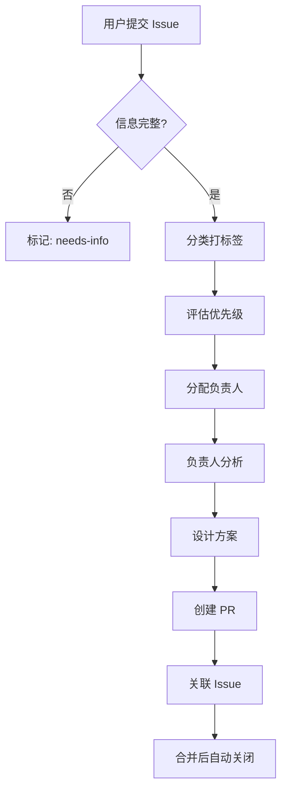

# Issue 模板使用示例

## ❌ 不好的 Issue 示例

```markdown
标题: 用 Redis 优化性能

我觉得我们应该加入 Redis 缓存来提升性能，
可以用 Redis 的 sorted set 来存储数据，
然后设置 TTL 为 3600 秒。
```

**问题**：
- 直接提方案而不是描述问题
- 没有说明什么性能有问题
- 没有说明影响范围

## ✅ 好的 Issue 示例

```markdown
标题: [Bug]: 用户列表页面加载缓慢

## 📋 问题描述
用户列表页面加载时间超过 5 秒，用户体验很差。
当用户数量超过 1000 时，页面几乎无法使用。

## 🎯 背景/动机
- 客户反馈页面太慢，影响日常工作
- 运营团队每天需要多次访问此页面
- 已有 3 个客户因此考虑不续费

## ✅ 期望结果
- 页面加载时间控制在 2 秒以内
- 支持至少 10000 个用户的流畅显示
- 用户操作（搜索、筛选）响应及时

## 📍 当前行为
- 加载 1000 个用户需要 5-8 秒
- 加载期间页面完全空白
- 没有加载进度提示

## 🔄 重现步骤
1. 登录系统
2. 点击左侧菜单"用户管理"
3. 等待页面加载
4. 观察加载时间（Chrome DevTools 显示 5.3s）

## 🚦 优先级建议
- [x] 🟠 High - 严重影响使用

## 📎 补充信息
- 环境：生产环境
- 用户数量：1200+
- 浏览器：Chrome 120, Firefox 119
- 截图：[loading-time.png]
- Network 分析：API 响应 4.8s，渲染 0.5s
```

## 📝 模板设计原则

### 1. 问题先行
- ❌ "我们应该使用 XXX 技术"
- ✅ "XXX 功能有 YYY 问题"

### 2. 影响导向
- ❌ "代码不够优雅"
- ✅ "导致开发效率降低 50%"

### 3. 可验证的期望
- ❌ "希望更快"
- ✅ "希望 2 秒内加载完成"

### 4. 客观描述
- ❌ "太慢了，体验很差"
- ✅ "加载需要 5 秒，用户反馈无法接受"

## 🔄 Issue 生命周期



## 💡 小贴士

1. **一个 Issue 聚焦一个问题**
   - 如果有多个问题，分别创建

2. **提供具体数据**
   - 不是"很慢"，而是"5 秒"
   - 不是"很多用户"，而是"1000+ 用户"

3. **先搜索再创建**
   - 避免重复 Issue
   - 可以在已有 Issue 补充信息

4. **持续更新**
   - 发现新信息及时补充
   - 问题解决后更新结果