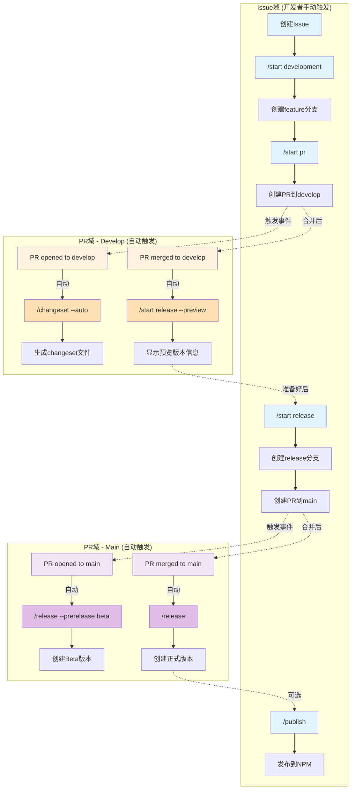

# GitHub Workflows 架构详解

## 核心概念：Issue域 vs PR域

我们的工作流系统分为两个主要的执行域：

### Issue域 (Issue Context)
- **定义**：在Issue评论中执行的命令
- **用途**：控制整个开发流程的主要入口
- **权限**：基于仓库协作者权限
- **命令执行者**：开发者/维护者

### PR域 (Pull Request Context)  
- **定义**：在PR评论中执行的命令
- **用途**：控制PR相关的自动化操作
- **权限**：基于PR权限和仓库权限
- **命令执行者**：开发者/维护者/GitHub Actions Bot

## 工作流程图



## 命令触发机制详解

### 1. 手动命令（开发者在Issue中触发）

| 命令 | 触发位置 | 执行时机 | 作用 |
|------|---------|---------|------|
| `/start development` | Issue评论 | 开始开发时 | 创建feature/#XX-issue分支 |
| `/start pr` | Issue评论 | 开发完成时 | 创建PR从feature到develop |
| `/start release` | Issue评论 | 准备发布时 | 创建release分支和PR到main |
| `/publish` | Issue评论 | 版本发布后 | 发布包到NPM |

### 2. 自动命令（GitHub Actions Bot触发）

| 命令 | 触发事件 | 触发位置 | 作用 |
|------|---------|---------|------|
| `/changeset --auto` | pr-opened-develop | PR评论 | 自动分析并生成changeset |
| `/start release --preview` | pr-merged-develop | PR评论 | 显示下次发布的版本预览 |
| `/release --prerelease beta` | pr-opened-main | PR评论 | 创建Beta测试版本 |
| `/release` | pr-merged-main | PR评论 | 创建正式生产版本 |

### 3. 命令权限控制

```yaml
权限检查流程:
1. 检查是否为 github-actions[bot]
   └─ 是 → 允许执行（自动化流程）
   └─ 否 → 继续检查
   
2. 检查用户仓库权限
   └─ admin/maintain/write → 允许执行
   └─ read/none → 拒绝执行
```

## 完整流程示例

### 场景：从Issue到生产发布

```bash
# 1. 开发者创建Issue #42
gh issue create --title "添加新功能"

# 2. [Issue域] 开发者开始开发
gh issue comment 42 --body "/start development"
# → 自动创建 feature/#42-issue 分支

# 3. 开发者提交代码
git checkout feature/#42-issue
git add .
git commit -m "feat: 添加新功能"
git push

# 4. [Issue域] 开发者创建PR
gh issue comment 42 --body "/start pr"
# → 创建PR #43 从 feature/#42-issue 到 develop

# 5. [PR域-自动] PR创建时
# → 触发 pr-opened-develop
# → Bot自动评论 "/changeset --auto"
# → 生成 changeset 文件

# 6. 开发者合并PR #43
gh pr merge 43

# 7. [PR域-自动] PR合并后
# → 触发 pr-merged-develop  
# → Bot自动评论 "/start release --preview"
# → 显示版本预览

# 8. [Issue域] 维护者准备发布
gh issue comment 42 --body "/start release"
# → 创建 release/1.2.0 分支
# → 更新版本号和CHANGELOG
# → 创建PR #44 到 main

# 9. [PR域-自动] Release PR创建时
# → 触发 pr-opened-main
# → Bot自动评论 "/release --prerelease beta"
# → 创建 v1.2.0-beta.0 版本

# 10. 维护者合并PR #44
gh pr merge 44

# 11. [PR域-自动] PR合并到main后
# → 触发 pr-merged-main
# → Bot自动评论 "/release"
# → 创建 v1.2.0 正式版本

# 12. [Issue域-可选] 发布到NPM
gh issue comment 42 --body "/publish"
# → 发布到 NPM registry
```

## 自动化级别

### 🟢 完全自动化
- changeset生成（PR到develop时）
- release预览（PR合并到develop后）
- Beta版本创建（PR到main时）
- 正式版本创建（PR合并到main后）

### 🟡 半自动化
- 分支创建（需要手动触发/start命令）
- PR创建（需要手动触发/start pr命令）
- Release流程启动（需要手动触发/start release命令）

### 🔴 手动操作
- Issue创建
- 代码提交
- PR审核和合并
- NPM发布（可选）

## 关键设计原则

1. **透明性**：所有自动化操作都通过评论命令触发，可追溯
2. **可控性**：关键决策点保留人工干预
3. **安全性**：严格的权限检查，防止未授权操作
4. **灵活性**：支持手动覆盖自动化流程
5. **可观察性**：每个步骤都有明确的反馈

## 故障排除

### Q: 为什么自动命令没有触发？
A: 检查以下几点：
- PAT_TOKEN是否正确配置
- 工作流文件是否在默认分支
- 事件条件是否满足（如分支名称）

### Q: 如何处理命令执行失败？
A: 查看方法：
1. 检查GitHub Actions运行日志
2. 查看PR/Issue评论中的错误信息
3. 验证用户权限和token权限

### Q: 能否跳过某些自动化步骤？
A: 可以：
- 使用 `--skip-auto` 参数（如果支持）
- 手动执行对应命令覆盖自动化
- 在PR描述中添加特定标记