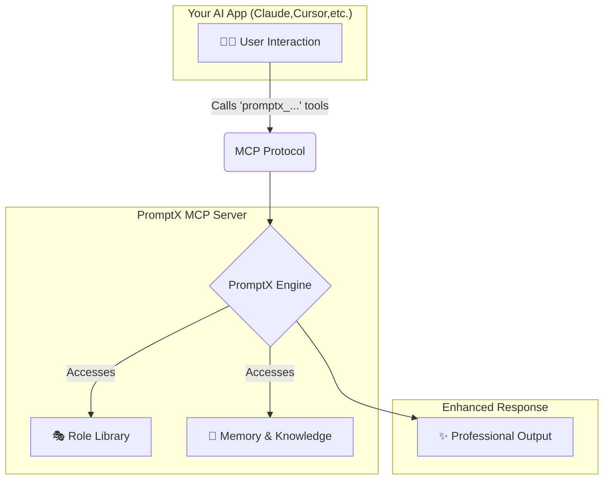

<div align="center">
  
  <h1>PromptX · AI應用原生專業能力增強系統</h1>
  <p>結合提示詞工程與上下文工程的AI專業能力增強框架，通過MCP協議為AI應用提供專業角色、記憶管理和知識體系，一行命令，讓任何 AI 客戶端秒變專業選手。</p>

  <!-- Badges -->
  <p>
    <a href="https://github.com/Deepractice/PromptX"></a>
    <a href="https://opensource.org/licenses/MIT"></a>
    <a href="#"></a>
    <a href="#"></a>
    <a href="#"></a>
  </p>

  <p>
    <strong><a href="README.md">原文</a></strong> | 
    <a href="README_EN.md">English</a> | 
    <a href="https://github.com/Deepractice/PromptX/issues">Issues</a>
  </p>
</div>

---

### ✨ **一眼看懂 PromptX**

PromptX 能做什麼？簡單來說，它讓你的 AI 助手擁有了「大腦」和「記憶」，更讓你成為AI能力的創造者。

- **🎭 專業角色扮演**: 提供覆蓋不同領域的專家角色，讓 AI 的回答更專業、更深入。
- **🧠 長期記憶與知識庫**: AI能夠記住關鍵資訊和你的偏好，在持續的對話和工作中提供連貫、個人化的支援。
- **✨ AI角色創造工坊**: **2分鐘內**將你的想法變成專業AI助手，從使用者到創造者的華麗轉身。
- **🔌 輕鬆整合**: 只需一行命令，即可為數十種主流 AI 應用（如 Claude、Cursor）無縫啟用這些強大功能。

<br/>

### 📸 **配置成功後的使用效果**

#### **1. 發現並激活專業角色**
*使用 `promptx_welcome` 發現可用角色，再用 `promptx_action` 激活，AI即刻變身領域專家。*


#### **2. 擁有智能記憶**
*使用 `promptx_remember` 保存關鍵資訊，AI將在後續的交流中主動運用這些知識。*


---

## ⚠️ **專案狀態說明**

PromptX 目前處於 **初始開發階段**，我們正在積極完善功能和修復問題。在達到正式穩定版本之前，您可能會遇到一些使用上的問題或不穩定情況。

**我們誠懇地請求您的理解和支持！** 🙏

---

## 🤔 你是否也遇過這些痛點？

**每次使用 AI 都要重新自我介紹？**
- 剛跟 Claude 說我是前端工程師，換個對話又要重新說一遍
- 上次討論的專案背景，新對話完全不記得
- 花一堆時間在「教育」AI，而不是解決問題

**複雜的提示詞管理到快抓狂？**  
- 好用的提示詞存在各種地方：記事本、Notion、腦袋裡...
- 想要組合不同專家角色，結果提示詞越來越長
- 每次都要 copy-paste 一大串，超沒效率

**AI 回答太泛用，不夠專業？**
- 問技術問題，回答像是從教科書複製貼上
- 明明是資深 PM，AI 卻給新手等級的建議
- 想要 AI 像真正的同事一樣協作，而不是萬能但不專業的助手
- 缺乏專業的上下文工程，無法維持深度對話的專業水準

## ✨ PromptX 如何解決這些問題？

### 🎯 核心概念：讓 AI 從「通用助手」變成「專業團隊」

想像一下，如果你可以：
- **一鍵激活**：`激活產品經理` → AI 立刻變身有經驗的 PM
- **智能記憶**：AI 記住你的專案背景、工作偏好、團隊文化
- **多角色協作**：同時啟用 PM、設計師、工程師角色，模擬真實團隊討論
- **提示詞模組化**：告別複製貼上，專業提示詞自動組合
- **持續上下文**：跨會話保持專業對話的連貫性

這就是 PromptX 想要實現的：**AI 專業能力的模組化和生態化**。

---

## 🚀 一鍵啟動，30 秒完成配置

### MCP 配置 - 30 秒完成設定

**開啟配置文件**
- 打開 AI IDE 客戶端 MCP 配置文件
- 將下面的 `promptx` 配置代碼複製貼上，這是最簡單的零配置模式
- 配置完成後 PromptX 會自動為您處理一切！

```json
{
  "mcpServers": {
    "promptx": {
      "command": "npx",
      "args": [
        "-y",
        "-f", 
        "--registry",
        "https://registry.npmjs.org",
        "dpml-prompt@beta",
        "mcp-server"
      ]
    }
  }
}
```

**配置參數說明：**
- `command`: 指定使用 npx 運行 promptx 服務
- `args`: 啟動參數配置列表
  - `-y`: 自動確認
  - `-f`: 強制刷新緩存  
  - `--registry`: 指定鏡像源
  - `https://registry.npmjs.org`: 使用官方鏡像
  - `dpml-prompt@beta`: 使用穩定測試版
  - `mcp-server`: 啟動服務

### 配置 & 初始化
```bash
# 系統初始化，自動準備工作環境
promptx_init

# 查看所有可用的專家角色
promptx_hello
```

### 立即體驗專業化 AI
```bash
# 激活產品經理角色
promptx_action product-manager

# AI 現在會用 PM 的思維模式回答問題
# 包含：用戶導向思考、數據驅動決策、商業價值評估
```

### 讓 AI 記住重要資訊
```bash
# 儲存專案資訊
promptx_remember "我們正在開發一個電商 App，目標用戶是 25-35 歲上班族"

# 之後 AI 會在這個專案背景下給建議
```

---

### ⚙️ **工作原理**

PromptX 作為您和AI應用之間的「專業能力中間件」，通過標準的 [MCP協議](https://github.com/metacontroller/mcp) 進行通信。



當您調用 `promptx_...` 系列工具時，AI應用會將請求通過MCP協議發送給 PromptX。PromptX 引擎會加載相應的專業角色、檢索相關記憶，然後返回一個經過專業能力增強的結果給AI應用，最終呈現給您。

---

**🎯 配置完成後，您的AI應用將自動獲得6個專業工具：**
- `promptx_init`: 🏗️ **系統初始化** - 自動準備工作環境。
- `promptx_hello`: 👋 **角色發現** - 瀏覽所有可用的專家角色。
- `promptx_action`: ⚡ **角色激活** - 一鍵變身指定領域的專家。**（含女媧🎨角色創造顧問）**
- `promptx_learn`: 📚 **知識學習** - 讓AI學習特定的知識或技能。
- `promptx_recall`: 🔍 **記憶檢索** - 從記憶庫中查找歷史資訊。
- `promptx_remember`: 💾 **經驗保存** - 將重要資訊存入長期記憶。

📖 **[查看完整MCP整合指南](docs/mcp-integration-guide.md)**

## 🎭 豐富的角色庫 - 台灣開發者最需要的專家

### 💻 技術開發類
- **前端工程師**：React/Vue 專家，重視 UX 和效能
- **後端工程師**：系統架構、API 設計、資料庫優化
- **DevOps 工程師**：CI/CD、容器化、雲端部署
- **資安工程師**：威脅分析、安全稽核、合規檢查

### 📊 產品業務類  
- **產品經理**：用戶研究、需求分析、產品策略
- **UI/UX 設計師**：使用者體驗、介面設計、原型製作
- **行銷企劃**：內容行銷、社群經營、數據分析
- **專案管理師**：進度控制、風險管理、團隊協調

### 🎯 更多專業角色
- **技術文件寫手**：API 文件、使用者手冊、技術部落格
- **QA 測試工程師**：測試案例、自動化測試、品質保證
- **資料分析師**：數據視覺化、商業洞察、報表製作

## 🧠 智能記憶系統 - AI 記住你的工作脈絡

### 專案記憶
```bash
# 記住專案背景
promptx_remember "開發台灣美食外送 App，競品分析包含 foodpanda、UberEats"

# AI 會在相關討論中主動提及這些資訊
```

### 個人偏好記憶
```bash
# 記住你的工作習慣
promptx_remember "我偏好敏捷開發，重視快速迭代和用戶反饋"

# AI 會按照你的工作風格給建議
```

### 團隊文化記憶
```bash
# 記住團隊特色
promptx_remember "團隊重視代碼品質，每個 PR 都要 Code Review"

# AI 會考慮團隊文化給出適合的建議
```

## 🤝 多角色協作 - 模擬真實團隊討論

**傳統 AI 使用方式：**
你 ↔ AI（一對一問答）

**PromptX 協作方式：**
你 ↔ AI產品經理 ↔ AI設計師 ↔ AI工程師（團隊協作）

### 實際應用場景
```bash
# 1. 先用產品經理角色分析需求
promptx_action product-manager
"幫我分析這個功能的用戶價值和優先級"

# 2. 切換到設計師角色考慮 UX
promptx_action ux-designer  
"基於剛才的需求分析，這個功能的使用者流程應該怎麼設計？"

# 3. 最後用工程師角色評估技術實現
promptx_action backend-engineer
"這個設計的技術實現方案和工作量評估？"
```

---

## 🎨 女媧創造工坊 - 客製化你的專屬 AI 角色
<div align="center">
  
</div>

### 為什麼需要自己創造角色？
- **領域專精**：台灣特有的行業知識（如：金融法規、健保制度）
- **團隊文化**：每個團隊都有獨特的工作流程和價值觀
- **個人風格**：適合你溝通習慣的 AI 助手
- **上下文定制**：為特定場景構建專業的對話上下文工程

#### **💫 從想法到現實，只需2分鐘**

你有沒有想過：如果我能為特定工作場景定制一個專業AI助手會怎樣？**女媧讓這個想法變成現實。**

> *「每個想法都值得擁有專屬的AI助手，技術的門檻不應該限制創意的飛翔。」*

#### **🎯 核心價值轉換**

- **🚀 零門檻創造**: 無需學習複雜技術，用自然語言描述需求即可
- **⚡ 極速交付**: 從想法到可用角色，全程2分鐘
- **🎭 專業品質**: 自動生成符合DPML標準的專業AI角色
- **🔄 即插即用**: 創建完成立即可以激活使用
- **💝 掌控感**: 從使用者到創造者的華麗轉身

#### **✨ 使用場景示例**

<div align="center">

| 🎯 **用戶需求** | ⚡ **女媧生成** | 🚀 **立即可用** |
|---|---|---|
| 👩‍💼 「我需要一個懂小紅書行銷的助手」 | 小紅書行銷專家角色 | `激活小紅書行銷專家` |
| 👨‍💻 「我要一個Python專家」 | Python程式設計導師角色 | `激活Python程式設計導師` |
| 🎨 「給我一個UI/UX設計顧問」 | UI/UX設計專家角色 | `激活UI/UX設計專家` |
| 📊 「需要一個資料分析師助手」 | 資料分析專家角色 | `激活資料分析專家` |

</div>

```bash
# 1️⃣ 激活女媧角色創造顧問
"我要女媧幫我創建一個角色"

# 2️⃣ 用自然語言描述需求
"我需要一個懂台灣電商法規的法務顧問，主要處理消保法、個資法相關問題"

# 3️⃣ 等待2分鐘，女媧為你生成專業角色
# 女媧會創建角色文件、註冊到系統、完成質量檢查

# 4️⃣ 立即激活使用你的專屬AI助手
"激活剛剛創建的角色"
```

#### **🌟 女媧的設計哲學**

- **🎯 無界創造**: 讓任何有想法的人都能創造AI助手，打破技術壁壘
- **⚡ 即時滿足**: 滿足數位時代對即時性的需求
- **🧠 成長引導**: 不只是工具使用，更是引導用戶理解AI能力邊界
- **🌱 生態共建**: 每個用戶創造的角色都可能成為他人的靈感源泉

---

## 🎯 技術亮點 - 融合前沿 AI 技術趨勢

PromptX 整合了當前 AI 領域的兩大核心技術：

### 📝 提示詞工程
- **模組化設計**：專業提示詞不再需要複製貼上
- **角色模板**：預建的專家角色，開箱即用
- **自動組合**：根據需求智能組合不同模組

### 🔄 上下文工程  
- **跨會話記憶**：AI 記住你的工作背景和偏好
- **專業連貫性**：保持長期對話的專業水準
- **智能適配**：根據對話進展調整回應策略

---

## 🔧 技術核心 - 為什麼選擇 PromptX？

### 核心優勢
- **一鍵激活**：專業角色立即可用，告別複製貼上
- **智能記憶**：AI 記住你的工作背景和偏好
- **模組化設計**：靈活組合不同專業能力
- **社群生態**：共建共享的角色和經驗庫

## 🌟 加入 PromptX 台灣社群

### 技術交流群
- **Facebook**：[Deepractice Taiwan](https://www.facebook.com/share/g/1XUkmkooF4/?mibextid=wwXIfr)
- **LINE 群**：搜尋「Deepractice AI台灣社區」

  

### 貢獻方式
- 🎯 **分享使用心得**：在社群分享你的應用場景
- 🎭 **創造角色模板**：開發台灣在地化的專業角色
- 📚 **撰寫教學文件**：幫助更多人上手 PromptX
- 🐛 **回報問題**：協助改善應用品質

---

## 📋 常見問題 FAQ

### Q：PromptX 支援哪些 AI 工具？
A：目前支援 Cursor、[Trae](https://www.trae.cn/?utm_source=community&utm_medium=CPA_jiangshan&utm_campaign=deepracticex)、Claude（Desktop & Web）、Zed、Continue 等主流 AI 編程工具，通過 MCP 協議實現無縫的上下文工程集成，更多工具持續接入中。

### Q：需要付費嗎？
A：PromptX 本身完全免費開源，但需要你自己的 AI 工具帳號（如 Cursor Pro）。

### Q：我的資料會被收集嗎？
A：所有資料都儲存在你的本機，PromptX 不會收集任何個人資料。

### Q：可以在公司專案使用嗎？
A：可以！MIT 授權允許商業使用，你可以在企業環境中安全地部署和使用。

### Q：如何貢獻內容？
A：歡迎提交 PR 到 GitHub，或在社群群組分享你的角色模板和使用心得。

## 🎯 立即開始你的 AI 專業化之旅

```bash
# 系統初始化，開啟新世界
promptx_init

# 開始體驗專業級 AI 助手
promptx_hello
```

---

## 📞 聯絡資訊

- **GitHub**：[Deepractice/PromptX](https://github.com/Deepractice/PromptX)
- **官方網站**：[deepractice.ai](https://deepractice.ai)
- **技術支援**：[issues](https://github.com/Deepractice/PromptX/issues)
- **商業合作**：carson@deepracticex.com

---

## ⭐ **Star增長趨勢**

[](https://star-history.com/#Deepractice/PromptX&Date)

---

### **🤝 貢獻與交流**

我們歡迎任何形式的貢獻和反饋！

- 🌿 **[分支策略](docs/BRANCHING.md)** - 分支管理和發布流程  
- 🚀 **[發布流程](docs/RELEASE.md)** - 版本管理和發布文檔

---

## 📄 授權條款

[MIT License](LICENSE) - 讓 AI 專業能力觸手可及

---

## 📝 翻譯資訊

**繁體中文翻譯**：楊清禾  
**Translation Author**: Yang Qing-He

---

**🤝 歡迎加入開源社群，共同推進 AI 工程化發展** 