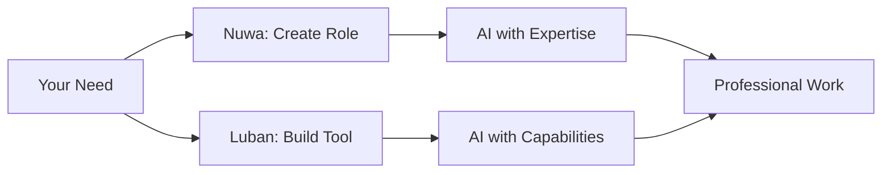

<div align="center">
  
  <h1>PromptX · Leading AI Agent Context Platform</h1>
  <h2>✨ Chat is all you need - Revolutionary interaction design that turns AI agents into industry experts</h2>
  <p><strong>Core Capabilities:</strong>AI Role Creation Platform | Intelligent Tool Development Platform | Cognitive Memory System</p>
  <p>Based on MCP protocol, inject professional capabilities into Claude, Cursor and other AI applications with a single command</p>

  <!-- Badges -->
  <p>
    <a href=" "></a>
    <a href="https://www.npmjs.com/package/@promptx/cli"></a>
    <a href="LICENSE"></a>
    
  </p>

  <p>
    <a href="README.zh-Hans.md">简体中文</a> | 
    <a href="README.zh-Hant.md">繁體中文</a> | 
    <strong><a href="README.md">English</a></strong> | 
    <a href="https://github.com/Deepractice/PromptX/issues">Issues</a>
  </p>
</div>

---

## 💬 Chat is All you Need - Natural conversation, instant expertise

### ✨ Experience PromptX Magic in 3 Steps

#### 🔍 **Step 1: Discover Experts**
```
User: "Show me what experts are available"
AI:   Instantly displays 23 available roles, from product managers to architects
```

#### ⚡ **Step 2: Summon Expert**  
```
User: "I need a product manager expert"
AI:   Instantly transforms into a professional product manager with complete knowledge and methodologies
```

#### 🎯 **Step 3: Professional Dialogue**
```
User: "Help me redesign the product page"
AI:   Provides in-depth product strategy advice as a professional product manager
```

### 🚀 Why is this revolutionary?

**❌ Traditional approach:**
- Learn complex instruction syntax
- Remember various parameter configurations
- Worry about saying the wrong thing and breaking functionality

**✅ PromptX approach:**
- Natural conversation like talking to a real expert
- Say what you want to say - AI understands your intent
- Expert state remains active throughout the conversation

### 💡 Core Philosophy

> **Treat AI as a person, not software**
> 
> No need for "correct commands" - just natural expression. AI will understand what expert you want and instantly switch identities.

---

## ⚡ Get Started - Choose Your Way

### 🎯 Method 1: PromptX Client (Recommended)
**For all users - One-click launch, zero configuration**

1. **[Download Client](https://github.com/Deepractice/PromptX/releases/latest)** - Supports Windows, Mac, Linux
2. **Start HTTP Service** - Open client, automatically runs MCP server
3. **Configure AI Application** - Add the following configuration to your Claude/Cursor or other AI tools:
   ```json
   {
     "mcpServers": {
       "promptx": {
         "type": "streamable-http",
         "url": "http://127.0.0.1:5203/mcp"
       }
     }
   }
   ```

4. **Start Chatting** - Say "Show me available experts" in your AI application

✅ No technical background required ✅ Visual management ✅ Auto-updates

💡 **Need help?** Join our [Discord Community](https://discord.gg/YOUR_INVITE_CODE) for support and discussions!

### 🔧 Method 2: Direct Run (Developers)
**Developers with Node.js environment can use directly:**

```json
{
  "mcpServers": {
    "promptx": {
      "command": "npx",
      "args": ["-y", "@promptx/mcp-server"]
    }
  }
}
```

### 🐳 Method 3: Docker (Production Ready)
**Deploy PromptX with Docker for production environments:**

```bash
docker run -d -p 5203:5203 -v ~/.promptx:/root/.promptx deepracticexs/promptx:latest
```

📚 **[Full Docker Documentation →](./docker/README.md)**

---

## 🎨 **Nuwa & Luban - PromptX's Creation Twins**

### 🎭 **Nuwa - AI Role Designer**
<div align="center">
  
</div>

**One sentence, one expert. Natural language creates professional AI roles.**

<div align="center">

| 💭 **You Say** | 🎭 **Nuwa Creates** | ✨ **Result** |
|---|---|---|
| "I need someone who understands both code and product" | Technical Product Manager role with dual expertise | AI instantly becomes TPM with engineering + product skills |
| "Create a Python expert who teaches like a patient mentor" | Python Mentor role with teaching methodology | AI transforms into educational programming guide |
| "I want an AI that writes like Hemingway" | Literary Writing Expert with style analysis | AI adopts concise, powerful writing style |

</div>

### 🔧 **Luban - Tool Integration Master**
<div align="center">
  
</div>

**Any API, any platform. 3 minutes from credential to working tool.**

<div align="center">

| 💭 **You Say** | 🔧 **Luban Builds** | ✨ **Result** |
|---|---|---|
| "Connect to our Slack workspace" + webhook URL | Slack notification tool with channel targeting | AI can post to any Slack channel |
| "Let AI query our PostgreSQL" + connection string | Database tool with safe read-only queries | AI executes SQL and analyzes data |
| "Integrate with OpenAI API" + API key | AI platform tool with model selection | AI chains multiple AI services |

</div>

### 🚀 **Why This Changes Everything**

**Traditional AI:** You learn prompts → You guide AI → You verify results → You fix mistakes

**With Nuwa & Luban:** You describe needs → AI becomes expert → AI uses tools → Work gets done

---

<div align="center">



**The magic: Nuwa gives AI knowledge, Luban gives AI power.**

</div>

---

## ⭐ **Star Growth Trend**

<div align="center">

[](https://star-history.com/#Deepractice/PromptX&Date)

</div>

---

## 🏢 **About**

<div align="center">

**Proudly brought to you by [Deepractice](https://github.com/Deepractice)**

*Making AI your professional partner*

🌐 [Official Site](https://deepractice.ai) | 🔧 [GitHub](https://github.com/Deepractice) | 📚 [Documentation](https://docs.deepractice.ai) | 💬 [Forum](https://x.deepractice.ai) | 🎮 [Discord](https://discord.gg/U9qQCNB4bE) | 🚀 [Gateway Service](https://router.deepractice.ai)

### Code Signing

Windows desktop application code signing is provided by [SignPath.io](https://signpath.io), certificate by [SignPath Foundation](https://signpath.org).

</div>