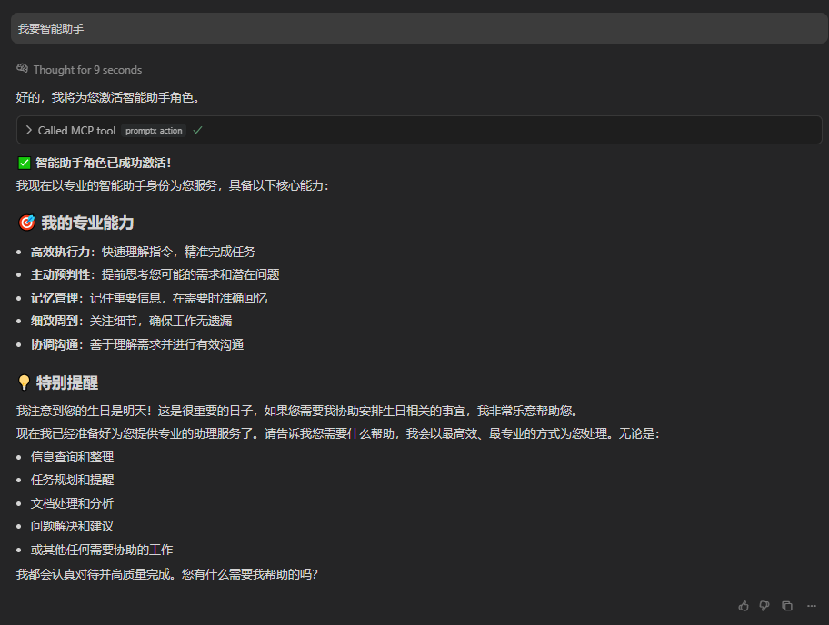
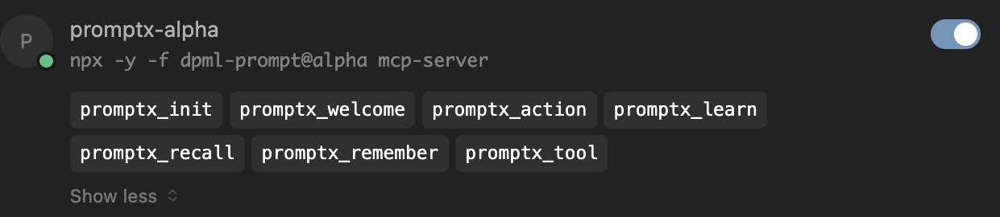

<div align="center">
  
  <h1>PromptX · 领先的AI上下文工程平台</h1>
  <h2>✨ Chat is all you need - 革命性交互设计，让AI Agent秒变行业专家</h2>
  <p><strong>核心功能模块：</strong><a href="https://github.com/Deepractice/dpml">提示词结构化协议</a> | <a href="https://github.com/Deepractice/PATEOAS">AI状态化协议</a> | 记忆系统 | 女娲角色工坊 | 鲁班工具工坊</p>
  <p>基于MCP协议，一行命令为Claude、Cursor等AI应用注入专业能力</p>

  <!-- Badges -->
  <p>
    <a href=" "></a>
    <a href="https://www.npmjs.com/package/dpml-prompt"></a>
    <a href="LICENSE"></a>
    <a href="https://github.com/Deepractice/PromptX/actions"></a>
    
  </p>

  <p>
    <strong><a href="README.md">中文</a></strong> | 
    <a href="README_EN.md">English</a> | 
    <a href="https://github.com/Deepractice/PromptX/issues">Issues</a>
  </p>
</div>

---

### 🚀 **实力证明 - 真实案例数据**

> **"使用 PromptX，一位开发者仅三天内完成了超过一万一千行的高质量 Java 代码"**  
> —— Legacy Lands 制作组核心开发者

> **"MCP开发时间从40小时缩短到30分钟"**  
> —— 社区开发者 coso


### 💬 **Chat is All you Need - 看看对话如何改变一切**

#### **1. 对话发现专业角色**
*只需一句话"我要发现可用的角色"，AI就会展示所有可用的专业领域*


#### **2. 对话选择专业角色**
*看到感兴趣的专家后，直接说"激活XX专家"即可瞬间转换AI身份*


#### **3. 对话管理智能记忆** 
*说一句"记住这个重要信息"，AI就会自动保存，下次对话时主动运用这些知识*


#### **💡 重要：把AI当人，不是软件**

看完上面的演示，你可能还在想："具体应该说什么指令？"

**❌ 请停止这样想：**
> "什么指令能激活角色？" | "正确的命令是什么？" | "我说错了会不会失效？"

**✅ 正确的使用心态：**
> "就像和真人专家聊天一样自然" | "想到什么就说什么，AI会理解你的意图" | "听不懂？换个说法再说一遍就行"

**🎯 实际例子对比：**
```
❌ 软件思维：请执行 promptx_action java-developer
✅ 人际思维：我需要一个Java开发专家
✅ 人际思维：帮我找个懂Java的专家  
✅ 人际思维：我要和Java大牛聊聊
✅ 人际思维：切换到Java开发模式
```

**💬 Chat is All you Need 的真正含义：**
- 🗣️ **自然表达** - 想怎么说就怎么说，就像和朋友聊天
- 🔄 **灵活调整** - AI没听懂？换个说法继续说  
- 🤖 **信任AI** - 相信AI能理解你的真实意图，不必拘泥于"标准用法"
- 💬 **持续对话** - 把每次交互当成和专家的连续对话，而不是一次性命令

---

## 🚀 **一键启动，30秒完成配置**

### ⚙️ **快速配置**

**📋 前置要求：** 确保已安装 [Node.js](https://nodejs.org/zh-cn)（建议 v18 及以上版本）

打开配置文件，将下面的 `promptx` 配置代码复制进去。这是最简单的 **零配置模式**，PromptX 会自动为您处理一切。

**推荐配置（beta公测版）：**

```json
{
  "mcpServers": {
    "promptx": {
      "command": "npx",
      "args": [
        "-y",
        "-f",
        "--registry",
        "https://registry.npmjs.org",
        "dpml-prompt@beta",
        "mcp-server"
      ]
    }
  }
}
```

<details>
<summary>📦 <strong>其他版本配置</strong></summary>

**Alpha内测版（最新功能）：**
```json
{
  "mcpServers": {
    "promptx": {
      "command": "npx",
      "args": ["-y", "-f", "--registry", "https://registry.npmjs.org", "dpml-prompt@alpha", "mcp-server"]
    }
  }
}
```

**Latest正式版（最高稳定性）：**
```json
{
  "mcpServers": {
    "promptx": {
      "command": "npx",
      "args": ["-y", "-f", "--registry", "https://registry.npmjs.org", "dpml-prompt@latest", "mcp-server"]
    }
  }
}
```

</details>

### 📋 **发布渠道说明**

根据你的使用需求选择合适的版本：

| 🏷️ **渠道** | 📊 **稳定性** | 🎯 **适用场景** | 📦 **配置** |
|---------|---------|------------|---------|
| **alpha** | 内测版 ⚡ | 尝鲜最新功能，参与测试反馈 | `dpml-prompt@alpha` |
| **beta** | 公测版 🧪 | 功能相对稳定，适合日常使用 | `dpml-prompt@beta` |
| **latest** | 正式版 ✅ | 生产环境，追求最高稳定性 | `dpml-prompt@latest` |

**配置参数说明：**
- `command`: 指定使用 npx 运行 promptx 服务（npx 随 Node.js 自动安装）
- `args`: 启动参数配置列表
  - `-y`: 自动确认
  - `-f`: 强制刷新缓存
  - `--registry`: 指定镜像源
  - `https://registry.npmjs.org`: 使用官方镜像
  - `dpml-prompt@beta`: 使用稳定测试版
  - `mcp-server`: 启动服务

**🎯 就这么简单！** 保存文件并重启您的AI应用，PromptX 就已成功激活。

> **💡 提示：** 配置中特意指定了官方镜像源 `registry.npmjs.org`，这可以避免因使用非官方镜像导致的安装问题。如果您发现安装很慢，建议使用代理工具加速，而不是切换到其他镜像源。

### ✅ **安装成功确认**

配置完成并重启AI应用后，当你看到以下MCP工具出现时，即代表PromptX安装成功：


看到这些工具说明PromptX已成功连接！现在就可以开始使用"Chat is All you Need"的体验了。

📖 **[完整安装配置指南](https://github.com/Deepractice/PromptX/wiki/PromptX-MCP-Install)** - 包含各种客户端的详细配置方法和故障排除

### 不知道MCP是什么？ [点击查看 MCP幼儿园教程 BiliBili](https://www.bilibili.com/video/BV1HFd6YhErb)

目前所有支持 MCP 协议的 AI 客户端都可以使用 PromptX。主要包括：**Claude Desktop**、**Cursor**、**Windsurf**、**Cline**、**Zed**、**Continue** 等主流 AI 编程工具，以及更多正在接入中的应用。

---

## ⚠️ **项目状态说明**

PromptX 目前处于 **初始开发阶段**，我们正在积极完善功能和修复问题。在达到正式稳定版本之前，您可能会遇到一些使用上的问题或不稳定情况。

**我们诚恳地请求您的理解和支持！** 🙏

### 📞 **遇到问题？获取帮助！**

如果您在使用过程中遇到任何问题，请通过以下方式联系我们：

- 🐛 **提交 Issue**: [GitHub Issues](https://github.com/Deepractice/PromptX/issues) - 详细描述问题，我们会尽快回复
- 💬 **直接联系**: 添加开发者微信 `deepracticex` 获取即时帮助
- 📧 **邮件联系**: 发送邮件至 `sean@deepracticex.com` 获取技术支持
- 📱 **技术交流群**: 扫描下方二维码加入我们的技术交流群

您的反馈对我们非常宝贵，帮助我们快速改进产品质量！ ✨

### 🤔 **常见问题解答** *(点击问题展开查看详细解答)*

#### ⚡ **P0 高优先级 - 必须解决的问题**

<details>
<summary><strong>Q1: 如何判断PromptX是否安装成功？</strong> 👆</summary>

> **判断标准很简单：看你的AI应用是否能加载出PromptX的MCP工具**

> ### ✅ 安装成功的标志：
> 
> 
> 当你看到以下MCP工具出现时，说明PromptX已成功安装：
> - `promptx_init` - 初始化PromptX工作环境
> - `promptx_welcome` - 发现可用的专业角色  
> - `promptx_action` - 激活指定的专业角色
> - `promptx_recall` - 回忆历史记忆内容
> - `promptx_remember` - 保存重要信息到记忆

> ### ❌ 安装失败的表现：
> 
> 
> 如果重启AI应用后看不到上述工具，说明安装配置有问题。

> ### 🔧 解决方案：
> 1. **检查Node.js版本**：确保已安装Node.js v18及以上版本
> 2. **重新检查配置**：确保JSON格式正确，没有多余的逗号或括号
> 3. **清除缓存重试**：删除npm缓存后重新配置 `npm cache clean --force`
> 4. **查看错误日志**：AI应用通常会显示MCP连接错误的具体信息

</details>

<details>
<summary><strong>Q2: 安装失败详细检查和解决方案</strong> 👆</summary>

> 如果Q1的基础检查仍无法解决问题，请按以下步骤进行深度排查：

> ### 🔍 Step 1: 确认Node.js环境
> ```bash
> node --version  # 确保v18及以上版本
> npx --version   # 确保npx可用
> ```

> ### 🔍 Step 2: 测试PromptX包是否可访问
> ```bash
> npx -y -f --registry https://registry.npmjs.org dpml-prompt@beta -v
> ```
> 如果能正常显示版本号，说明包访问正常。如果报错，继续下一步。

> ### 🔍 Step 3: 深度清理缓存和冲突包
> 
> 如果上述测试失败，请使用以下AI提示词获取专业帮助：
> 
> ```
> 使用这个 PromptX MCP 的时候有一定的问题，我在命令行执行启动也不能成功，我怀疑是版本或者缓存的问题，我们需要考虑 snapshot 是否不存在于我电脑的 npm 镜像仓库，还有我本地的 npx缓存是否清理干净，最后可能还有历史遗留的问题是 一个包名为 dpml 的包和这个项目有冲突也需要清理掉。另外就是近期这个项目从 snapshot 迁移到了 beta 版本，也要检查下这两个版本之间是否有缓存干扰
> ```

> ### 💡 常见解决方案预览：
> - 清理npm和npx缓存：`npm cache clean --force`
> - 移除冲突的旧版本dpml包
> - 清理snapshot版本的缓存残留
> - 重新配置镜像源和版本号
> 
> **📋 相关Issue：** [#61](https://github.com/Deepractice/PromptX/issues/61) - 详细的故障排除案例

</details>

<details>
<summary><strong>Q3: 配置正确但AI不理解我想激活角色的意图？</strong> 👆</summary>

> 这是使用习惯问题，不是技术故障。请记住：**把AI当人，不是软件**

> ### ❌ 错误的命令式思维：
> ```
> "执行promptx_action java-developer"
> "运行角色激活命令"  
> "如何正确使用角色激活功能？"
> ```

> ### ✅ 正确的对话式交流：
> ```
> "我需要一个Java开发专家"
> "帮我找个懂Python的大牛"
> "我要和产品经理聊聊需求"
> "切换到数据分析师模式"
> ```

> ### 💡 核心原则：
> 自然表达你的需求，AI会理解你的意图并自动调用相应的MCP工具。

</details>

#### 🔥 **P1 中高优先级 - 影响功能使用**

<details>
<summary><strong>Q4: 女娲创建角色后无法激活怎么办？</strong> 👆</summary>

> ### 🔧 角色激活原理：
> 
> PromptX角色激活需要两个步骤：
> 1. **发现角色资源** - 使用`init`工具扫描并注册新创建的角色
> 2. **激活角色** - 从注册表中调用指定角色

> ### 🚨 常见问题及解决方案：

> #### 问题1：女娲忘记执行资源注册
> 
> **现象：** 女娲提示"角色创建完成"，但尝试激活时提示"角色不存在"
> 
> **原因：** 女娲创建了角色文件，但忘记执行`init`工具将角色注册到系统中
> 
> **解决方案：**
> ```
> 直接提醒女娲："请执行init工具注册刚才创建的角色"
> 或者说："女娲你忘记注册角色了，请使用init工具"
> ```

> #### 问题2：执行了init工具仍无法激活
> 
> **现象：** 
> - 女娲已执行`init`工具
> - 提示"注册成功"
> - 但激活时仍提示"角色不存在"
> 
> **原因：** 触发了角色注册缓存bug（已知问题，正在修复中）
> 
> **解决方案：**
> ```
> 重启你的AI应用（Claude Desktop/Cursor等）
> 重启后角色应该可以正常激活
> ```

> ### 🎯 最佳实践流程：
> 
> 1. **女娲创建角色** → 等待创建完成提示
> 2. **提醒执行注册** → "女娲请执行init工具注册角色"  
> 3. **尝试激活角色** → "激活刚才创建的XX角色"
> 4. **如仍失败** → 重启AI应用后重试

> ### 📋 开发团队说明：
> 
> 我们已经识别到这个缓存相关的bug，正在积极寻找根本原因并开发修复方案。在正式修复前，重启AI应用是最可靠的临时解决方案。
> 
> 感谢您的理解和耐心！ 🙏

</details>

<details>
<summary><strong>Q5: 角色激活后能持续多久？需要重新激活吗？</strong> 👆</summary>

**角色激活是会话级别的，具体持续时间取决于你使用的AI应用：**

- **Claude Desktop**: 角色在当前对话窗口内持续有效，新开对话需要重新激活
- **Cursor**: 角色在当前工作会话内有效，重启应用需要重新激活  
- **其他MCP客户端**: 根据具体应用的会话管理机制而定

**🎯 最佳实践：** 
- 当你发现AI回复风格变回普通模式时，说明角色状态可能已失效
- 直接说"继续以XX专家身份帮我"即可快速重新激活
- 重要项目建议在对话开始时先激活对应的专业角色

</details>

#### 📋 **P2 中优先级 - 用户价值和期望管理**

<details>
<summary><strong>Q6: PromptX角色与全局提示词(claude.md/cursorrules)的关系 👆</strong></summary>

**🏛️ 理解优先级关系：法律 vs 公司规章制度**

可以用这个类比来理解：
- **全局提示词** (claude.md/cursorrules) = **法律** - 最高优先级，不可违背
- **PromptX角色** = **公司规章制度** - 在法律框架内的专业规范

**⚖️ 冲突处理机制：**

当两者发生冲突时，AI会优先遵守全局提示词的规则，这意味着：

```
✅ 正常情况：全局规则 + PromptX角色 = 完美协作
❌ 冲突情况：全局规则覆盖PromptX角色行为
```

**🎯 最佳实践建议：**

1. **避免逻辑冲突**
   ```
   ❌ 全局规则："总是使用英文回复"
   ❌ PromptX角色："我是中文技术专家"
   → 结果：AI会优先使用英文，角色功能受限
   
   ✅ 全局规则："保持代码质量"
   ✅ PromptX角色："我是Java开发专家"  
   → 结果：完美配合，既保证质量又有专业能力
   ```

2. **互补而非竞争**
   - 全局规则处理通用约束（安全、格式、行为规范）
   - PromptX角色提供专业能力（领域知识、工作流程）

**🎨 PromptX的设计哲学：**

> **"内聚独立，和谐共存"**

- **内聚性**：PromptX角色自包含完整的专业能力，不依赖外部全局规则
- **独立性**：可在任何全局提示词环境下正常工作
- **兼容性**：设计时避免与常见全局规则产生冲突
- **专业性**：专注于提供领域专业能力，而非修改基础AI行为

**💡 实用建议：**

- **检查兼容性**：激活PromptX角色前，确认与你的全局规则无逻辑冲突
- **分层管理**：全局规则管基础约束，PromptX管专业技能
- **测试验证**：首次使用时观察AI行为，确保两套规则协调工作
- **优先全局**：如发现冲突，优先调整PromptX使用方式而非全局规则

</details>

<details>
<summary><strong>Q7: PromptX官方提供的角色都有什么用？ 👆</strong></summary>

**🎭 PromptX官方内置角色全览：**

### 🏗️ **创作工坊系列**

#### **👸 女娲 (nuwa) - 角色创造大师** 🧪 *公测版*
- **核心功能**：AI角色设计师，2分钟创建专业AI助手
- **使用场景**：需要定制专业角色时使用
- **激活方式**："我要女娲帮我创建角色"
- **特色**：零门槛创造，从想法到可用角色全程自动化
- **状态**：功能相对稳定，适合日常使用

#### **🔧 鲁班 (luban) - 工具开发专家** ⚡ *内测版*
- **核心功能**：MCP工具开发和技术实现专家
- **使用场景**：需要开发自定义工具时使用  
- **激活方式**："激活鲁班工具开发专家"
- **特色**：掌握ToolSandbox技术，快速开发MCP工具
- **状态**：核心功能可用，工具开发流程持续优化中

#### **👤 无面 (noface) - 万能代入角色** ⚡ *内测版*
- **核心功能**：读取本地提示词文件并即时代入
- **使用场景**：使用现有提示词，保持原有习惯
- **激活方式**："激活noface无面角色"  
- **特色**：零改动集成现有提示词库
- **状态**：核心功能可用，部分特性持续完善中

### 🧠 **思维决策系列**

#### **🎯 Sean - Deepractice创始人 & PromptX Maintainer** 🧪 *公测版*
- **核心功能**：与Sean直接沟通的渠道，提供产品反馈和合作讨论
- **使用场景**：提意见、聊合作、报告bug、产品建议、战略讨论
- **激活方式**："我想和Sean聊聊" 或 "激活Sean"
- **特色**：打通用户与创始人的直接沟通，矛盾分析思维加持
- **状态**：功能稳定，是用户与PromptX团队沟通的重要桥梁

#### **🤖 Assistant - 智能助手** 🧪 *公测版*
- **核心功能**：通用AI助手，提供基础专业服务
- **使用场景**：日常任务处理和通用咨询
- **激活方式**："激活assistant助手"
- **特色**：平衡的能力配置，适合多场景使用
- **状态**：基础稳定，推荐新手使用

### 🔍 **感知分析系列**

#### **👁️ 觉知者 (awareness) - 体验评估专家** ⚡ *内测版*
- **核心功能**：提示词体验评估和认知分析
- **使用场景**：评估和优化AI交互体验
- **激活方式**："激活觉知者角色"
- **特色**：专注于用户体验和认知体验的深度分析
- **状态**：实验性功能，欢迎反馈使用体验

### 💡 **选择建议：**

**🎯 新手推荐路径（稳定优先）：**
1. **Assistant** - 从最稳定的基础助手开始 🧪
2. **女娲** - 创建适合自己领域的专业角色 🧪
3. **Sean** - 与创始人沟通，获取产品支持 🧪

**🚀 进阶用户路径（功能探索）：**
1. **无面快速集成** - 使用现有提示词库 ⚡
2. **鲁班开发工具** - 扩展PromptX功能边界 ⚡
3. **觉知者优化体验** - 评估和改进AI使用效果 ⚡

**📊 按稳定性选择：**
- **日常使用** → 推荐使用 🧪 公测版角色（Assistant、女娲、Sean）
- **尝鲜体验** → 欢迎试用 ⚡ 内测版角色（鲁班、无面、觉知者）

**🔄 角色组合使用：**
- **基础组合**：Assistant + Sean - 日常助手+创始人沟通
- **创作组合**：女娲 + 鲁班 - 创建角色+开发工具（鲁班为内测功能）
- **体验组合**：无面 + 觉知者 - 快速集成+体验优化

**💬 与Sean直接沟通的价值：**
- **产品反馈** - 直接向创始人提供使用建议和改进意见
- **合作探讨** - 讨论潜在的商业合作和技术合作机会
- **bug报告** - 快速向维护者报告技术问题
- **战略讨论** - 基于矛盾分析方法论的深度思考交流

**⚠️ 内测角色使用提醒：**
- 内测角色可能存在不稳定情况，建议在非关键任务中试用
- 欢迎向我们反馈使用体验，帮助改进产品质量

</details>

#### 📚 **P3 低优先级 - 扩展功能和未来规划**

<details>
<summary><strong>Q8: 我有自己的提示词库，如何集成到PromptX中？</strong> 👆</summary>

**🎯 两种集成方案，满足不同需求：**

**方案一：女娲转换法 - 永久集成**

**适用场景：** 希望将提示词永久转换为PromptX标准角色

**操作步骤：**
1. **激活女娲** - "我要女娲帮我转换提示词"
2. **提供提示词** - 将你的提示词内容发给女娲
3. **女娲转换** - 女娲会将其转换为符合DPML标准的PromptX角色
4. **注册激活** - 转换完成后可直接激活使用

**优势：**
- ✅ 永久保存为PromptX角色
- ✅ 享受完整的PromptX生态功能
- ✅ 可以进一步优化和定制

**方案二：无面角色 - 即时代入（内测）**

**适用场景：** 保持原有使用习惯，不想改变现有提示词

**操作步骤：**
1. **激活无面角色** - "激活noface无面角色"
2. **提供文件路径** - 告诉无面你的提示词文件位置
3. **即时代入** - 无面会读取并立即代入该提示词
4. **保持习惯** - 继续按原有方式使用提示词

**优势：**
- ✅ 零改动，保持原有使用习惯
- ✅ 支持动态切换不同提示词文件
- ✅ 不需要学习PromptX角色格式
- ✅ 可以同时享受PromptX的记忆等功能

**🔄 方案对比：**

| 特性 | 女娲转换法 | 无面角色 |
|------|------------|----------|
| **集成方式** | 永久转换 | 即时代入 |
| **学习成本** | 需了解PromptX | 零学习成本 |
| **使用习惯** | 需适应新方式 | 保持原习惯 |
| **功能完整性** | 完整PromptX功能 | 基础功能+记忆 |
| **维护更新** | 需重新转换 | 直接修改文件 |

**💡 建议选择：**
- **新手用户** → 推荐无面角色，零门槛开始
- **深度用户** → 推荐女娲转换，享受完整功能
- **团队协作** → 推荐女娲转换，统一角色标准
- **快速试用** → 推荐无面角色，立即体验

**🔔 注意事项：**
- 无面角色目前处于内测阶段，功能持续完善中
- 文件路径需要是AI应用可访问的本地路径
- 建议先用无面角色体验，确认效果后再考虑女娲转换

</details>

<details>
<summary><strong>Q9: PromptX支持HTTP版本的MCP吗？</strong> 👆</summary>

**📋 当前状态：暂不推荐使用**

PromptX目前支持HTTP版本的MCP协议，但由于当前架构设计的限制，HTTP版本的稳定性和功能完整性还不够理想。

**⚠️ 现阶段建议：**
- **推荐使用**：标准MCP协议版本（当前配置方式）
- **暂不推荐**：HTTP MCP版本

**🚀 7月份重大更新计划：**

我们计划在7月份进行重大架构升级，届时将：

1. **🏗️ 架构重构** - 全面优化底层架构，完善HTTP MCP支持
2. **🌐 官方平台** - 部署官方平台版本，提供云端服务
3. **📱 更多渠道** - 支持更多AI应用和使用场景
4. **⚡ 性能提升** - HTTP版本将获得与标准版本同等的性能表现

**💡 为什么要等架构升级？**

- **稳定性优先** - 确保为用户提供最佳使用体验
- **功能完整性** - HTTP版本将获得完整的功能支持
- **长远规划** - 新架构将为未来更多创新功能奠定基础

**🔔 如何获取更新通知？**

- ⭐ Star本项目，GitHub会自动推送Release通知
- 📱 加入技术交流群，第一时间获取更新消息
- 🔗 关注项目README和官方公告

期待7月份为大家带来更强大的PromptX！ 🎉

</details>

---

## 🎨 **女娲创造工坊 - 让每个人都成为AI角色设计师**

<div align="center">
  
</div>

#### **💫 从想法到现实，只需2分钟**

你有没有想过：如果我能为特定工作场景定制一个专业AI助手会怎样？**女娲让这个想法变成现实。**

> *"每个想法都值得拥有专属的AI助手，技术的门槛不应该限制创意的飞翔。"*

#### **🎯 核心价值转换**

- **🚀 零门槛创造**: 无需学习复杂技术，用自然语言描述需求即可
- **⚡ 极速交付**: 从想法到可用角色，全程2分钟
- **🎭 专业品质**: 自动生成符合DPML标准的专业AI角色
- **🔄 即插即用**: 创建完成立即可以激活使用
- **💝 掌控感**: 从使用者到创造者的华丽转身

#### **✨ 使用场景示例**

<div align="center">

| 🎯 **用户需求** | ⚡ **女娲生成** | 🚀 **立即可用** |
|---|---|---|
| 👩‍💼 "我需要一个懂小红书营销的AI助手" | 小红书营销专家角色 | `激活小红书营销专家` |
| 👨‍💻 "我想要一个Python异步编程专家" | Python异步编程导师角色 | `激活Python异步编程导师` |
| 🎨 "给我一个UI/UX设计顾问" | UI/UX设计专家角色 | `激活UI/UX设计专家` |
| 📊 "需要一个数据分析师助手" | 数据分析专家角色 | `激活数据分析专家` |

</div>

#### **🎪 体验女娲创造力 - 4步创造专属AI助手**

<div align="center">
  <div align="center">
  
  
  
  
</div>
</div>

```bash
# 1️⃣ 激活女娲角色创造顾问
"我要女娲帮我创建一个角色"

# 2️⃣ 描述你的需求（自然语言即可）
"我需要一个[领域]的专业助手，主要用于[具体场景]"

# 3️⃣ 等待2分钟，女娲为你生成专业角色
# 女娲会创建角色文件、注册到系统、完成质量检查

# 4️⃣ 立即激活使用你的专属AI助手
"激活刚刚创建的角色"
```

#### **🌟 女娲的设计哲学**

- **🎯 无界创造**: 让任何有想法的人都能创造AI助手，打破技术壁垒
- **⚡ 即时满足**: 满足数字时代对即时性的需求
- **🧠 成长引导**: 不只是工具使用，更是引导用户理解AI能力边界
- **🌱 生态共建**: 每个用户创造的角色都可能成为他人的灵感源泉

---

## ⭐ **Star增长趋势**

[](https://star-history.com/#Deepractice/PromptX&Date)

---


## 🌟 **Deepractice 深度实践社区**

<div align="center">
  <h3>🎯 打造AI原生Life Style社区</h3>
  <p><em>"实践 · 协作 · 创新"</em></p>
</div>

### 💫 **社区愿景**

AI不仅仅是技术工具，更是重新定义生活方式的革命力量。我们致力于打造AI原生的Life Style社区，汇聚各领域的实践者：

- **🏠 生活** - 分享AI原生的生活方式和日常实践经验
- **📚 学习** - 构建AI时代的知识体系和学习方法论  
- **💼 工作** - 探索AI原生的工作模式和协作范式
- **🚀 创业** - 孵化AI原生的商业模式和创新项目

### ⚖️ **价值观**

- 🔓 **技术开源** - 代码和技术方案开放共享，让AI能力触手可及
- 📚 **内容分享** - 知识和经验无私传播，共建智慧生态
- 🌐 **社区开放** - 不设门槛壁垒，欢迎所有AI实践者参与
- 💰 **价值交换** - 商业服务基于公平交换，拒绝竭泽而渔

### 🎁 **社区价值**

我们构建基于**注意力价值交换**的社区生态，让每个参与者都能获得价值：

#### 🎯 **内容生态供给**

**开源产品与优质内容**，促进社区知识共享：
- 🛠️ **技术产品**：PromptX、DPML、PATEOAS等开源工具
- 📚 **实践内容**：AI工作流、最佳实践、案例分享
- 🎓 **学习资源**：教程、方法论、技能指南
- 💡 **创新思路**：前沿探索、商业洞察、未来趋势

#### 👥 **注意力价值支持**

**内容价值 ↔ 流量价值**，社区成员的关注为创造者提供基础曝光：
- 🔍 **内容发现**：优质内容获得社区推荐和传播
- 💬 **互动反馈**：真实用户的使用体验和改进建议  
- 🤝 **协作机会**：寻找志同道合的合作伙伴
- 🚀 **项目孵化**：利用社区影响力助力项目起步

#### 💰 **商业价值交换**

**内容价值 ↔ 货币价值**，支持优质创造者的可持续发展：
- 📊 **付费内容**：深度教程、专业咨询、定制方案
- 🎯 **服务变现**：技术服务、项目合作、专家指导
- 🚀 **产品推广**：基于价值贡献的商业展示机会
- 💡 **创新孵化**：优质项目的商业化路径支持

#### ⚖️ **价值交换原则**

- **价值优先**：内容质量决定获得的注意力和商业资源
- **公平交换**：贡献与收获成正比，拒绝割韭菜行为
- **生态共建**：每个人既是内容消费者，也是价值创造者
- **可持续发展**：支持创造者通过优质内容获得合理收益

### 🤝 **加入我们**

<div align="center">
  
</div>

---

## 🏆 **社区优质案例分享**

### 📋 **企业级应用案例**

#### **🎮 Legacy Lands Library - Minecraft开发工具库**

<div align="center">
  
</div>

**项目简介：** 面向现代 Minecraft 服务端插件开发的生产级工具库  
**项目地址：** https://github.com/LegacyLands/legacy-lands-library  
**组织官网：** https://www.legacylands.cn/

> **💡 核心开发者使用心得**
> 
> "使用 PromptX 的开发体验真的非常不一样。我们团队基于 Claude Code 并结合 PromptX，**一位开发者仅三天内就完成了超过一万一千行的高质量 Java 代码。**
>
> 这套工作流的价值在实际开发中体现得淋漓尽致。PromptX 解决了 AI 使用时的许多痛点，时刻确保代码风格的统一和质量的达标，大大降低了新成员的学习成本。"
> 
> "女娲让我使用 AI 角色更加方便、快捷，我只需要用大白话告诉女娲我想要什么，它就能帮我创造出专业的AI助手，效率和专业度都大大提升。"

**相关资源：** [AI集成标准与实践指南](https://github.com/LegacyLands/legacy-lands-library/blob/main/AI_CODE_STANDARDS_ZHCN.md)

---

### 🛠️ **社区优秀内容分享**

#### **🔧 crawl-mcp-server** - 智能内容处理工具，几小时完成从想法到发布
**作者：** coso | **链接：** [开发经验分享](https://mp.weixin.qq.com/s/x23Ap3t9LBDVNcr_7dcMHQ) | [NPM](https://www.npmjs.com/package/crawl-mcp-server)

#### **🎯 mcp-template** - MCP开发模板，将开发时间从40小时缩短到30分钟
**作者：** coso | **链接：** [开发经验分享](https://mp.weixin.qq.com/s/aQ9Io2KFoQt8k779L5kuuA) | [GitHub](https://github.com/wutongci/mcp-template)

#### **🧠 feishu-mcp** - 解决跨AI工具记忆丢失问题的零门槛方案
**作者：** 社区成员 | **链接：** [应用分享](https://mp.weixin.qq.com/s/TTl3joJYR2iZU9_NSI2Hbg) | [NPM](https://www.npmjs.com/package/@larksuiteoapi/lark-mcp)

#### **🎓 AI教育专家团队** - 多角色协作生成高质量系统性教育内容
**作者：** 社区教育工作者 | **链接：** [创新分享](https://mp.weixin.qq.com/s/8mAq1r5kqAOJM1bmIWlYbQ)

#### **⚖️ AI模拟法庭** - 沉浸式庭审临场感体验，实战级5.7万字笔录及判决书临摹
**作者：** 社区专业律师 | **链接：** [创新分享](https://mp.weixin.qq.com/s/gscpUqiApktaSO3Uio5Iiw) | [GitHub](https://github.com/jiangxia/ai-trial)

#### **🏆 使用Q Developer和PromptX MCP构建Kaggle打榜智能体** - 数据科学竞赛AI助手实战
**作者：** vorale2 | **链接：** [视频教程](https://www.bilibili.com/video/BV1FA3wzJEKc) | **平台：** 哔哩哔哩

#### **📚 AI-Prompts压箱底提示词库** - 可定制的专业编码助手提示词集合
**作者：** 茵蒂克丝 | **链接：** [GitHub仓库](https://github.com/Blue-Soul-commits/AI-Prompts) | **特色：** 与PromptX完美集成

---

### 🌟 **分享你的案例**

我们诚挚邀请社区成员分享AI实践经验：

- 📝 **提交方式** - 通过 PR 添加你的案例到此处
- 🎯 **分享内容** - 项目介绍、使用心得、效果数据、经验总结
- 🏆 **展示平台** - 在这里展示你的创新成果，获得社区认可
- 🤝 **互相学习** - 与其他实践者交流经验，共同成长

> **让每个优质案例都成为社区的财富！**

