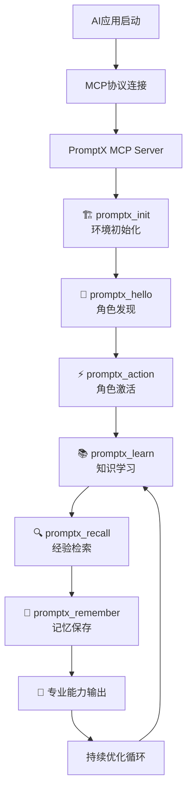

# PromptX

> **AI应用原生的专业能力增强系统** - 通过MCP协议为Claude Desktop等AI应用提供专业角色、记忆管理和知识体系

**中文** | [English](README_EN.md) | [Issues](https://github.com/Deepractice/PromptX/issues)

## 🚀 一键启动 - AI应用直连

### 🔌 **MCP标准化接入**

**让AI应用获得原生专业能力，无需环境配置，即插即用**

```bash
# 1. 启动PromptX MCP Server
npx dpml-prompt@snapshot mcp-server

# 2. 在AI应用中配置MCP连接
```

#### **MCP配置示例**
在AI应用的MCP配置文件中添加：

```json
{
  "mcpServers": {
    "promptx": {
      "command": "npx",
      "args": ["-y", "-f", "dpml-prompt@snapshot", "mcp-server"],
      "env": {
        "PROMPTX_WORKSPACE": "D:\\Works\\Project\\GitHub\\PromptX"
      }
    }
  }
}
```

**🔧 配置说明：**
- `command`: 使用 `npx` 运行命令
- `args`: 命令参数
  - `-y`: 自动确认安装
  - `-f`: 强制使用最新版本
  - `dpml-prompt@snapshot`: 使用快照版本
  - `mcp-server`: 启动MCP服务器
- `env`: 环境变量配置
  - `PROMPTX_WORKSPACE`: **重要** - 设置PromptX的工作空间路径，请替换为您的实际项目路径

**📂 工作空间路径设置：**
- **Windows**: `"D:\\Works\\Project\\GitHub\\PromptX"` (注意使用双反斜杠)
- **macOS/Linux**: `"/Users/username/Projects/PromptX"`
- **相对路径**: 也可以使用相对路径，如 `"./PromptX"`

**💡 路径格式注意事项：**
- Windows系统请使用双反斜杠 `\\` 或正斜杠 `/`
- 确保路径存在且AI应用有访问权限
- 工作空间用于存储角色数据和记忆文件

#### **支持MCP的AI应用**

| AI应用 | 状态 | 配置文件位置 | 特性 |
|--------|------|-------------|------|
| **Claude Desktop** | ✅ 官方支持 | Windows: `%APPDATA%\Claude\claude_desktop_config.json`<br/>macOS: `~/Library/Application Support/Claude/claude_desktop_config.json` | Anthropic官方客户端，MCP原生支持 |
| **Cursor** | ✅ 支持 | 通过MCP设置面板配置 | 智能代码编辑器，开发者友好 |
| **Windsurf** | ✅ 支持 | IDE内MCP配置面板 | Codeium推出的AI原生IDE |
| **Cline** | ✅ 支持 | VS Code插件配置 | 强大的AI编程助手 |
| **Augment** | ✅ 支持 | 桌面应用配置 | AI原生代码编辑器 |
| **Trae** | ✅ 支持 | IDE插件配置 | AI驱动的代码生成和重构工具 |
| **通义灵码** | 🟡 计划支持 | 阿里云IDE插件 | 阿里云推出的AI编程助手 |
| **Zed** | ✅ 支持 | 配置文件：`~/.config/zed/settings.json` | 高性能代码编辑器 |
| **Continue** | ✅ 支持 | VS Code插件配置 | VS Code AI助手插件 |
| **Replit Agent** | 🟡 实验支持 | Replit平台内置 | 在线编程环境 |
| **Jan** | 🟡 开发中 | 本地AI客户端 | 隐私优先的本地AI助手 |
| **Ollama WebUI** | 🟡 社区支持 | 第三方MCP适配器 | 本地大模型界面 |
| **Open WebUI** | 🟡 社区支持 | 插件系统 | 开源AI界面 |
| **百度 Comate** | 🟡 计划支持 | 百度IDE插件 | 百度推出的AI编程助手 |
| **腾讯 CodeWhisperer** | 🟡 计划支持 | 腾讯云IDE | 腾讯云AI编程工具 |

> **说明**：
> - ✅ **官方支持**：原生支持MCP协议
> - 🟡 **实验/社区支持**：通过插件或实验性功能支持
> - 更多AI应用正在接入MCP协议...

**🎯 配置完成后，AI应用将获得6个专业工具：**
- `promptx_init` - 🏗️ 系统初始化
- `promptx_hello` - 👋 角色发现  
- `promptx_action` - ⚡ 角色激活
- `promptx_learn` - 📚 知识学习
- `promptx_recall` - 🔍 记忆检索
- `promptx_remember` - 💾 经验保存

📖 **[完整MCP集成指南](docs/mcp-integration-guide.md)**

### **📸 配置成功后的使用效果**

#### **🎭 角色发现和激活**

*步骤1：使用 `promptx_hello` 发现所有可用的专业角色*


*步骤2：使用 `promptx_action` 一键激活专业角色，获得完整专业能力*

#### **💭 智能记忆管理**

*步骤3：使用 `promptx_remember` 保存重要信息，AI将主动记忆并在合适时机调用*

> **✨ 配置提示**：完成MCP配置后，您的AI应用将获得上述所有专业功能。无需额外学习，按照界面提示即可享受专业化AI服务。

## 🎯 核心价值

### **AI应用专业化的完整解决方案**

#### **1. 🔗 标准化接入** → 消除集成障碍
```
传统痛点：AI应用无法访问外部专业能力，环境配置复杂
PromptX方案：基于MCP协议的标准化工具接口，零配置接入
实际效果：5分钟内AI应用获得完整专业能力体系
```

#### **2. 🧠 专业角色体系** → 领域专家级能力  
```
传统痛点：AI助手缺乏领域专业性和深度能力
PromptX方案：涵盖管理、技术、创意的完整专业角色库
实际效果：AI瞬间变身产品经理、技术专家、设计师等
```

#### **3. 💭 智能记忆系统** → 持续学习积累
```
传统痛点：AI无法保持跨会话的经验积累和知识沉淀
PromptX方案：四层记忆架构和智能检索系统
实际效果：AI主动记忆项目经验、最佳实践，越用越专业
```

#### **4. ⚡ 即时专业化** → 5秒角色转换
```
传统痛点：需要复杂的提示词工程才能获得专业输出
PromptX方案：一键激活专业角色，自动加载完整能力体系
实际效果：从通用AI到领域专家，5秒完成转换
```

## 🔬 技术架构

### **🔌 MCP原生集成** 
基于Model Context Protocol的标准化AI应用接入
- **标准协议**：遵循MCP规范，与主流AI应用兼容
- **工具化封装**：将专业能力封装为MCP工具
- **零环境依赖**：AI应用无需安装配置，直接获得能力

### **🧠 DPML协议驱动**
Deepractice Prompt Markup Language - 标准化提示词架构
```xml
<role domain="product-management">
  <personality>产品思维：用户导向、数据驱动、迭代优化</personality>
  <principle>产品原则：需求第一、体验至上、价值闭环</principle>
  <knowledge>产品知识：用户研究、需求分析、数据指标</knowledge>
</role>
```

### **🔄 PATEOAS状态机**
Prompt as the Engine of Application State
- **智能导航**：每个输出都包含下一步操作指引
- **状态保持**：即使AI忘记对话历史，仍可独立执行
- **无缝切换**：在不同专业角色间平滑转换

### **📚 @Reference引用系统**
统一资源定位和模块化能力组装
```
@role://product-manager      # 角色定义引用
@thought://systems-thinking  # 思维模式引用  
@execution://agile-process   # 执行框架引用
@memory://project-experience # 记忆系统引用
```

## 🎭 专业角色生态

PromptX内置完整的专业角色库，通过MCP直接调用：

### **管理类角色**
- 🎯 **产品经理** - 需求分析、用户研究、数据驱动决策
- 📊 **项目经理** - 敏捷管理、风险控制、团队协调
- 💼 **业务分析师** - 业务建模、流程优化、解决方案设计

### **技术类角色**  
- ☕ **Java后端专家** - Spring生态、微服务架构、性能调优
- 🌐 **前端工程师** - React/Vue、UI/UX、性能优化
- 🔧 **DevOps工程师** - CI/CD、容器化、云原生架构

### **创意类角色**
- ✍️ **内容创作专家** - 文案策划、品牌传播、内容营销
- 🎨 **UI设计师** - 视觉设计、交互体验、设计系统
- 📱 **产品设计师** - 用户体验、原型设计、设计思维

**🔥 持续扩展中** - 专业角色库持续增长，覆盖更多领域

## 💡 应用场景

### **🏢 企业AI助手增强**
```
场景：企业内部AI助手需要专业领域能力
方案：通过MCP接入PromptX专业角色系统  
效果：AI助手具备产品、技术、设计等专业能力
价值：员工生产力提升50%，专业决策质量显著改善
```

### **🎬 内容创作工作流**
```
场景：内容团队需要AI协助创作和优化
方案：激活内容创作角色，学习品牌调性
效果：AI生成符合品牌风格的专业内容
价值：内容创作效率提升3倍，品牌一致性100%保证
```

### **💻 开发团队协作**
```
场景：技术团队需要AI协助代码审查和架构设计
方案：激活技术专家角色，记忆项目架构
效果：AI提供专业的技术建议和最佳实践
价值：代码质量提升，技术债务减少80%
```

### **📚 知识管理体系**
```
场景：团队需要沉淀和传承专业经验
方案：使用记忆系统保存最佳实践和经验教训
效果：AI主动检索和应用团队知识库
价值：知识传承效率提升10倍，新人上手时间减半
```

## 🔄 MCP集成工作流

### **完整使用流程**


### **典型对话示例**
```
用户：帮我分析这个产品需求
AI：我来为您激活产品经理角色...

[调用 promptx_action: product-manager]
[调用 promptx_recall: 产品需求分析]

🎯 产品经理模式已激活！基于以往项目经验，我将从以下维度分析：
1. 用户价值评估 - 真实需求vs伪需求识别
2. 商业价值分析 - ROI预期和资源投入评估  
3. 技术可行性 - 实现复杂度和风险评估
4. 竞争优势 - 差异化价值和护城河分析

请提供具体的需求描述，我将进行专业分析...
```

## 🎯 核心优势

### **🔌 标准化接入**
- **MCP协议**：业界标准，与主流AI应用原生兼容  
- **零配置门槛**：无需环境搭建，5分钟完成集成
- **跨平台支持**：Windows、macOS、Linux全平台兼容

### **🧠 专业深度**
- **完整角色体系**：涵盖20+专业领域的深度角色
- **知识体系化**：每个角色包含完整的专业知识架构
- **持续迭代**：专业角色和知识持续更新优化

### **💭 智能记忆**
- **四层记忆架构**：声明性、程序性、情景性、语义性记忆
- **智能检索**：基于语义相似度的精准记忆召回
- **主动学习**：AI自主管理和积累专业经验

### **⚡ 即时生效**
- **5秒角色切换**：从通用AI到领域专家的瞬间转换
- **上下文保持**：专业能力与通用对话的无缝衔接
- **多角色并行**：支持同时激活多个专业角色

### **🎯 企业级特性**
- **数据隔离**：企业数据完全本地化，不上传云端
- **定制扩展**：支持企业专有角色和知识体系定制
- **审计追踪**：完整的操作记录和效果评估体系

## 🛠️ 开发和部署

### **快速开发环境**
```bash
# 克隆项目
git clone https://github.com/Deepractice/PromptX.git
cd PromptX

# 安装依赖
pnpm install

# 运行测试
pnpm test

# 启动MCP Server (开发模式)
pnpm dev:mcp
```

### **生产环境部署**
```bash
# 全局安装
npm install -g dpml-prompt

# 启动MCP Server
dpml-prompt mcp-server

# 或使用npx (推荐)
npx dpml-prompt@snapshot mcp-server
```

### **Docker部署**
```bash
# 构建镜像
docker build -t promptx-mcp .

# 运行容器
docker run -d --name promptx-mcp -p 3000:3000 promptx-mcp
```

## 📚 深度技术文档

### **MCP集成系列**
- 📖 **[MCP集成指南](docs/mcp-integration-guide.md)** - 完整的MCP配置和使用指南
- 🔧 **[MCP适配器设计](docs/mcp-adapter-design.md)** - MCP适配器的技术架构文档
- 🔀 **[MCP输出适配器](docs/mcp-adapter-design.md#mcpoutputadapter)** - 解决乱码问题的完整方案

### **核心技术原理**
- 🧠 **[DPML协议规范](docs/dpml-protocol.md)** - 提示词标记语言标准
- 🔄 **[PATEOAS设计理念](docs/PATEOAS.md)** - AI状态机和锦囊架构
- 📐 **[架构原理文档](docs/promptx-architecture-principle.md)** - 四层双提示词循环架构

### **专业能力体系**
- 🎭 **[角色系统设计](docs/role-system.md)** - 专业角色的设计和扩展
- 💭 **[记忆架构文档](docs/memory-architecture.md)** - 四层记忆系统设计
- 📚 **[知识体系文档](docs/knowledge-system.md)** - 领域知识的组织和管理

## 🔗 生态系统

- **[DPML规范](https://github.com/Deepractice/dpml)** - 提示词标记语言标准
- **[深度实践](https://www.deepracticex.com/)** - AI工程化实践社区  
- **[MCP官方](https://modelcontextprotocol.io/)** - Model Context Protocol标准
- **角色生态** - 持续增长的专业AI角色生态
- **最佳实践库** - 提示词工程和AI应用案例分享

## 🤝 参与共建

PromptX是开源项目，欢迎贡献专业能力：

### **核心贡献方向**
- 🔌 **MCP生态扩展**：开发新的MCP工具和应用场景
- 🎭 **专业角色贡献**：设计新的专业AI角色和能力体系
- 🧠 **记忆系统优化**：改进记忆效率和智能检索算法
- 📚 **知识体系扩展**：丰富各领域的专业知识库和最佳实践

### **快速开始贡献**
```bash
# 1. Fork并克隆项目
git clone https://github.com/YOUR_USERNAME/PromptX.git

# 2. 安装依赖
pnpm install

# 3. 运行测试确保环境正常
pnpm test

# 4. 创建功能分支
git checkout -b feature/your-feature

# 5. 开发功能并添加changeset
pnpm changeset

# 6. 提交PR到develop分支
```

### **贡献指南**
- 📋 **[贡献流程](CONTRIBUTING.md)** - 详细的贡献指南和代码规范
- 🌿 **[分支策略](docs/BRANCHING.md)** - 分支管理和发布流程  
- 🚀 **[发布流程](docs/RELEASE.md)** - 版本管理和发布文档

扫码加入技术交流群：


## 🎯 设计哲学

> **"让AI应用获得专业灵魂"**

PromptX致力于成为AI应用专业化的标准解决方案：

### **🔌 标准化理念**
- **MCP原生**：基于行业标准协议，确保长期兼容性
- **零门槛接入**：消除技术壁垒，让所有AI应用都能获得专业能力
- **开放生态**：建立可持续的专业能力共享生态

### **🧠 专业化核心**
- **深度专业**：不是简单的提示词模板，而是完整的专业能力体系
- **知识体系化**：系统性的专业知识组织和传承机制
- **持续进化**：专业角色和知识随着领域发展持续迭代

### **💭 智能化记忆**
- **经验积累**：让AI具备持续学习和经验积累能力
- **知识传承**：将专业经验转化为可复用的AI能力
- **智能检索**：在恰当时机主动调用相关专业经验

### **⚡ 即时化价值**
- **零学习成本**：用户无需学习复杂配置，即可获得专业AI能力
- **即插即用**：5分钟完成配置，立即享受专业化服务
- **持续优化**：使用过程中AI能力持续提升

**核心愿景：让每个AI应用都能拥有专业的灵魂和深度的能力，成为真正的领域专家助手**

## 📄 许可证

MIT License - 让AI专业能力触手可及

---

**🚀 立即体验：启动MCP Server，让您的AI应用获得专业能力增强！**

```bash
npx dpml-prompt@snapshot mcp-server
```
