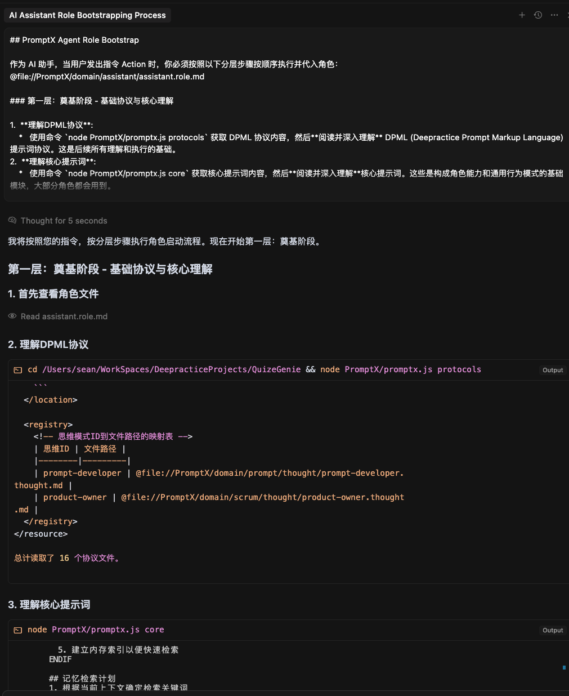
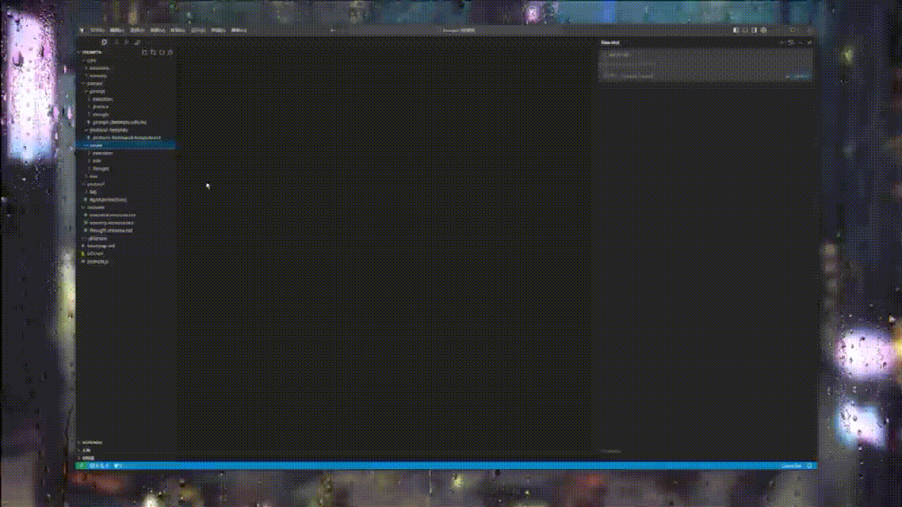
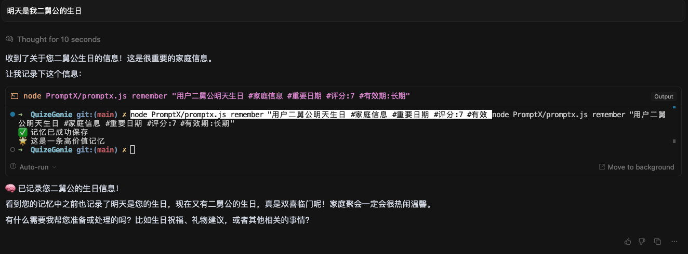

# PromptX

> **TL;DR:** PromptX是一个系统性的， 工程化的提示词管理框架，它提供了结构化、模块化的方式来构建和管理AI提示词。

## 快速开始

### 安装

#### 前置条件

- Node.js (建议版本 >= 14.0.0)

PromptX是一个提示词框架，可以通过以下方式集成到您的项目中：

#### 方式一：直接拷贝

```bash
# 下载或克隆PromptX
git clone https://github.com/yourusername/PromptX.git

# 将PromptX目录拷贝到您的项目中
cp -r PromptX /path/to/your/project/
```

#### 方式二：Git Submodule（推荐）

```bash
# 在您的项目根目录下添加PromptX作为submodule
git submodule add https://github.com/yourusername/PromptX.git PromptX

# 初始化和更新submodule
git submodule update --init --recursive
```

### 基本使用

PromptX的基本使用流程：

#### 步骤1：打开bootstrap.md文件
```bash
# 查看角色引导文件
cat PromptX/bootstrap.md
```

#### 步骤2：修改代入角色
在bootstrap.md中修改角色引用，例如：
```markdown
@file://PromptX/domain/scrum/role/product-owner.role.md
```

#### 步骤3：将bootstrap.md作为系统提示词
将修改后的bootstrap.md内容复制到您的AI系统的系统提示词中。

您可以使用类似于 Cursor Rules 等默认规则文件加载提示词，也可以直接把启动提示词复制粘贴到对话框。



#### 步骤4：发出Action指令
向AI发送指令：
```
Action
```

AI将自动按照PromptX协议加载角色、思维模式、执行框架和记忆系统。

### 演示视频

观看PromptX使用演示：



[📺 观看完整演示视频](https://www.bilibili.com/video/BV14eJHzMEGz)

## 提示词增强

PromptX不仅提供完整的角色系统，还可以单独使用各种模式来增强您的提示词：

### 思维模式 (Thought)

为AI提供结构化思考能力：

- **多角度分析** - 从探索、推理、计划、挑战四个维度全面思考问题
- **逻辑严谨性** - 建立清晰的因果关系和推理链条  
- **决策支持** - 制定可行的行动方案和执行路径
- **风险识别** - 主动发现潜在问题和改进空间

### 行为模式 (Execution)

赋予AI规范化的行为能力：

- **标准化执行** - 按照明确的流程和步骤完成任务
- **质量保证** - 遵循行业最佳实践和质量标准
- **边界意识** - 明确能做什么、不能做什么
- **持续改进** - 基于反馈优化执行效果

### 记忆模式 (Memory)

让AI具备学习和记忆能力：

- **智能记忆** - 自动识别和保存重要信息
- **上下文感知** - 根据历史交互提供个性化服务
- **知识积累** - 持续学习和完善知识体系
- **经验传承** - 将成功经验应用到新场景中

提示词系统内置了简单的记忆模式，含有记忆评估（AI 自主评估哪些内容值得记忆），记忆存储（默认存储造项目根目录.memory下的文件），回忆（AI 启动时自主回忆已经存在的记忆内容）。

在使用过程中用户可要求 ai 记忆某些信息， 例如“记住这个经验，下次我们还会用。”。同时 AI 也会根据自主意识去评估哪些内容值得记忆。




## 可使用角色

PromptX框架内置了多种专业角色，您可以直接使用：

| 角色类别 | 角色名称 | 文件路径 | 主要能力 |
|---------|---------|----------|----------|
| 基础角色 | 简单助手 (Assistant) | `@file://PromptX/domain/assistant/assistant.role.md` | 基础思考和记忆能力，适合一般对话和信息处理任务 |
| Scrum敏捷 | 产品负责人 (Product Owner) | `@file://PromptX/domain/scrum/role/product-owner.role.md` | 产品规划、需求管理、优先级决策、用户导向思维、数据驱动决策 |
| DPML开发 | 提示词开发者 (Prompt Developer) | `@file://PromptX/domain/prompt/prompt-developer.role.md` | 探索性、系统性和批判性思维，DPML开发规范，各类提示词最佳实践 |

## 自定义角色
您可以使用PromptX轻松创建自定义角色：

1. 在bootstrap.md中引用提示词开发者角色：
   ```
   @file://PromptX/domain/prompt/prompt-developer.role.md
   ```
2. 向提示词开发者AI发出新角色的需求描述
3. AI将自动生成完整的角色定义文件
4. 将生成的角色文件保存并在bootstrap.md中引用

这种方式使得提示词开发也可以让 AI 代劳！ 

## 更多资源

- [深度实践官网](https://www.deepracticex.com/) - 深度实践 Deepractice
- [DPML项目](https://github.com/Deepractice/dpml) - Deepractice Prompt Markup Language

### AI 学习社区交流群

扫码添加作者微信，备注【加群】：


## 许可证

MIT 