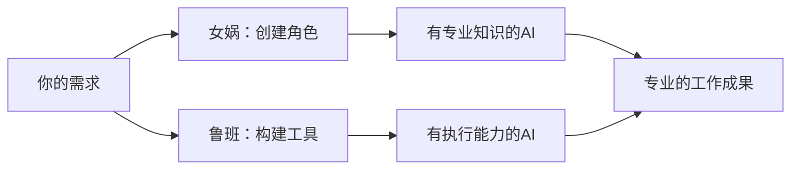

<div align="center">
  
  <h1>PromptX · 领先的AI上下文工程平台</h1>
  <h2>✨ Chat is all you need - 革命性交互设计，让AI Agent秒变行业专家</h2>
  <p><strong>核心能力：</strong>AI角色创造平台 | 智能工具开发平台 | 认知记忆系统</p>
  <p>基于MCP协议，一行命令为Claude、Cursor等AI应用注入专业能力</p>

<!-- Badges -->

<p>
    <a href=" "></a>
    <a href="https://www.npmjs.com/package/@promptx/cli"></a>
    <a href="LICENSE"></a>
    
  </p>

<p>
    <strong><a href="README.zh-Hans.md">简体中文</a></strong> | 
    <a href="README.zh-Hant.md">繁體中文</a> | 
    <a href="README.md">English</a> | 
    <a href="https://github.com/Deepractice/PromptX/issues">Issues</a>
  </p>
</div>

---

## 💬 Chat is All you Need - 自然对话，瞬间专业

### ✨ 三步体验 PromptX 魔力

#### 🔍 **第一步：发现专家**

```
用户：「我要看看有哪些专家可以用」
AI：   立即展示23个可用角色，从产品经理到架构师应有尽有
```

#### ⚡ **第二步：召唤专家**

```
用户：「我需要一个产品经理专家」
AI：   瞬间变身专业产品经理，获得完整专业知识和工作方法
```

#### 🎯 **第三步：专业对话**

```
用户：「帮我重新设计产品页面」
AI：   以专业产品经理身份，提供深度产品策略建议
```

### 🚀 为什么这是革命性的？

**❌ 传统方式：**

- 学习复杂指令语法
- 记住各种参数配置
- 担心说错话导致失效

**✅ PromptX方式：**

- 像和真人专家聊天一样自然
- 想怎么说就怎么说，AI理解你的意图
- 专家状态持续对话期间保持有效

### 💡 核心理念

> **把AI当人，不是软件**
>
> 不需要"正确指令"，只需要自然表达。AI会理解你想要什么专家，并瞬间转换身份。

---

## ⚡ 立即开始 - 两种方式任选

### 🎯 方式一：PromptX 客户端（推荐）

**适合所有用户 - 一键启动，零配置**

1. **[下载客户端](https://github.com/Deepractice/PromptX/releases/latest)** - 支持 Windows、Mac、Linux
2. **启动HTTP服务** - 打开客户端，自动运行MCP服务器
3. **配置AI应用** - 将以下配置添加到你的Claude/Cursor等AI工具：

   ```json
   {
     "mcpServers": {
       "promptx": {
         "type": "streamable-http",
         "url": "http://127.0.0.1:5203/mcp"
       }
     }
   }
   ```
4. **开始对话** - 在AI应用中说"我要看看有哪些专家"

✅ 无需技术背景 ✅ 可视化管理 ✅ 自动更新

### 🔧 方式二：直接运行（开发者）

**有Node.js环境的开发者可以直接使用：**

```json
{
  "mcpServers": {
    "promptx": {
      "command": "npx",
      "args": ["-y", "@promptx/mcp-server"]
    }
  }
}
```

### 🐳 方式三：Docker（生产就绪）

**使用Docker部署PromptX到生产环境：**

```bash
docker run -d -p 5203:5203 -v ~/.promptx:/root/.promptx deepracticexs/promptx:latest
```

📚 **[完整Docker文档 →](./docker/README.md)**

---

## 🎨 **女娲与鲁班 - PromptX创造双子星**

### 🎭 **女娲 - AI角色设计师**
<div align="center">
  
</div>

**一句话，一个专家。自然语言创造专业AI角色。**

<div align="center">

| 💭 **你说** | 🎭 **女娲创造** | ✨ **结果** |
|---|---|---|
| "我需要一个既懂代码又懂产品的人" | 技术产品经理角色，双重专业能力 | AI瞬间成为TPM，兼具工程与产品思维 |
| "创建一个Python专家，像耐心的导师一样教学" | Python导师角色，内置教学方法论 | AI变身编程教育专家，循序渐进引导学习 |
| "我想要一个写作风格像海明威的AI" | 文学写作专家，风格分析能力 | AI采用简洁有力的写作风格 |

</div>

### 🔧 **鲁班 - 工具集成大师**
<div align="center">
  
</div>

**任何API，任何平台。3分钟从凭证到可用工具。**

<div align="center">

| 💭 **你说** | 🔧 **鲁班构建** | ✨ **结果** |
|---|---|---|
| "连接我们的企业微信" + webhook地址 | 企微通知工具，支持群组定向 | AI可以发送消息到任何企微群 |
| "让AI查询我们的PostgreSQL" + 连接串 | 数据库工具，安全只读查询 | AI执行SQL并分析数据 |
| "集成OpenAI的API" + API密钥 | AI平台工具，模型切换能力 | AI可以串联多个AI服务 |

</div>

### 🚀 **为什么这改变一切**

**传统AI：** 你学提示词 → 你指导AI → 你验证结果 → 你修正错误

**有了女娲和鲁班：** 你描述需求 → AI成为专家 → AI使用工具 → 工作完成

---

<div align="center">



**魔力所在：女娲赋予AI知识，鲁班赋予AI能力。**

</div>

---

## ⭐ **Star增长趋势**

<div align="center">

[](https://star-history.com/#Deepractice/PromptX&Date)

</div>

---

## 🏢 **关于我们**

<div align="center">

**由 [Deepractice 深度实践](https://github.com/Deepractice) 出品**

*让AI成为你的专业伙伴*

🌐 [官网](https://deepractice.ai) | 🔧 [GitHub](https://github.com/Deepractice) | 📚 [文档中心](https://docs.deepractice.ai) | 💬 [论坛](https://x.deepractice.ai) | 🚀 [中转站服务](https://router.deepractice.ai)

### 代码签名

Windows 桌面应用程序代码签名由 [SignPath.io](https://signpath.io) 提供，证书由 [SignPath Foundation](https://signpath.org) 签发。

</div>

---

### 📱 联系作者


**扫码添加开发者微信，获取技术支持与合作洽谈**

</div>
