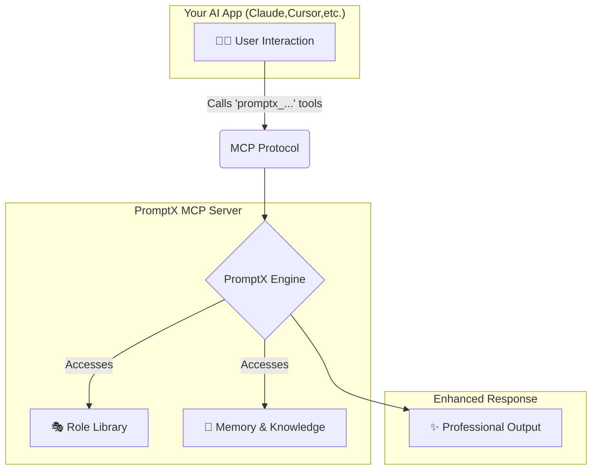

<div align="center">
  
  <h1>PromptX · AI-native Professional Capability Enhancement System</h1>
  <p>Provides specialized roles, memory management, and knowledge systems for AI applications through MCP protocol. One command to transform any AI client into a professional powerhouse.</p>

  <!-- Badges -->
  <p>
    <a href=" "></a>
    <a href="https://www.npmjs.com/package/dpml-prompt"></a>
    <a href="LICENSE"></a>
    <a href="https://github.com/Deepractice/PromptX/actions"></a>
  </p>
  
  <p>
    <a href="README.md">中文</a> | 
    <strong><a href="README_EN.md">English</a></strong> | 
    <a href="https://github.com/Deepractice/PromptX/issues">Issues</a>
  </p>
</div>

---

### ✨ **Understanding PromptX at a Glance**

What can PromptX do? Simply put, it gives your AI assistant a "brain" and "memory."

- **🎭 Professional Role-Playing**: Provides expert roles across different domains, making AI responses more professional and in-depth.
- **🧠 Long-term Memory & Knowledge Base**: AI can remember key information and your preferences, providing coherent and personalized support in ongoing conversations and work.
- **🔌 Easy Integration**: With just one command, seamlessly enable these powerful features for dozens of mainstream AI applications (like Claude, Cursor).

<br/>

### 📸 **Usage Effects After Configuration**

#### **1. Discover and Activate Professional Roles**
*Use `promptx_hello` to discover available roles, then `promptx_action` to activate them, instantly transforming your AI into a domain expert.*


#### **2. Intelligent Memory**
*Use `promptx_remember` to save key information, and AI will proactively apply this knowledge in subsequent interactions.*


---

## ⚠️ **Project Status Notice**

PromptX is currently in the **early development stage**, and we are actively improving features and fixing issues. Before reaching the official stable version, you may encounter some usage issues or instability.

**We sincerely ask for your understanding and support!** 🙏

### 📞 **Need Help? Get Support!**

If you encounter any issues during usage, please contact us through:

- 🐛 **Submit Issue**: [GitHub Issues](https://github.com/Deepractice/PromptX/issues) - Describe the problem in detail, we'll respond promptly
- 💬 **Direct Contact**: Add developer WeChat `sean-xie-deepractice` for immediate assistance
- 📱 **Tech Community**: Scan the QR code below to join our technical discussion group

Your feedback is invaluable to us and helps us improve product quality rapidly! ✨

---

## 🚀 **Quick Start - 30-Second Setup**

Open your configuration file and copy the `promptx` configuration code below. This is the simplest **zero-configuration mode**, where PromptX automatically handles everything for you.

```json
{
  "mcpServers": {
    "promptx": {
      // Use npx to run promptx service
      "command": "npx",
      // Startup parameters configuration
      "args": [
        "-y",                               // Auto-confirm
        "-f",                               // Force refresh cache
        "--registry",                       // Specify registry
        "https://registry.npmjs.org",       // Use official registry
        "dpml-prompt@beta",                 // Use stable beta version
        "mcp-server"                        // Start service
      ]
    }
  }
}
```

**🎯 It's that simple!** Save the file and restart your AI application, and PromptX is successfully activated.

> **💡 Tip:** The configuration specifically uses the official registry `registry.npmjs.org` to avoid installation issues caused by unofficial mirrors. If you find the installation slow, it's recommended to use a proxy tool for acceleration rather than switching to alternative mirrors.

### 🌐 **Advanced Configuration: HTTP Mode Support**

In addition to the local mode above, PromptX also supports **HTTP mode**, suitable for remote deployment or special network environments:

```bash
# Start HTTP mode server
npx -f -y dpml-prompt@beta mcp-server --transport http --port 3000
```

Then use in client configuration:
```json
{
  "mcpServers": {
    "promptx": {
      "url": "http://localhost:3000/mcp"
    }
  }
}
```

📖 **[Complete Installation & Configuration Guide](https://github.com/Deepractice/PromptX/wiki/PromptX-MCP-Install)** - Detailed configuration methods for various clients and troubleshooting

<br/>

---

### ⚙️ **How It Works**

PromptX acts as a "professional capability middleware" between you and your AI application, communicating through the standard [MCP protocol](https://github.com/metacontroller/mcp).



When you call the `promptx_...` series of tools, your AI application sends the request via the MCP protocol to PromptX. The PromptX engine loads the appropriate professional roles, retrieves relevant memories, and then returns a professionally enhanced result to your AI application, which is ultimately presented to you.

---

### New to MCP? [Watch MCP Tutorial on BiliBili](https://www.bilibili.com/video/BV1HFd6YhErb)

All AI clients that support the MCP protocol can use PromptX. This includes major applications like **Claude Desktop**, **Cursor**, **Windsurf**, **Cline**, **Zed**, **Continue**, and many more mainstream AI development tools that are integrating MCP support.

**🎯 After configuration, your AI application will automatically gain 6 professional tools:**
- `promptx_init`: 🏗️ **System Initialization** - Automatically prepares the working environment.
- `promptx_hello`: 👋 **Role Discovery** - Browse all available expert roles.
- `promptx_action`: ⚡ **Role Activation** - Transform into an expert in a specific domain with one click.
- `promptx_learn`: 📚 **Knowledge Learning** - Have AI learn specific knowledge or skills.
- `promptx_recall`: 🔍 **Memory Retrieval** - Look up historical information from the memory repository.
- `promptx_remember`: 💾 **Experience Saving** - Store important information in long-term memory.

📖 **[Complete MCP Integration Guide](docs/mcp-integration-guide.md)**

---

## 📋 **Practice Cases: Legacy Lands Library**

<div align="center">
  
</div>

#### 📖 Project Overview

**Project Name:** Legacy Lands Library  
**Project URL:** https://github.com/LegacyLands/legacy-lands-library  
**Project Description:** legacy-lands-library is a development toolkit library for modern Minecraft server plugin development. It aims to provide developers with a cross-platform, production-ready infrastructure.

#### 🏢 Organization Information

**Organization Name:** Legacy Lands Development Team  
**Official Website:** https://www.legacylands.cn/  
**Organization Description:** Legacy Lands is an innovative team focused on building large-scale Minecraft civilization simulation experiences. They participate in the open-source community, providing elegant, efficient, and reliable solutions for Minecraft server plugin development and other domains.

> #### **💡 Core Developer Experience**
> "The development experience with PromptX is truly different. Our team, using Claude Code combined with PromptX, had one developer complete over eleven thousand lines of high-quality Java code in just three days.
>
> The value of this workflow is fully demonstrated in actual development. PromptX solves many pain points in AI usage, consistently ensuring code style uniformity and quality standards, greatly reducing the learning curve for new team members. Best practices that previously required repeated communication and documentation inheritance can now naturally integrate into every code generation."

#### **📚 Related Resources**

- **AI Integration Standards and Practice Guide:** https://github.com/LegacyLands/legacy-lands-library/blob/main/AI_CODE_STANDARDS_ZHCN.md

---

## ⭐ **Star Growth Trend**

[](https://star-history.com/#Deepractice/PromptX&Date)

---

### **🤝 Contributing and Communication**

We welcome any form of contribution and feedback!

- 🌿 **[Branching Strategy](docs/BRANCHING.md)** - Branch management and release process  
- 🚀 **[Release Process](docs/RELEASE.md)** - Version management and release documentation

Join our technical community:


---

## 📄 **License**

[MIT License](LICENSE) - Making AI professional capabilities accessible

---

**🚀 Get Started Now: Launch PromptX MCP Server and enhance your AI application with professional capabilities!**