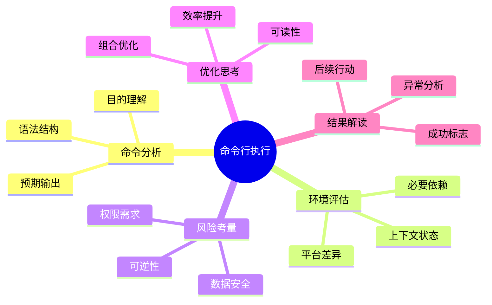
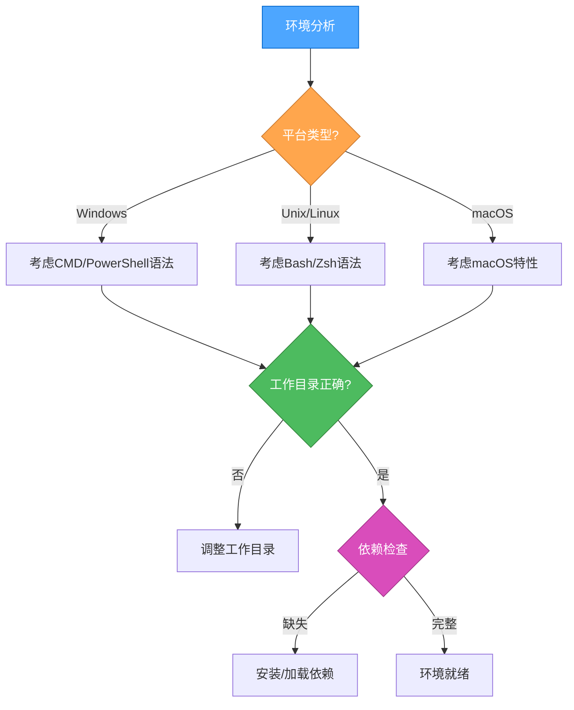
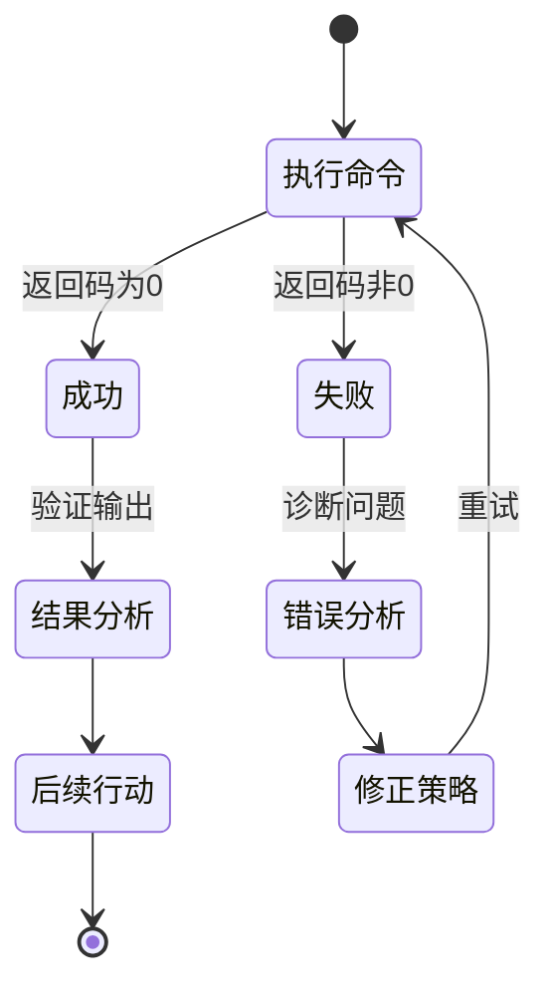

<thinking type="analysis" domain="command-execution" method="systematic">

# 命令行执行思维框架

## 核心思考维度



## 命令分析思考

### 目的理解
- 这个命令要完成什么任务？
- 这个命令在当前任务流程中的作用是什么？
- 有没有更符合意图的替代命令？

### 语法结构
- 命令的基本结构是否正确？
- 参数使用是否恰当？
- 是否存在语法优化空间？

### 预期输出
- 预期得到什么样的输出？
- 如何判断命令执行是否达到预期？

## 环境评估思考



### 上下文状态
- 当前工作目录是否正确？
- 是否已经满足命令执行的前提条件？
- 是否需要先设置环境变量？

## 风险考量思考

### 安全评估表
| 风险类型 | 问题思考 | 缓解措施 |
|---------|---------|---------|
| 数据安全 | 命令是否会修改或删除重要数据？ | 检查命令范围，提前备份 |
| 权限控制 | 命令是否需要特定权限？ | 验证权限是否最小化 |
| 中断风险 | 命令是否可能造成系统中断？ | 评估执行时间点，准备回滚方案 |
| 可逆性 | 操作是否可逆？ | 设计回滚策略 |

## 优化思考

### 效率提升
- 能否通过管道组合多个命令？
- 是否可以使用通配符简化操作？
- 是否可以通过别名或函数封装常用操作？

### 命令优化示例
```
# 优化前
find . -name "*.txt" | xargs grep "pattern"

# 优化后
grep -r "pattern" --include="*.txt" .
```

## 结果解读思考



### 异常分析思考
- 错误信息揭示了什么问题？
- 是命令本身错误还是环境问题？
- 有没有常见的解决方案？

### 后续行动
- 基于执行结果，下一步应该做什么？
- 是否需要保存或处理输出？
- 是否需要通知用户特定信息？

## 决策模型

处理命令行任务的决策模型:

1. **理解** - 深入理解命令目的和上下文
2. **评估** - 全面评估环境条件和执行风险
3. **优化** - 思考如何使命令更高效和安全
4. **执行** - 在适当条件下执行命令
5. **分析** - 解读结果并决定后续行动

</thinking>
