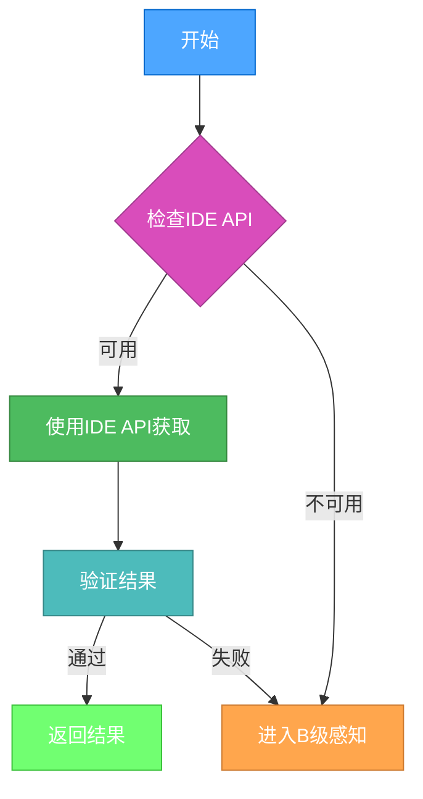

<executing mode="sequential" context="system">

# 项目根目录感知执行流程

## 感知执行阶段

### A级感知（高可靠性）


1. IDE API调用
```javascript
const rootDir = cursor.getWorkspaceRoot();
```

2. 结果验证
```bash
[ -d "${ROOT_DIR}" ] && [ -r "${ROOT_DIR}" ] && [ -x "${ROOT_DIR}" ]
```

### B级感知（中等可靠性）

1. 版本控制检测
```bash
find . -name ".git" -type d -exec dirname {} \; 2>/dev/null | head -n 1
```

2. 包管理文件检测
```bash
find . \( -name "package.json" -o -name "pom.xml" -o -name "requirements.txt" \) -type f -exec dirname {} \; 2>/dev/null | head -n 1
```

3. 项目配置文件检测
```bash
find . -name ".projectrc" -type f -exec dirname {} \; 2>/dev/null | head -n 1
```

### C级感知（低可靠性）

用户交互确认（仅在A、B级方法都失败时使用）
```bash
echo "请确认项目根目录是否为: $PWD [Y/n]"
read confirmation
```

## 验证阶段

1. 路径存在性验证
```bash
[ -d "${ROOT_DIR}" ]
```

2. 权限验证
```bash
[ -r "${ROOT_DIR}" ] && [ -x "${ROOT_DIR}" ]
```

3. 项目标志验证
```bash
[ -e "${ROOT_DIR}/.git" ] || [ -e "${ROOT_DIR}/package.json" ] || [ -e "${ROOT_DIR}/pom.xml" ]
```

4. 路径合法性验证
```bash
[[ "${ROOT_DIR}" =~ ^[/][a-zA-Z0-9._/-]+$ ]]
```

## 异常处理

1. IDE API不可用
- 降级到B级感知方法
- 记录错误信息并继续

2. 验证失败
- 尝试下一级感知方法
- 记录失败原因并继续

## 更新策略

1. 自动更新触发条件
- 会话开始时
- 工作目录变更时
- 显式请求更新时
- 置信度低于0.7时

2. 缓存策略
- 会话内缓存：保持整个会话有效
- 跨会话缓存：基于项目特征判断有效性

> 注意：此执行流程专注于项目根目录的感知机制，通过多级感知策略和严格的验证确保准确性。感知结果可由其他组件进行存储处理。

</executing> 