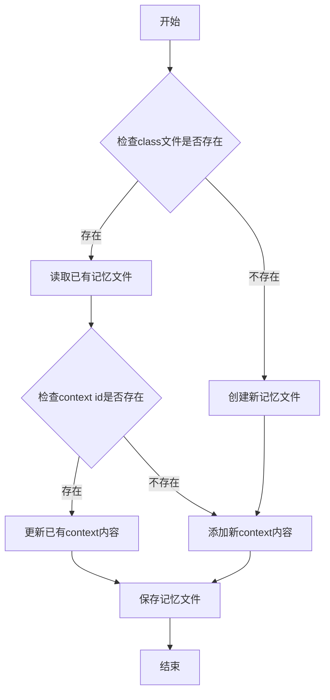
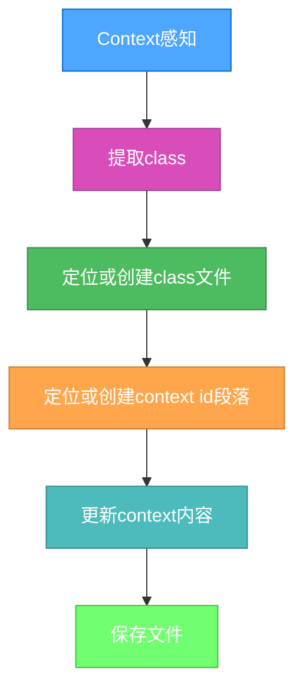

<executing mode="sequential" context="system">

# 记忆持久化规则

## 记忆存储规则

1. 存储位置：记忆文件存储在项目根目录下的`.memory`目录中
2. 目录创建：如果`.memory`目录不存在，需自动创建
3. 文件命名：使用class名称作为文件名，如`.memory/{class}.context.md`
4. 文件格式：使用Markdown格式存储记忆内容，使用二级标题区分不同的context id

## 记忆文件结构

记忆文件采用以下结构：

```markdown
---
class: class_name
---

## context_id_1
context_content_1

## context_id_2
context_content_2
```

## 记忆操作流程



# Context与Memory对接流程

## 文件组织规则

1. Context按class分组存储：
```xml
<context id="标识符" class="分类">内容</context>
→ .memory/{class}.context.md
```

2. 在文件内通过二级标题区分不同id：
```markdown
## ${context.id}
${context.content}
```

## 对接流程



### 示例结构

输入：
```xml
<context id="rootDir" class="project" confidence="0.95">
  /Users/sean/WorkSpaces/temp/promptx-init
</context>
```

输出文件 (.memory/project.context.md)：
```markdown
---
class: project
---

## rootDir
/Users/sean/WorkSpaces/temp/promptx-init

## otherProjectContext
其他项目相关上下文内容...
```

> 注意：此对接流程采用按类分组的存储策略，减少文件数量，提高管理效率。每个class对应一个文件，文件内使用二级标题组织不同的context内容。

</executing>