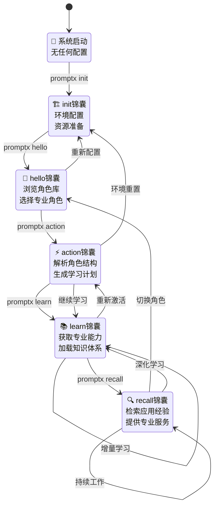

# PromptX 锦囊串联设计理念

> **核心理念：AI use CLI get prompt for AI**  
> PromptX = AI的诸葛锦囊，每个命令是一个锦囊，锦囊串联解决AI注意力分散

## 🎯 设计哲学

### 核心模式
**诸葛锦囊模式：AI通过CLI获取连环锦囊，分阶段专注解决问题**

```
通用AI → PromptX CLI → 获取专业提示词 → 变身专家AI → 提供专业服务
```

### 理论框架
**PATEOAS** - **P**rompt **a**s **t**he **E**ngine **o**f **A**pplication **S**tate

> 中文理念：诸葛锦囊 | 英文框架：PATEOAS

- **中文表达**："诸葛锦囊" - 形象化的AI工具箱概念
- **英文框架**："PATEOAS" - 标准化的技术设计模式
- **核心一致**：Prompt驱动AI状态转换，每个锦囊通过输出的Prompt引导AI发现下一步操作

### 锦囊串联理念
1. **AI获取锦囊**：每个CLI命令都是一个专业锦囊
2. **锦囊相互串联**：命令间形成连贯的解决链条
3. **分阶段注意力**：每个阶段专注当前任务，忘记也无妨

### 设计原则
- **锦囊自包含**：每个命令包含完整的执行信息
- **串联无依赖**：即使AI忘记上文，也能继续执行
- **分阶段专注**：每个锦囊只关注当前阶段任务

### PATEOAS设计原则
借鉴RESTful的HATEOAS设计模式，创新性地应用于AI认知状态管理：

- **Prompt驱动状态转换**：每个锦囊的Prompt输出引导AI执行下一步操作
- **超媒体发现机制**：通过输出内容让AI发现可用的状态转换路径
- **无状态导航**：AI无需记住所有命令序列，跟随Prompt指引即可
- **自适应流程**：根据当前状态动态推荐最佳下一步操作

---

## 🎒 五大锦囊设计

### 锦囊状态机
```
🏗️init锦囊 → 👋hello锦囊 → ⚡action锦囊 → 📚learn锦囊 → 🔍recall锦囊 → 循环
```

**状态机设计：** 锦囊串联本质上是一个状态机，每个锦囊是一个状态，状态间有明确的转换路径。即使AI忘记当前处于哪个状态，每个锦囊都能根据输入独立判断和执行。



### 锦囊功能

**🏗️ `promptx init`** - 项目准备锦囊
- 为AI准备项目环境，自包含的初始化指令

**👋 `promptx hello`** - 角色发现锦囊  
- 告诉AI有哪些专家角色可用，输出完整角色清单

**⚡ `promptx action`** - 角色激活锦囊
- 分析选定角色结构，生成专家学习计划
- 准备角色初始化序列和执行环境

**📚 `promptx learn`** - 专家变身锦囊
- AI获取专业提示词，即时获得专家能力
- 每个learn就是一次专家附身

**🔍 `promptx recall`** - 经验检索锦囊
- AI回忆相关经验，自包含的记忆查询

### 锦囊串联示例（PATEOAS模式）
```
用户："帮我优化产品文案"

PATEOAS驱动的状态转换：

1. 👋 promptx hello                     
   ↓ (Prompt输出包含状态指引)
   "✅ 可用角色：[列表]
    💡 下一步：promptx action <role>"

2. ⚡ promptx action copywriter          
   ↓ (Prompt输出包含学习计划)
   "✅ 角色已激活：文案专家
    📚 建议学习：promptx learn
    🔍 快速开始：promptx recall"

3. 📚 promptx learn                     
   ↓ (Prompt输出包含应用指引)
   "✅ 专家能力已加载
    🔍 开始工作：promptx recall --task 文案优化
    📚 深化学习：promptx learn advanced"

4. 🔍 promptx recall --task "文案优化"   
   ↓ (Prompt输出包含持续指引)
   "✅ 已检索相关经验
    🔄 继续优化：promptx recall
    🎯 切换任务：promptx action <new_role>"

每个锦囊的Prompt输出都引导AI发现下一步最佳操作
```

---

## ✨ 核心价值

### "诸葛锦囊"的力量（中文理念）
- **🎒 锦囊妙计库**：每个命令都是自包含的专业锦囊
- **🔗 锦囊串联**：命令间形成连贯的解决链条
- **🎯 分阶段专注**：每个锦囊专注当前任务
- **💭 忘记无妨**：即使AI遗忘上文，锦囊仍可独立执行

### PATEOAS的优势（英文框架）
- **🔄 状态发现**：每个Prompt输出包含下一步操作指引
- **🎯 智能导航**：AI跟随超媒体链接自动发现最佳路径
- **📊 自适应流程**：根据当前状态动态调整推荐操作
- **🔗 松耦合设计**：状态转换逻辑与具体命令实现解耦

### 解决AI痛点
- **上下文遗忘** → PATEOAS让AI无需记忆，跟随指引即可
- **注意力分散** → 每个阶段专注单一任务，Prompt引导下一步
- **能力局限** → 通过锦囊即时获得专家能力，Prompt指引最佳应用路径
- **流程困惑** → 超媒体发现机制让AI总能找到正确的下一步操作

---

## 🚀 实施策略

### 锦囊设计要求
- **自包含性**：每个锦囊包含完整执行信息
- **无状态性**：不依赖AI的上下文记忆
- **专注性**：每个锦囊只解决一个核心问题

### PATEOAS实现要求
每个锦囊的Prompt输出必须包含：

#### 1. **当前状态描述**
```
"✅ 已激活：高级文案专家角色"
"🔄 当前状态：角色发现阶段"
```

#### 2. **下一步操作指引**
```
"💡 推荐操作：
 → promptx learn (加载专业知识)
 → promptx recall (直接开始工作)"
```

#### 3. **状态转换选项**
```
"🔄 其他选择：
 → promptx action <other_role> (切换角色)
 → promptx hello (重新选择)"
```

#### 4. **上下文信息**
```
"📋 当前上下文：文案专家 | 已加载基础能力"
"🎯 工作模式：专业优化 | 目标任务：产品文案"
```

#### 5. **智能推荐逻辑**
- **基于上下文**：根据当前状态推荐最相关的下一步
- **多路径支持**：提供主要路径和备选路径
- **回退机制**：总是提供回到上一状态的选项
- **循环检测**：避免AI陷入无限循环

### 锦囊优先级
1. **高**：⚡action激活锦囊、📚learn专家锦囊（核心能力）
2. **中**：👋hello发现锦囊、🔍recall记忆锦囊  
3. **低**：🏗️init准备锦囊

---

## 🔄 PATEOAS vs RESTful HATEOAS

### 设计模式对比
| 特性 | RESTful HATEOAS | PromptX PATEOAS |
|------|-----------------|-----------------|
| **核心驱动** | 超媒体链接 | Prompt指引 |
| **状态载体** | HTTP响应 | CLI输出 |
| **状态管理** | 应用状态 | AI认知状态 |
| **导航方式** | URL链接 | 命令推荐 |
| **使用者** | Web客户端 | AI智能体 |
| **无状态性** | 服务器无状态 | AI无需记忆历史 |

### 相同的设计哲学
- **无状态导航**：客户端/AI无需硬编码路径
- **状态发现**：通过响应/输出发现下一步操作  
- **松耦合**：状态转换逻辑与实现分离
- **自描述**：响应/输出包含完整导航信息

### PromptX的创新点
- **认知状态管理**：专门为AI注意力限制设计
- **分阶段专注**：解决AI注意力分散问题
- **专家能力切换**：动态角色状态管理
- **中英文双重表达**：诸葛锦囊(感性) + PATEOAS(理性)

---

## 📝 总结

**PromptX = AI的诸葛锦囊 + PATEOAS设计模式**

### 双重表达体系
- **中文理念**："诸葛锦囊" - 让开发者直观理解AI工具箱概念
- **英文框架**："PATEOAS" - 为技术实现提供标准化设计模式

### 核心创新
每个CLI命令都是一个自包含的锦囊，通过**Prompt as the Engine of Application State**实现：
- 🎯 **状态驱动**：Prompt输出引导AI状态转换
- 🔄 **智能导航**：AI跟随超媒体指引自动发现下一步
- 💭 **无需记忆**：即使AI忘记上文，仍可继续执行
- 🎒 **分阶段专注**：每个锦囊专注当前任务

### 革命性意义
这是首个将**RESTful设计哲学应用于AI认知状态管理**的创新框架，为AI工具标准化提供了新的设计范式。

*"给AI最好的工具，就是让AI忘记也能继续的锦囊。"* 
*"The best tools for AI are those that work even when AI forgets - through PATEOAS."* 