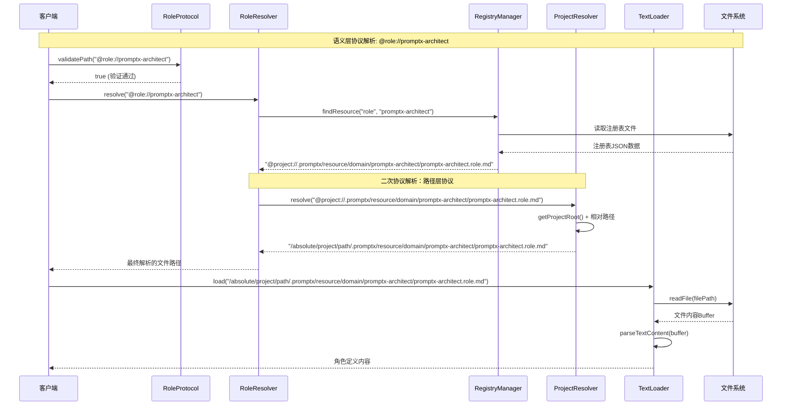
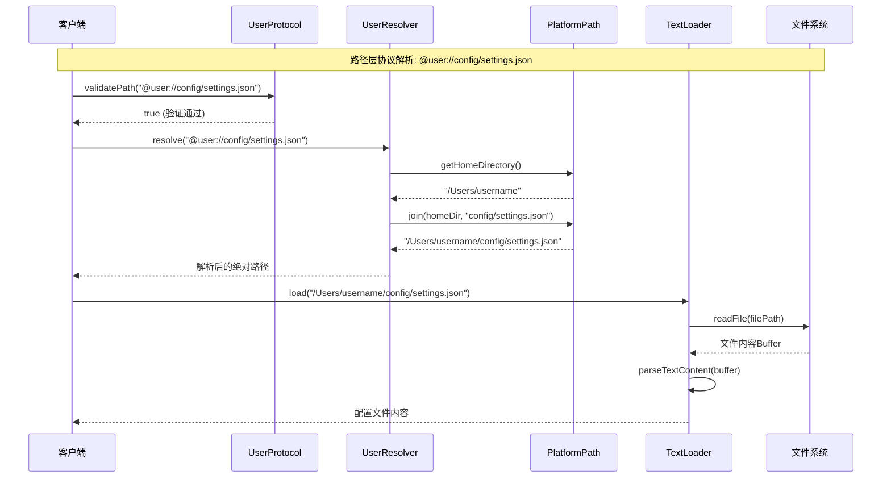
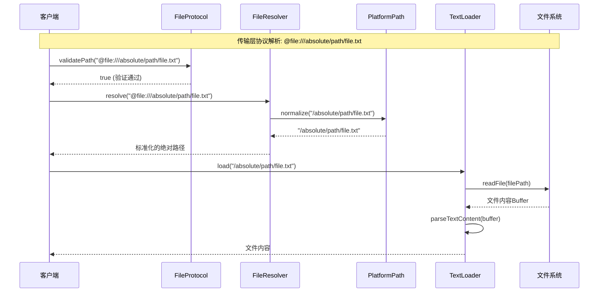

# PromptX 资源协议系统架构设计

## 📋 概述

PromptX 资源协议系统采用**三层装饰器模式**架构，实现了统一的资源访问协议体系。系统遵循**奥卡姆剃刀原理**、**单一职责原则**和**约定大于配置**的设计理念，提供简洁、高效、跨平台的资源管理能力。

## 🏗️ 架构设计理念

### 核心设计原则
- **🔪 奥卡姆剃刀原理**：追求最简洁有效的解决方案，去除不必要的复杂性
- **🎯 单一职责原则**：每个组件只负责一个明确的职责，避免功能混杂
- **⚙️ 约定大于配置**：优先使用智能约定减少用户配置，提供零配置体验
- **🔄 装饰器模式**：层次化装饰，功能逐步增强，灵活可组合

### MVP 设计策略
- **专注核心功能**：去除缓存、复杂验证等非核心功能
- **渐进式扩展**：架构支持后续功能的平滑增加
- **跨平台优先**：统一处理 Windows、macOS、Linux 平台差异

## 🎭 三层协议体系

### 1. 语义层协议 (AI功能协议)
负责AI功能的语义抽象，通过注册表查找实际资源路径。

| 协议 | 描述 | 示例 |
|------|------|------|
| `@role://` | AI角色定义协议 | `@role://product-manager` |
| `@thought://` | 思维模式协议 | `@thought://creativity` |
| `@execution://` | 执行原则协议 | `@execution://best-practice` |
| `@knowledge://` | 知识体系协议 | `@knowledge://javascript` |

### 2. 路径层协议 (路径抽象协议)
提供跨平台的路径抽象，直接进行路径转换。

| 协议 | 描述 | 示例 |
|------|------|------|
| `@user://` | 用户路径协议 | `@user://config/settings.json` |
| `@project://` | 项目路径协议 | `@project://src/lib/core.js` |
| `@package://` | 包路径协议 | `@package://lodash/index.js` |

### 3. 传输层协议 (物理资源协议)
直接访问物理资源或网络资源。

| 协议 | 描述 | 示例 |
|------|------|------|
| `@file://` | 文件系统协议 | `@file:///absolute/path/file.txt` |
| `@http://` | HTTP协议 | `@http://api.example.com/data` |
| `@https://` | HTTPS协议 | `@https://secure.api.com/data` |

## 📊 系统架构类图

```mermaid
classDiagram
    %% === Layer 1: Protocol Definition 协议定义层 ===
    class IResourceProtocol {
        <<interface>>
        +name: string
        +version: string
        +pathPattern: RegExp
        +description: string
        +validatePath(path: string): boolean
        +getExamples(): string[]
    }
    
    class ResourceProtocol {
        <<abstract>>
        +name: string
        +version: string
        +constructor(name: string, version?: string)
        +validate(path: string): boolean
        +toString(): string
    }
    
    %% === 语义层协议 ===
    class RoleProtocol {
        +pathPattern: RegExp
        +description: "AI角色定义协议"
        +validatePath(path: string): boolean
        +getExamples(): string[]
    }
    
    class ThoughtProtocol {
        +pathPattern: RegExp
        +description: "思维模式协议"
        +validatePath(path: string): boolean
        +getExamples(): string[]
    }
    
    class ExecutionProtocol {
        +pathPattern: RegExp
        +description: "执行原则协议"
        +validatePath(path: string): boolean
        +getExamples(): string[]
    }
    
    class KnowledgeProtocol {
        +pathPattern: RegExp
        +description: "知识体系协议"
        +validatePath(path: string): boolean
        +getExamples(): string[]
    }
    
    %% === 路径层协议 ===
    class UserProtocol {
        +pathPattern: RegExp
        +description: "用户路径协议"
        +validatePath(path: string): boolean
        +getExamples(): string[]
    }
    
    class ProjectProtocol {
        +pathPattern: RegExp
        +description: "项目路径协议"
        +validatePath(path: string): boolean
        +getExamples(): string[]
    }
    
    class PackageProtocol {
        +pathPattern: RegExp
        +description: "包路径协议"
        +validatePath(path: string): boolean
        +getExamples(): string[]
    }
    
    %% === 传输层协议 ===
    class FileProtocol {
        +pathPattern: RegExp
        +description: "文件系统协议"
        +validatePath(path: string): boolean
        +getExamples(): string[]
    }
    
    class HttpProtocol {
        +pathPattern: RegExp
        +description: "HTTP协议"
        +validatePath(path: string): boolean
        +getExamples(): string[]
    }
    
    %% === Layer 2: Resolution 协议解析层 ===
    class IResourceResolver {
        <<interface>>
        +resolve(protocolPath: string): Promise~string~
        +canResolve(protocolPath: string): boolean
    }
    
    class ResourceResolver {
        <<abstract>>
        +platformPath: PlatformPath
        +constructor(platformPath: PlatformPath)
        +normalizePath(path: string): string
        +expandEnvironmentVars(path: string): string
        +validatePath(path: string): boolean
    }
    
    %% === 语义层解析器 ===
    class RoleResolver {
        +registryManager: RegistryManager
        +resolve(protocolPath: string): Promise~string~
        +canResolve(protocolPath: string): boolean
        -findRoleInRegistry(roleName: string): string
    }
    
    class ThoughtResolver {
        +registryManager: RegistryManager
        +resolve(protocolPath: string): Promise~string~
        +canResolve(protocolPath: string): boolean
        -findThoughtInRegistry(thoughtName: string): string
    }
    
    %% === 路径层解析器 ===
    class UserResolver {
        +resolve(protocolPath: string): Promise~string~
        +canResolve(protocolPath: string): boolean
        +getUserHome(): string
        -resolveUserPath(path: string): string
    }
    
    class ProjectResolver {
        +resolve(protocolPath: string): Promise~string~
        +canResolve(protocolPath: string): boolean
        +getProjectRoot(): string
        -resolveProjectPath(path: string): string
    }
    
    class PackageResolver {
        +packageManager: PackageManager
        +resolve(protocolPath: string): Promise~string~
        +canResolve(protocolPath: string): boolean
        -findPackagePath(packageName: string): string
    }
    
    %% === 传输层解析器 ===
    class FileResolver {
        +resolve(protocolPath: string): Promise~string~
        +canResolve(protocolPath: string): boolean
        -resolveAbsolutePath(path: string): string
    }
    
    class HttpResolver {
        +resolve(protocolPath: string): Promise~string~
        +canResolve(protocolPath: string): boolean
        -validateUrl(url: string): boolean
    }
    
    %% === Layer 3: Loading 内容加载层 ===
    class IResourceLoader {
        <<interface>>
        +load(filePath: string): Promise~string~
        +canLoad(filePath: string): boolean
        +getSupportedExtensions(): string[]
    }
    
    class ResourceLoader {
        <<abstract>>
        +encoding: string
        +constructor(encoding?: string)
        +readFile(filePath: string): Promise~Buffer~
        +detectEncoding(buffer: Buffer): string
        +handleError(error: Error, filePath: string): never
    }
    
    class TextLoader {
        +load(filePath: string): Promise~string~
        +canLoad(filePath: string): boolean
        +getSupportedExtensions(): string[]
        -parseTextContent(buffer: Buffer): string
    }
    
    class MarkdownLoader {
        +load(filePath: string): Promise~string~
        +canLoad(filePath: string): boolean
        +getSupportedExtensions(): string[]
        -parseMarkdownContent(buffer: Buffer): string
    }
    
    class JsonLoader {
        +load(filePath: string): Promise~string~
        +canLoad(filePath: string): boolean
        +getSupportedExtensions(): string[]
        -parseJsonContent(buffer: Buffer): string
    }
    
    class HttpLoader {
        +load(url: string): Promise~string~
        +canLoad(url: string): boolean
        +getSupportedProtocols(): string[]
        -fetchContent(url: string): Promise~string~
    }
    
    %% === Supporting Classes 支持类 ===
    class PlatformPath {
        +platform: string
        +separator: string
        +homeDir: string
        +constructor()
        +join(...paths: string[]): string
        +resolve(path: string): string
        +normalize(path: string): string
        +getHomeDirectory(): string
        +getEnvironmentVariable(name: string): string
    }
    
    class RegistryManager {
        +registryPath: string
        +constructor(registryPath: string)
        +findResource(type: string, name: string): string
        +registerResource(type: string, name: string, path: string): void
        +loadRegistry(): Map~string, string~
    }
    
    class PackageManager {
        +packagePaths: string[]
        +constructor(packagePaths: string[])
        +findPackage(packageName: string): string
        +resolvePackageResource(packageName: string, resourcePath: string): string
    }
    
    %% === Inheritance Relations 继承关系 ===
    IResourceProtocol <|-- ResourceProtocol
    ResourceProtocol <|-- RoleProtocol
    ResourceProtocol <|-- ThoughtProtocol
    ResourceProtocol <|-- ExecutionProtocol
    ResourceProtocol <|-- KnowledgeProtocol
    ResourceProtocol <|-- UserProtocol
    ResourceProtocol <|-- ProjectProtocol
    ResourceProtocol <|-- PackageProtocol
    ResourceProtocol <|-- FileProtocol
    ResourceProtocol <|-- HttpProtocol
    
    IResourceResolver <|-- ResourceResolver
    ResourceResolver <|-- RoleResolver
    ResourceResolver <|-- ThoughtResolver
    ResourceResolver <|-- UserResolver
    ResourceResolver <|-- ProjectResolver
    ResourceResolver <|-- PackageResolver
    ResourceResolver <|-- FileResolver
    ResourceResolver <|-- HttpResolver
    
    IResourceLoader <|-- ResourceLoader
    ResourceLoader <|-- TextLoader
    ResourceLoader <|-- MarkdownLoader
    ResourceLoader <|-- JsonLoader
    ResourceLoader <|-- HttpLoader
    
    %% === Composition Relations 组合关系 ===
    ResourceResolver --> PlatformPath
    RoleResolver --> RegistryManager
    ThoughtResolver --> RegistryManager
    PackageResolver --> PackageManager
```



## 🔍 注册表协议引用机制

### 注册表结构说明

PromptX 的注册表本身也使用协议引用，而不是直接存储物理路径：

```json
{
  "id": "promptx-architect",
  "source": "project", 
  "protocol": "role",
  "name": "Promptx Architect 角色",
  "reference": "@project://.promptx/resource/domain/promptx-architect/promptx-architect.role.md"
}
```

### 二次协议解析流程

语义层协议的解析需要经过两个步骤：

1. **第一次解析**：`@role://promptx-architect` → 查找注册表 → `@project://...`
2. **第二次解析**：`@project://...` → 路径层解析器 → 物理文件路径

这种设计的优势：
- **🔄 协议一致性**：注册表也遵循统一的协议语法
- **🎯 灵活性**：资源可以存储在不同的位置（用户、项目、包等）
- **🔧 可维护性**：修改资源位置只需更新注册表，不影响引用方
- **📈 扩展性**：支持跨项目、跨用户的资源引用

## 🔄 系统交互序列图

### 语义层协议解析流程



### 路径层协议解析流程



### 传输层协议解析流程



## 🔧 跨平台支持

### PlatformPath 跨平台抽象

```typescript
class PlatformPath {
  constructor() {
    this.platform = process.platform
    this.separator = path.sep
    this.homeDir = os.homedir()
  }
  
  // 统一路径拼接
  join(...paths: string[]): string {
    return path.join(...paths)
  }
  
  // 统一路径解析
  resolve(inputPath: string): string {
    return path.resolve(inputPath)
  }
  
  // 统一路径标准化
  normalize(inputPath: string): string {
    return path.normalize(inputPath)
  }
  
  // 统一环境变量获取
  getEnvironmentVariable(name: string): string {
    return process.env[name] || ''
  }
}
```

### 平台差异处理

| 平台 | 用户目录 | 路径分隔符 | 配置目录 |
|------|----------|------------|----------|
| Windows | `C:\Users\username` | `\` | `%APPDATA%` |
| macOS | `/Users/username` | `/` | `~/Library` |
| Linux | `/home/username` | `/` | `~/.config` |

## 📈 扩展性设计

### 新协议添加流程

1. **定义协议类**：继承 `ResourceProtocol`
2. **实现解析器**：继承 `ResourceResolver`
3. **注册协议**：添加到协议注册表
4. **测试验证**：编写单元测试

### 新加载器添加流程

1. **定义加载器类**：继承 `ResourceLoader`
2. **实现加载逻辑**：重写 `load()` 方法
3. **注册加载器**：添加到加载器工厂
4. **测试验证**：编写单元测试

## 🎯 使用示例

### 基础用法

```typescript
// 语义层协议使用
const roleContent = await resourceSystem.load('@role://product-manager')
const thoughtContent = await resourceSystem.load('@thought://creativity')

// 路径层协议使用
const userConfig = await resourceSystem.load('@user://config/settings.json')
const projectFile = await resourceSystem.load('@project://src/index.js')

// 传输层协议使用
const localFile = await resourceSystem.load('@file:///path/to/file.txt')
const remoteData = await resourceSystem.load('@https://api.example.com/data')
```

### 高级用法

```typescript
// 协议验证
const isValid = RoleProtocol.validatePath('@role://invalid-name')

// 自定义解析器
class CustomResolver extends ResourceResolver {
  async resolve(protocolPath: string): Promise<string> {
    // 自定义解析逻辑
    return this.customResolveLogic(protocolPath)
  }
}

// 自定义加载器
class XmlLoader extends ResourceLoader {
  async load(filePath: string): Promise<string> {
    const buffer = await this.readFile(filePath)
    return this.parseXmlContent(buffer)
  }
}
```

## 🚀 性能优化

### MVP 阶段优化策略

1. **延迟加载**：按需加载协议解析器和加载器
2. **路径缓存**：缓存已解析的路径映射关系
3. **并发处理**：支持多个资源的并发加载
4. **错误恢复**：优雅的错误处理和重试机制

### 未来扩展优化

1. **内容缓存**：添加智能内容缓存系统
2. **预加载**：预测性资源预加载
3. **压缩传输**：网络资源的压缩传输
4. **增量更新**：支持资源的增量更新

## 📝 总结

PromptX 资源协议系统通过三层装饰器架构，实现了：

- **🎯 统一的资源访问接口**：所有资源通过统一的 `@protocol://` 语法访问
- **🔄 灵活的扩展机制**：支持新协议和新加载器的平滑添加
- **🌍 完整的跨平台支持**：统一处理不同操作系统的差异
- **⚡ 高效的解析性能**：MVP 设计专注核心功能，性能优异
- **🛠️ 简洁的使用体验**：零配置开箱即用，符合约定大于配置理念

这个架构为 PromptX 系统提供了坚实的资源管理基础，支持未来功能的持续演进和扩展。 