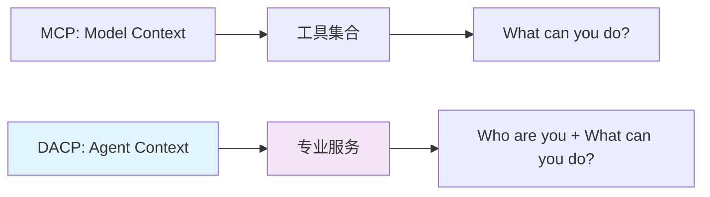
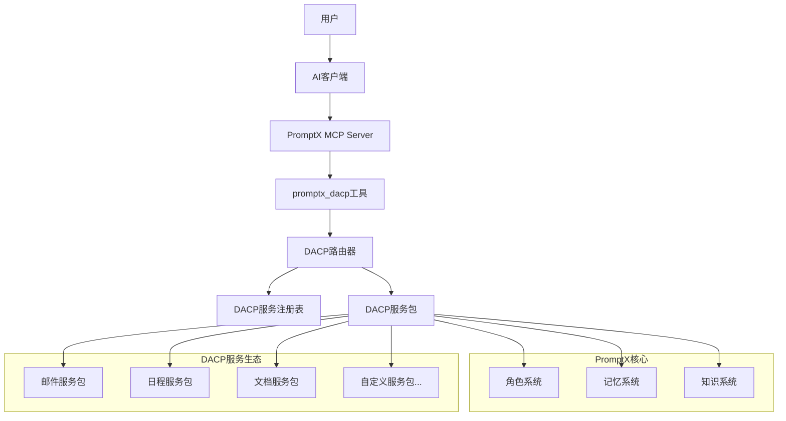
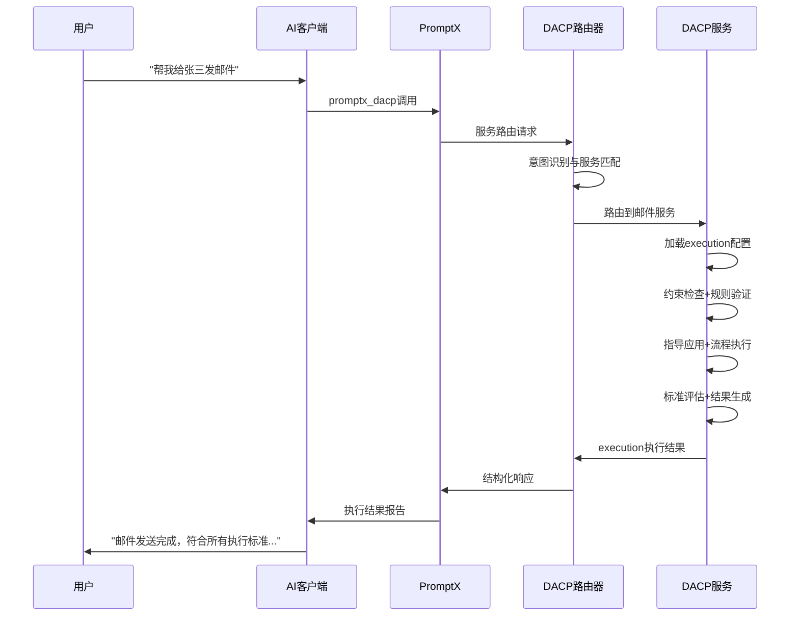
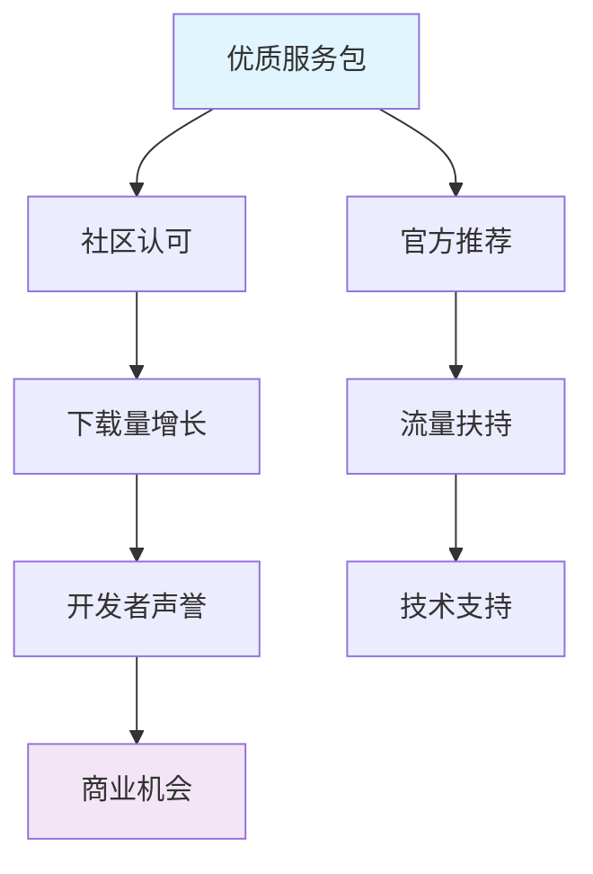
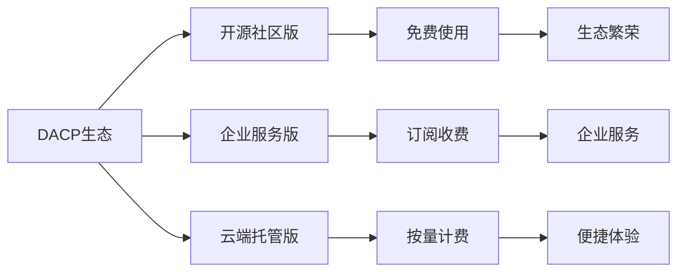
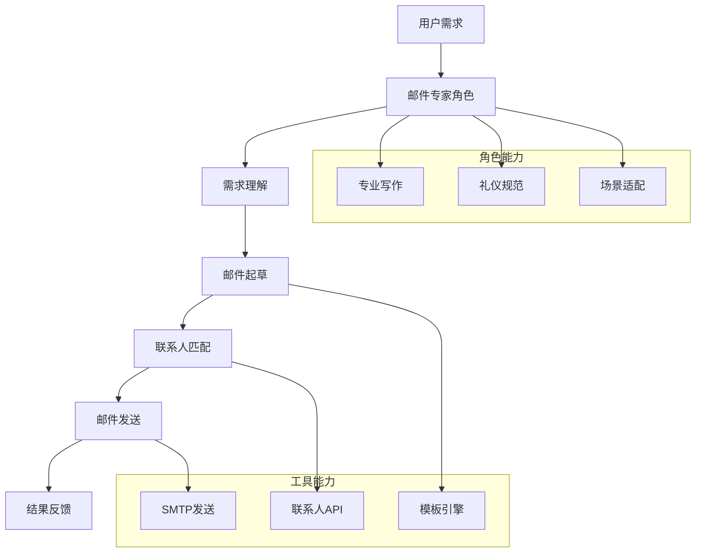
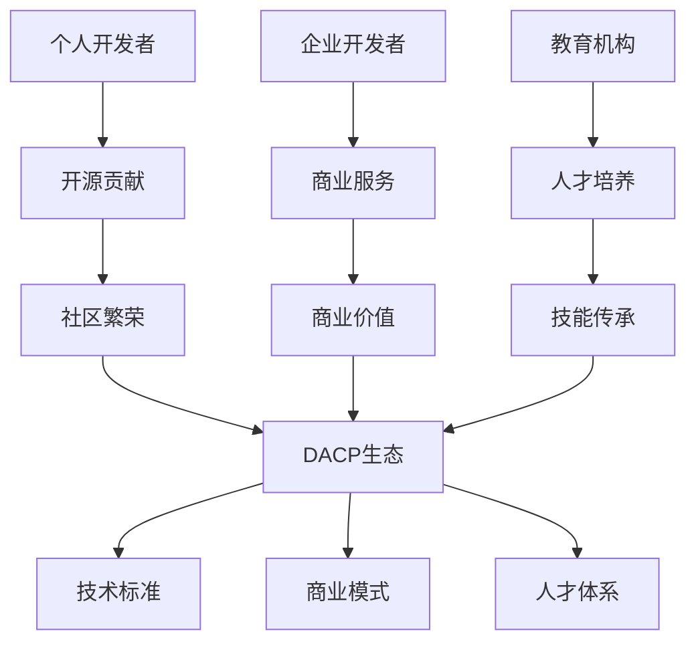

# DACP白皮书
## Deepractice Agent Context Protocol

**版本**: 1.0.0-draft  
**作者**: Deepractice Team  
**创建日期**: 2024-12-17  
**更新日期**: 2025-01-19  

---

## 摘要

DACP（Deepractice Agent Context Protocol）是一种基于MCP协议的AI智能体上下文协议，旨在解决AI应用中"能说会道但无法行动"的核心痛点。通过提供结构化的execution执行框架，DACP实现了从"AI建议"到"AI行动"的关键跃迁，为用户提供可预期、可评估的专业服务解决方案。

## 目录

1. [背景与动机](#1-背景与动机)
2. [核心概念](#2-核心概念)
3. [架构设计](#3-架构设计)
4. [协议规范](#4-协议规范)
5. [实现指南](#5-实现指南)
6. [生态建设](#6-生态建设)
7. [案例研究](#7-案例研究)
8. [未来展望](#8-未来展望)

---

## 1. 背景与动机

### 1.1 现状分析

当前AI应用生态面临的核心挑战：

#### **MCP协议的局限性**
- **功能导向**: MCP专注于"What can you do?"，提供工具能力
- **冷冰冰的交互**: 工具描述技术化，缺乏专业身份感
- **学习成本高**: 用户需要理解复杂的工具参数和使用方式
- **角色分离**: AI人格与工具能力相互独立，无法形成专业服务闭环

#### **用户需求的演进**
- 从"使用AI工具"到"获得AI服务"
- 从"技术能力"到"专业解决方案"
- 从"参数配置"到"自然语言需求"
- 从"一次性交互"到"持续专业关系"

### 1.2 DACP的价值主张

DACP通过以下核心创新解决上述挑战：



#### **范式转移**
- **从工具到服务**: 不是提供工具，而是提供专业服务
- **从功能到身份**: 不是说明功能，而是体现专业身份
- **从参数到对话**: 不是配置参数，而是自然语言交流
- **从使用到委托**: 不是学习使用，而是委托专业处理

---

## 2. 核心概念

### 2.1 Agent Context（智能体上下文）

#### **定义**
Agent Context是AI智能体在特定专业领域中的完整身份定义，包括：
- **专业人格**: 角色定位、性格特征、沟通风格
- **专业知识**: 领域知识、最佳实践、经验积累
- **专业能力**: 可执行的工具服务、解决方案能力
- **专业记忆**: 历史经验、用户偏好、上下文记忆

#### **与Model Context的区别**

| 维度 | Model Context (MCP) | Agent Context (DACP) |
|------|---------------------|----------------------|
| **关注点** | 模型能力扩展 | 智能体身份构建 |
| **交互方式** | 工具调用 | 专业服务 |
| **用户体验** | 学习工具使用 | 委托专业处理 |
| **价值定位** | 功能增强 | 身份服务 |

### 2.2 DACP服务包

#### **服务包构成**
```
DACP服务包 = PromptX角色 + 专用工具 + 绑定关系
```

- **PromptX角色**: 基于DPML协议的专业AI角色定义
- **专用工具**: 为该角色定制的执行能力工具集
- **绑定关系**: 角色与工具的语义绑定和使用说明

#### **服务包特征**
- **专业性**: 针对特定领域的深度专业化
- **完整性**: 从理解到执行的完整服务闭环
- **可组合**: 支持多服务协作和能力组合
- **可扩展**: 支持动态加载和能力扩展

### 2.3 核心设计原则

#### **2.3.1 角色优先原则**
```
技术服务于体验，工具服务于角色
```
- 所有工具都通过角色身份来表达
- 用户感知的是专业服务，而非技术工具
- 角色人格决定交互风格和服务质量

#### **2.3.2 自然交互原则**  
```
用户说需求，AI提供服务
```
- 用户使用自然语言描述需求
- AI角色智能理解并执行相应服务
- 避免复杂的参数配置和技术细节

#### **2.3.3 专业服务原则**
```
不是工具使用者，而是专业服务提供者
```
- 每个DACP服务都是完整的专业解决方案
- 角色承担专业责任，提供专业建议
- 服务质量符合专业标准和行业最佳实践

#### **2.3.4 生态协作原则**
```
开放标准，协作共赢
```
- 标准化的协议接口，支持第三方扩展
- 基于PromptX角色生态，复用成熟的角色资源
- 鼓励开发者贡献专业服务包

---

## 3. 架构设计

### 3.1 整体架构



### 3.2 核心组件

#### **3.2.1 DACP路由器**
- **服务发现**: 自动发现可用的DACP服务
- **意图识别**: 分析用户需求，匹配合适的服务
- **负载均衡**: 在多个服务实例间分发请求
- **错误处理**: 统一的错误处理和降级策略

#### **3.2.2 服务注册表**
- **服务注册**: DACP服务的动态注册和注销
- **元数据管理**: 服务能力、版本、依赖等信息
- **健康检查**: 服务可用性监控和状态管理
- **版本管理**: 服务版本兼容性和升级策略

#### **3.2.3 Execution执行引擎**
- **约束验证**: 检查请求是否违反客观限制条件
- **规则执行**: 强制执行必须遵守的行为准则
- **指导应用**: 基于最佳实践优化执行方案
- **流程执行**: 按照定义的步骤完成任务
- **标准评估**: 根据criteria评估执行结果质量

### 3.3 数据流设计

#### **请求处理流程**


---

## 4. 协议规范

### 4.1 DACP服务标识

#### **服务ID规范**
```
格式: dacp-{domain}-service
示例: 
- dacp-email-service
- dacp-calendar-service  
- dacp-document-service
```

#### **版本管理**
```
语义化版本: major.minor.patch
示例: 1.2.3
- major: 不兼容的API变更
- minor: 向后兼容的功能新增
- patch: 向后兼容的问题修复
```

### 4.2 调用协议

#### **promptx_dacp工具接口**
```json
{
  "name": "promptx_dacp",
  "description": "调用DACP专业服务，让PromptX角色拥有执行能力",
  "inputSchema": {
    "type": "object",
    "properties": {
      "service_id": {
        "type": "string",
        "description": "DACP服务ID"
      },
      "action": {
        "type": "string",
        "description": "具体操作"
      },
      "parameters": {
        "type": "object",
        "properties": {
          "user_request": {
            "type": "string",
            "description": "用户自然语言需求"
          },
          "context": {
            "type": "object",
            "description": "上下文信息"
          }
        }
      }
    },
    "required": ["service_id", "action", "parameters"]
  }
}
```

#### **请求/响应格式**
```typescript
// DACP请求格式
interface DACPRequest {
  service_id: string;        // 服务标识
  action: string;            // 操作名称
  parameters: {
    user_request: string;    // 用户自然语言需求
    context: object;         // 上下文信息
  };
  request_id?: string;       // 可选的请求ID
  timeout?: number;          // 可选的超时时间（毫秒）
}

// DACP响应格式
interface DACPResponse {
  request_id: string;
  success: boolean;
  data?: {
    execution_result: object; // 执行结果
    evaluation: object;       // 标准评估结果
    applied_guidelines: string[]; // 应用的指导原则
    performance_metrics: object;  // 性能指标
  };
  error?: {
    code: string;
    message: string;
    details?: object;
  };
}
```

### 4.3 服务端协议

#### **DACP服务配置文件**
```json
{
  "id": "dacp-email-service",
  "name": "邮件发送服务",
  "version": "1.0.0",
  "description": "基于execution框架的邮件处理服务",
  "author": "example@company.com",
  "execution": {
    "constraint": [
      "SMTP服务器连接限制每分钟100次",
      "单封邮件大小不超过25MB",
      "发送频率限制每分钟最多50封",
      "必须支持TLS加密连接"
    ],
    "rule": [
      "必须验证收件人邮箱格式有效性",
      "禁止发送包含垃圾邮件特征的内容",
      "必须记录邮件发送日志用于审计",
      "敏感信息必须加密传输"
    ],
    "guideline": [
      "建议使用HTML格式提升邮件阅读体验",
      "建议根据收件人类型调整语言风格",
      "建议添加邮件签名提升专业形象",
      "建议根据紧急程度设置邮件优先级"
    ],
    "process": [
      "1. 解析用户自然语言邮件需求",
      "2. 验证收件人信息和权限",
      "3. 根据场景和指导原则生成邮件内容",
      "4. 应用安全规则和格式约束",
      "5. 调用SMTP服务发送邮件",
      "6. 记录发送日志并返回结果状态"
    ],
    "criteria": [
      "邮件成功送达率必须 > 95%",
      "发送响应时间必须 < 3秒",
      "错误信息必须准确且用户可理解",
      "邮件格式必须符合RFC标准"
    ]
  },
  "actions": [
    {
      "name": "send_email",
      "description": "按照execution框架发送邮件",
      "parameters": {
        "type": "object",
        "properties": {
          "user_request": {
            "type": "string",
            "description": "用户的自然语言邮件需求"
          },
          "context": {
            "type": "object",
            "properties": {
              "contacts": {"type": "array", "description": "联系人信息"},
              "project": {"type": "string", "description": "项目上下文"},
              "urgency": {"type": "string", "description": "紧急程度"}
            }
          }
        }
      }
    }
  ],
  "endpoints": {
    "http": "http://localhost:3001/dacp",
    "websocket": "ws://localhost:3001/dacp"
  }
}
```

#### **服务端接口规范**
```typescript
interface DACPServiceInterface {
  // 服务信息查询
  getInfo(): Promise<ServiceInfo>;
  
  // 健康检查
  healthCheck(): Promise<HealthStatus>;
  
  // 执行服务
  execute(request: DACPRequest): Promise<DACPResponse>;
  
  // 获取支持的操作列表
  getActions(): Promise<ActionInfo[]>;
}
```

### 4.4 错误处理标准

#### **错误代码规范**
```
格式: DACP_[CATEGORY]_[SPECIFIC_ERROR]

分类:
- AUTH: 认证相关错误
- PARAM: 参数相关错误  
- SERVICE: 服务相关错误
- ROLE: 角色相关错误
- TIMEOUT: 超时相关错误
```

#### **标准错误码**
```json
{
  "DACP_AUTH_INVALID_TOKEN": "无效的认证令牌",
  "DACP_PARAM_MISSING_REQUIRED": "缺少必需参数",
  "DACP_PARAM_INVALID_FORMAT": "参数格式无效",
  "DACP_SERVICE_UNAVAILABLE": "服务暂时不可用",
  "DACP_SERVICE_NOT_FOUND": "服务未找到",
  "DACP_ROLE_ACTIVATION_FAILED": "角色激活失败",
  "DACP_TIMEOUT_REQUEST": "请求超时",
  "DACP_TIMEOUT_SERVICE": "服务响应超时"
}
```

---

## 5. 实现指南

### 5.1 开发环境准备

#### **前置条件**
- 基本的API开发经验
- 了解DPML execution框架概念

#### **开发工具和环境（概念设计）**
DACP服务开发可以使用任何技术栈，只需要遵循协议规范：

**未来规划的工具链**：
- DACP CLI工具（概念阶段，用于项目初始化和管理）
- execution框架解析器（概念阶段，解析.execution.md文件）
- 协议验证工具（概念阶段，验证服务是否符合DACP规范）
- 服务模板生成器（概念阶段，快速生成服务骨架）

**理想的项目初始化流程**：
```
1. 选择技术栈（Node.js/Python/Go/Java等）
2. 定义execution框架
3. 实现协议接口
4. 配置服务端点
5. 注册和部署

注：以上流程为概念设计，具体工具尚在规划中
```

### 5.2 创建DACP服务

基于execution框架的DACP服务开发流程：

#### **标准项目结构**
```
dacp-email-service/
├── dacp.config.json       # DACP服务配置文件
├── execution/             # execution框架定义
│   └── email-service.execution.md
├── src/                   # 服务实现（技术栈无关）
│   ├── main.*            # 服务入口点
│   ├── execution-engine.* # execution框架执行引擎
│   └── tools/            # 具体工具实现
│       ├── email-client.*
│       ├── validator.*
│       └── template.*
├── tests/                # 测试文件
├── docs/                 # 服务文档
└── deployment/           # 部署配置
```

**技术栈灵活性**：
- 实现语言：Node.js、Python、Go、Java、Rust等
- 部署方式：Docker容器、云函数、传统服务器
- 存储方案：根据需要选择数据库或文件系统

#### **步骤1: 服务配置定义**
```json
// dacp.config.json - DACP服务配置文件
{
  "id": "dacp-email-service",
  "name": "邮件发送服务",
  "version": "1.0.0",
  "description": "基于execution框架的专业邮件处理服务",
  "execution_source": "./execution/email-service.execution.md",
  "endpoints": {
    "http": "http://localhost:3001/dacp",
    "health": "http://localhost:3001/health"
  },
  "actions": [
    "send_email",
    "validate_email", 
    "get_status"
  ],
  "metadata": {
    "category": "communication",
    "tags": ["email", "smtp", "messaging"],
    "author": "example@company.com"
  }
}
```

#### **步骤2: 实现服务逻辑**

基于execution框架的DACP服务执行流程：

```
伪代码：EmailService执行逻辑

FUNCTION send_email(user_request, context):
    // 按照execution框架的优先级顺序执行
    
    1. 约束验证(最高优先级)
       检查SMTP连接限制、邮件大小、发送频率等客观限制
       IF 违反约束 THEN 返回错误
    
    2. 规则执行(次高优先级) 
       验证邮箱格式、检查垃圾邮件特征、安全规则等
       IF 违反规则 THEN 返回错误
    
    3. 指导原则应用(建议性)
       优化邮件格式、调整语言风格、添加签名等
       增强用户请求 = 应用指导原则(user_request)
    
    4. 流程执行(核心逻辑)
       解析需求 → 验证收件人 → 生成内容 → 发送邮件 → 记录日志
       执行结果 = 按步骤执行(增强用户请求, context)
    
    5. 标准评估(质量验证)
       检查送达率、响应时间、格式规范等标准
       评估结果 = 评估执行质量(执行结果)
    
    RETURN {
        execution_result: 执行结果,
        evaluation: 评估结果,
        applied_guidelines: 应用的指导原则列表
    }
```

**核心设计思想**：
- **优先级驱动**：严格按照constraint > rule > guideline > process > criteria的顺序
- **失败快速**：约束和规则检查失败时立即停止执行
- **质量保证**：每次执行都有明确的评估标准
- **可追溯性**：记录应用的指导原则和执行路径

#### **步骤3: 创建execution定义**
```markdown
<!-- execution/email-service.execution.md -->
# 邮件服务执行单元

## 执行框架定义

<execution>
  <constraint>
    - SMTP服务器连接限制每分钟100次
    - 单封邮件大小不超过25MB
    - 发送频率限制每分钟最多50封
    - 必须支持TLS加密连接
  </constraint>
  
  <rule>
    - 必须验证收件人邮箱格式有效性
    - 禁止发送包含垃圾邮件特征的内容
    - 必须记录邮件发送日志用于审计
    - 敏感信息必须加密传输
  </rule>
  
  <guideline>
    - 建议使用HTML格式提升邮件阅读体验
    - 建议根据收件人类型调整语言风格
    - 建议添加邮件签名提升专业形象
    - 建议根据紧急程度设置邮件优先级
  </guideline>
  
  <process>
    1. 解析用户自然语言邮件需求
    2. 验证收件人信息和权限
    3. 根据场景和指导原则生成邮件内容
    4. 应用安全规则和格式约束
    5. 调用SMTP服务发送邮件
    6. 记录发送日志并返回结果状态
  </process>
  
  <criteria>
    - 邮件成功送达率必须 > 95%
    - 发送响应时间必须 < 3秒
    - 错误信息必须准确且用户可理解
    - 邮件格式必须符合RFC标准
  </criteria>
</execution>

## 工具接口定义
- **send_email(to, subject, body, options)**: 执行邮件发送
- **validate_email(address)**: 验证邮箱格式
- **get_smtp_status()**: 检查SMTP服务状态
- **log_email_activity(data)**: 记录邮件活动日志
```

#### **步骤4: 测试和验证**

**服务启动（概念设计）**：
```bash
# 启动DACP服务（未来CLI工具概念）
dacp start

# 查看服务状态（未来CLI工具概念）
dacp status

注：dacp CLI工具目前为概念设计，尚未开发
```

**接口测试**：
```
POST /dacp HTTP/1.1
Content-Type: application/json

{
  "service_id": "dacp-email-service",
  "action": "send_email",
  "parameters": {
    "user_request": "给张三发个会议提醒",
    "context": {
      "contacts": [{"name": "张三", "email": "zhang@company.com"}],
      "urgency": "high"
    }
  }
}
```

**预期响应格式**：
```json
{
  "success": true,
  "data": {
    "execution_result": {
      "message_id": "msg_123",
      "status": "sent",
      "recipient": "zhang@company.com"
    },
    "evaluation": {
      "criteria_met": true,
      "performance": {"response_time": "1.2s"}
    },
    "applied_guidelines": ["HTML格式", "高优先级"]
  }
}
```

### 5.3 部署和集成

#### **服务部署流程**

**注册和发现（概念设计）**：
```bash
# 注册服务到DACP注册中心（概念阶段）
dacp register ./dacp.config.json

# 验证服务注册状态（概念阶段）
dacp services --list

# 启动服务实例（概念阶段）
dacp start --config ./dacp.config.json

注：以上命令为DACP生态的概念设计，相关工具和注册中心尚未开发
```

**部署模式**：
- **本地开发**：直接运行服务进程
- **容器部署**：Docker/Kubernetes环境
- **云函数**：Serverless部署模式
- **边缘计算**：IoT设备本地服务

#### **与PromptX集成使用**
```
用户: "帮我给张三发个邮件提醒明天的会议"

PromptX角色系统: 理解用户意图，识别为邮件发送需求

promptx_dacp工具调用: {
  "service_id": "dacp-email-service",
  "action": "send_email", 
  "parameters": {
    "user_request": "帮我给张三发个邮件提醒明天的会议",
    "context": {"project": "当前项目", "contacts": [...]}
  }
}

DACP服务执行: 
1. constraint检查 → 2. rule验证 → 3. guideline应用 → 4. process执行 → 5. criteria评估

返回给PromptX: {
  "success": true,
  "data": {
    "execution_result": {
      "message_id": "msg_123",
      "status": "sent",
      "recipient": "zhang@company.com",
      "subject": "明天产品评审会议提醒"
    },
    "evaluation": {
      "criteria_met": true,
      "performance": {
        "delivery_rate": 100,
        "response_time": "1.2s"
      }
    },
    "applied_guidelines": ["HTML格式", "专业签名", "高优先级"]
  }
}

用户得到反馈: "邮件已发送给张三，提醒明天的会议，符合所有执行标准。"
```

---

## 6. 生态建设

### 6.1 开发者生态

#### **DACP服务商店**
- **官方服务包**: Deepractice维护的核心服务包
- **社区贡献**: 开发者贡献的开源服务包  
- **企业定制**: 针对特定行业的专业服务包
- **质量认证**: 服务包的质量评级和认证体系

#### **开发者激励机制**


#### **质量保证体系**
- **代码审查**: 自动化代码质量检查
- **安全扫描**: 依赖库和代码安全扫描
- **性能测试**: 服务响应时间和并发能力测试
- **用户反馈**: 用户评价和使用反馈收集

### 6.2 治理机制

#### **DACP标准委员会**
- **组织结构**: Deepractice主导，社区参与
- **决策机制**: 技术提案 → 社区讨论 → 投票决议
- **版本管理**: 协议版本的规划和发布管理

#### **开放标准原则**
- **透明性**: 所有技术决策过程公开透明
- **兼容性**: 新版本向后兼容，渐进式演进
- **可扩展性**: 支持第三方扩展和定制化需求

### 6.3 商业模式

#### **多元化收入模式**


#### **价值创造循环**
- **开源贡献** → **社区繁荣** → **用户增长** → **商业价值** → **持续投入**

---

## 7. 案例研究

### 7.1 邮件服务包案例

#### **背景需求**
企业用户需要一个智能邮件助手，能够：
- 理解自然语言邮件需求
- 自动起草专业邮件内容
- 智能管理联系人信息
- 提供邮件发送分析

#### **解决方案设计**


#### **实现效果**
- **用户体验**: 从复杂的邮件配置简化为自然语言对话
- **专业质量**: 邮件内容符合商务礼仪，提升沟通效果
- **效率提升**: 邮件处理时间减少80%，错误率降低90%

### 7.2 日程管理服务包案例

#### **Execution框架设计**
```
日程管理服务的execution定义：

Constraint（约束）:
- 日历系统API调用限制：每分钟最多200次
- 会议时长限制：最短15分钟，最长8小时
- 提前通知时间：至少5分钟前发送邀请

Rule（规则）:
- 必须检查参与者日程冲突
- 必须验证会议室可用性
- 禁止在非工作时间安排常规会议

Guideline（指导原则）:
- 建议会议时长控制在1小时内
- 建议为重要会议预留缓冲时间
- 建议根据参与者时区安排合适时间

Process（流程）:
1. 解析日程安排需求
2. 检查参与者可用时间
3. 预订会议室资源
4. 发送会议邀请
5. 设置提醒通知

Criteria（标准）:
- 会议创建成功率 > 98%
- 冲突检测准确率 = 100%
- 邀请发送延迟 < 30秒
```

#### **使用场景**
```
用户: "明天下午安排一个产品评审会议，邀请产品团队"

AI分析: 
- 时间: 明天下午（具体时间待确认）
- 事件: 产品评审会议
- 参与者: 产品团队成员
- 需求: 会议室预订 + 邀请发送

执行结果: "日程安排完成 - 明天下午2点产品评审会议已创建，A301会议室已预订，5位团队成员已收到邀请。执行评估：无冲突检测，响应时间12秒，符合所有标准。"
```

---

## 8. 未来展望

### 8.1 技术演进路线

#### **短期目标（6个月）**
- **协议标准化**: 完成DACP 1.0正式版协议规范
- **原型验证**: 开发核心邮件服务包作为概念验证
- **基础工具**: 开发DACP CLI和SDK的基础版本
- **文档体系**: 建立完整的协议和开发者文档

#### **中期目标（1年）**
- **生态初建**: 发布核心服务包（邮件、日程、文档等）
- **社区发展**: 吸引早期开发者贡献第三方服务包
- **标准推广**: 在开发者社区推广DACP协议概念
- **工具完善**: 完成CLI、SDK、注册中心等基础设施

#### **长期愿景（3年）**
- **行业影响**: DACP在Agent Context领域获得广泛认知
- **生态成熟**: 建立繁荣的第三方服务包生态
- **商业化**: 探索可持续的商业模式和盈利路径

### 8.2 技术创新方向

#### **智能化增强**
- **自适应路由**: 基于用户行为的智能服务推荐
- **自动化角色生成**: AI自动生成DACP服务的角色定义
- **智能错误恢复**: 服务故障时的自动降级和恢复机制

#### **性能优化**
- **分布式架构**: 支持微服务架构和容器化部署
- **边缘计算**: 支持边缘设备上的轻量级DACP服务
- **实时通信**: WebSocket和服务端推送的实时交互能力

#### **安全增强**
- **零信任架构**: 端到端的安全验证和加密
- **隐私保护**: 用户数据的本地化处理和隐私保护
- **审计日志**: 完整的操作审计和合规性支持

### 8.3 生态发展愿景

#### **开发者生态**


#### **应用场景拓展**
- **企业内部**: 内部系统集成和工作流自动化
- **行业解决方案**: 医疗、教育、金融等行业专用服务包
- **个人助手**: 面向个人用户的生活服务助手
- **IoT集成**: 物联网设备的智能化控制和管理

---

## 9. 结论

DACP（Deepractice Agent Context Protocol）代表了AI应用开发领域的重要创新，通过将专业AI角色与执行工具深度绑定，实现了从"AI建议"到"AI行动"的关键跃迁。

### 9.1 核心价值总结

#### **用户价值**
- **简化交互**: 从复杂工具配置到自然语言对话
- **专业服务**: 从通用AI到专业角色服务
- **完整解决方案**: 从单一功能到端到端服务

#### **开发者价值**  
- **标准化开发**: 统一的协议和开发框架
- **生态复用**: 基于PromptX成熟的角色生态
- **商业机会**: 新的AI服务商业模式

#### **行业价值**
- **技术标准**: 推动Agent Context领域标准化
- **生态繁荣**: 促进AI应用生态的健康发展  
- **创新引领**: 引领人机交互范式的转变

### 9.2 关键成功要素

#### **技术维度**
- 基于PromptX的成熟角色体系
- 标准化的协议设计和实现
- 完善的开发工具和文档支持

#### **生态维度**
- 开放的标准制定和治理机制
- 多元化的开发者激励体系
- 可持续的商业模式设计

#### **市场维度**
- 明确的用户价值主张
- 渐进式的市场推广策略
- 持续的技术创新和迭代

DACP的成功将不仅推动PromptX产品的发展，更将为整个AI应用行业带来新的发展机遇和技术标准。我们期待与开发者社区共同构建这一创新生态，让AI真正成为每个人的专业助手。

---

## 附录

### A. 技术规范参考
- [MCP协议规范](https://github.com/metacontroller/mcp)
- [DPML语言规范](../prompt/protocol/dpml.protocol.md)
- [PromptX角色系统](../docs/role-system-complete-guide.md)

### B. 开发资源（规划中）
- DACP SDK文档（概念阶段，尚未开发）
- 服务包模板（概念阶段，尚未开发）
- 示例代码仓库（概念阶段，尚未开发）

### C. 社区资源
- [技术讨论区](https://github.com/Deepractice/PromptX/discussions)
- [问题反馈](https://github.com/Deepractice/PromptX/issues)
- [开发者微信群](../README.md#技术交流)

---

**版权声明**: 本文档遵循 [MIT License](../LICENSE) 开源协议。

**文档版本**: 1.0.0-concept  
**最后更新**: 2024-12-17  
**状态**: 概念设计阶段，相关工具和服务尚未开发 