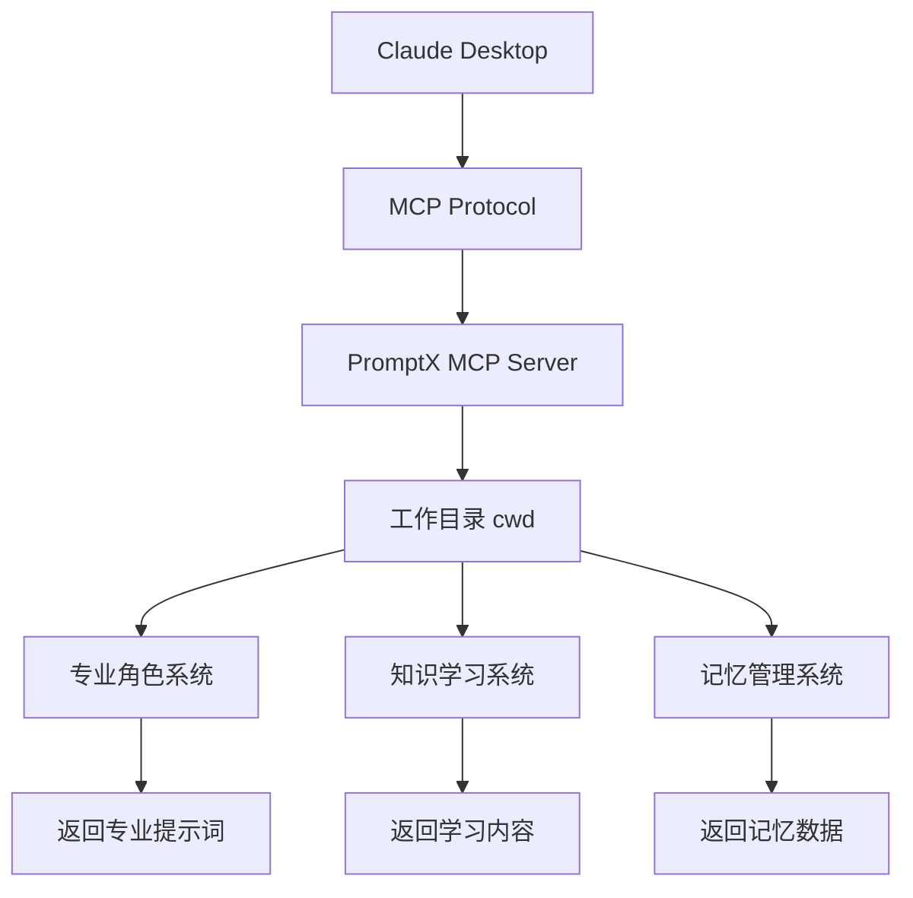

# PromptX MCP Server 集成指南

## 🎯 概述

PromptX MCP Server 将 PromptX 的所有 CLI 功能封装为 Model Context Protocol (MCP) 工具，让 Claude Desktop 等 AI 应用可以直接调用 PromptX 的专业角色和知识系统。

## 🚀 快速开始

### 1. 启动 MCP Server

```bash
# 在 PromptX 项目目录中
npx dpml-prompt@snapshot mcp-server
```

### 2. Claude Desktop 配置

在 Claude Desktop 的配置文件中添加 PromptX MCP Server：

**Windows 配置路径：**
```
%APPDATA%\Claude\claude_desktop_config.json
```

**macOS 配置路径：**
```
~/Library/Application Support/Claude/claude_desktop_config.json
```

**配置内容：**
```json
{
  "mcpServers": {
    "promptx": {
      "command": "npx",
      "args": ["dpml-prompt@snapshot", "mcp-server"],
      "cwd": "/Users/username/Projects/MyProject"
    }
  }
}
```

### 💡 **重要：关于 `cwd` 参数**

#### **`cwd` 的含义和MCP协议限制**
- `cwd` = **Current Working Directory** (当前工作目录)
- **重要**：由于MCP协议限制，**Server无法直接获取配置中的`cwd`参数**
- `process.cwd()`返回的是AI应用安装目录，而不是配置的工作目录

#### **✨ 正确配置方案（基于社区标准）**

**方案1：通过环境变量传递工作目录（推荐）**

```json
{
  "mcpServers": {
    "promptx": {
      "command": "npx",
      "args": ["dpml-prompt@snapshot", "mcp-server"],
      "cwd": "/Users/username/Projects/MyProject",
      "env": {
        "PROMPTX_WORKSPACE": "/Users/username/Projects/MyProject"
      }
    }
  }
}
```

**方案2：依赖自动检测（适合标准项目）**

```json
{
  "mcpServers": {
    "promptx": {
      "command": "npx", 
      "args": ["dpml-prompt@snapshot", "mcp-server"],
      "cwd": "/Users/username/Projects/MyProject"
    }
  }
}
```

PromptX 会自动向上查找项目根目录（检测 `.git`、`package.json`、`.promptx` 等项目标识）。

#### **环境变量检测优先级**

PromptX 按以下优先级检测工作目录：

1. **`WORKSPACE_FOLDER_PATHS`** - VS Code/Cursor 标准环境变量
2. **`PROMPTX_WORKSPACE`** - PromptX 专用环境变量（推荐）
3. **`PWD`** - Shell 传递的工作目录
4. **智能推测** - 向上查找项目根目录
5. **回退** - 使用 `process.cwd()`

#### **应该指向哪里？**

```bash
✅ 推荐：指向你要让AI协助的项目目录
"cwd": "/Users/username/Projects/MyWebApp"        # 你的Node.js项目
"PROMPTX_WORKSPACE": "/Users/username/Projects/MyWebApp"

✅ 具体示例：
# 前端项目
"cwd": "/Users/john/Projects/react-dashboard"
"env": {"PROMPTX_WORKSPACE": "/Users/john/Projects/react-dashboard"}

# 后端项目  
"cwd": "/Users/john/Projects/express-api"
"env": {"PROMPTX_WORKSPACE": "/Users/john/Projects/express-api"}

# Windows项目
"cwd": "D:\\Work\\Projects\\MyDotNetApp"
"env": {"PROMPTX_WORKSPACE": "D:\\Work\\Projects\\MyDotNetApp"}
```

#### **⚠️ 常见错误和解决方案**

**错误现象：**
```bash
❌ 日志显示：
📍 工作目录: D:\Works\DevelopmentKits\cursor  # AI应用安装目录
```

**解决方案：**
```json
{
  "mcpServers": {
    "promptx": {
      "command": "npx",
      "args": ["dpml-prompt@snapshot", "mcp-server"],
      "cwd": "D:\\Your\\Actual\\Project",
      "env": {
        "PROMPTX_WORKSPACE": "D:\\Your\\Actual\\Project"
      }
    }
  }
}
```

**验证成功：**
```bash
✅ 日志显示：
[执行上下文] 使用PROMPTX_WORKSPACE: D:\Your\Actual\Project
📍 工作目录: D:\Your\Actual\Project  # ✅ 正确的项目目录
```

#### **🔧 调试和故障排除**

**检查环境变量检测：**
```bash
# 启动时会显示详细的检测过程
[执行上下文] 使用PROMPTX_WORKSPACE: /your/project/path
```

**如果自动检测失败：**
1. **确保项目目录包含项目标识文件**：`.git`、`package.json`、`.promptx` 等
2. **明确设置环境变量**：添加 `"PROMPTX_WORKSPACE": "项目路径"`
3. **检查路径格式**：Windows使用双反斜杠 `\\` 或正斜杠 `/`

#### **💡 为什么需要环境变量？**

这不是PromptX的设计缺陷，而是**MCP协议的普遍限制**：

1. **协议限制**：MCP Server 无法直接访问客户端配置参数
2. **社区标准**：环境变量是社区公认的解决方案
3. **兼容性**：适用于所有MCP客户端（Claude Desktop、VS Code、Cursor等）

#### **📝 完整配置示例**

**Windows 示例：**
```json
{
  "mcpServers": {
    "promptx": {
      "command": "npx",
      "args": ["dpml-prompt@snapshot", "mcp-server"],
      "cwd": "D:\\Work\\Projects\\MyProject",
      "env": {
        "PROMPTX_WORKSPACE": "D:\\Work\\Projects\\MyProject",
        "MCP_DEBUG": "true"
      }
    }
  }
}
```

**macOS/Linux 示例：**
```json
{
  "mcpServers": {
    "promptx": {
      "command": "npx", 
      "args": ["dpml-prompt@snapshot", "mcp-server"],
      "cwd": "/Users/username/Projects/MyProject",
      "env": {
        "PROMPTX_WORKSPACE": "/Users/username/Projects/MyProject",
        "MCP_DEBUG": "true"
      }
    }
  }
}
```

## 🔧 可用工具

PromptX MCP Server 提供以下 6 个专业工具：

### 1. `promptx_init` - 初始化工作环境
- **功能**: 🏗️ 初始化 PromptX 工作环境
- **参数**: 无
- **用途**: 设置基础环境和系统协议

### 2. `promptx_hello` - 发现专业角色
- **功能**: 👋 发现可用的 AI 专业角色
- **参数**: 无
- **用途**: 查看所有可用的专业角色列表

### 3. `promptx_action` - 激活专业角色
- **功能**: ⚡ 激活指定专业角色
- **参数**: 
  - `role` (必需): 角色ID，如 `assistant`, `product-manager`, `java-backend-developer`
- **用途**: 获取特定角色的专业提示词和能力

### 4. `promptx_learn` - 学习专业资源
- **功能**: 📚 学习专业资源和知识
- **参数**:
  - `resource` (必需): 资源URL，支持格式如 `thought://creativity`, `execution://best-practice`, `knowledge://scrum`
- **用途**: 深入学习特定领域的专业知识

### 5. `promptx_recall` - 检索记忆
- **功能**: 🔍 检索相关记忆和经验
- **参数**:
  - `query` (可选): 检索关键词，不提供则返回所有记忆
- **用途**: 从记忆系统中查找相关的专业经验

### 6. `promptx_remember` - 保存记忆
- **功能**: 💾 保存重要信息到记忆系统
- **参数**:
  - `content` (必需): 要保存的重要信息或经验
  - `tags` (可选): 自定义标签，用空格分隔
- **用途**: 将重要信息保存到 AI 记忆系统

## 💡 使用示例

### 在 Claude Desktop 中的对话示例：

**用户**: "帮我初始化 PromptX 环境，然后激活产品经理角色"

**Claude 会自动调用**:
1. `promptx_init()` - 初始化环境
2. `promptx_hello()` - 查看可用角色
3. `promptx_action(role: "product-manager")` - 激活产品经理角色

**用户**: "学习敏捷开发的最佳实践，并记住关键要点"

**Claude 会自动调用**:
1. `promptx_learn(resource: "execution://agile-best-practice")` - 学习敏捷实践
2. `promptx_remember(content: "学到的关键要点", tags: "敏捷 最佳实践")` - 保存到记忆

## 🔄 工作流程



## 🎯 优势

### 1. **无环境依赖**
- 解决了 AI 应用无法直接访问 CLI 环境的问题
- 通过 MCP 协议标准化接口

### 2. **专业能力增强**
- 6 个专业工具覆盖完整的 AI 能力增强流程
- 从角色激活到知识学习再到记忆管理

### 3. **标准化集成**
- 遵循 Model Context Protocol 标准
- 与 Claude Desktop 等主流 AI 应用无缝集成

### 4. **智能化操作**
- AI 可以根据对话需求自动选择合适的工具
- 支持复杂的多步骤工作流程

## 🛠️ 故障排除

### 常见问题

1. **MCP Server 启动失败**
   - 检查 Node.js 版本 (需要 >= 18)
   - 确保在正确的项目目录中运行

2. **Claude Desktop 连接失败**
   - 检查配置文件路径是否正确
   - 确认 `cwd` 路径指向正确的工作目录
   - 重启 Claude Desktop 应用

3. **工具调用失败**
   - 检查 `cwd` 指向的目录是否存在
   - 确认目录具有读写权限
   - 查看 Claude Desktop 的日志输出

4. **记忆和配置丢失**
   - 检查 `cwd` 配置是否一致
   - 确认工作目录下是否有 `.promptx/` 文件夹
   - 避免频繁更改 `cwd` 路径

### 调试模式

启动 MCP Server 时会显示详细的执行日志：
```bash
🔧 MCPServerCommand 已创建 (简化版本)
🚀 启动 PromptX MCP Server...
📡 等待 AI 应用连接...
🔧 可用工具:
  - promptx_init: 初始化PromptX工作环境
  - promptx_hello: 发现可用的AI专业角色
  - promptx_action: 激活指定专业角色
  - promptx_learn: 学习专业资源和知识
  - promptx_recall: 检索相关记忆和经验
  - promptx_remember: 保存重要信息到记忆系统
✅ MCP Server 已启动 (简化模式)
```

### **检查 `cwd` 配置**
```bash
# 在你配置的 cwd 目录下运行以下命令测试
npx dpml-prompt@snapshot --help

# 如果能正常显示帮助信息，说明 cwd 配置正确
```

## 🔮 未来规划

1. **完整 MCP 协议支持** - 实现完整的 MCP 协议功能
2. **更多 AI 应用支持** - 扩展到更多 AI 应用平台
3. **高级工具功能** - 添加更多专业工具和能力
4. **性能优化** - 提升工具调用的响应速度

---

通过 PromptX MCP Server，AI 应用可以获得完整的专业角色能力和知识管理系统，实现真正的 AI 能力增强。 