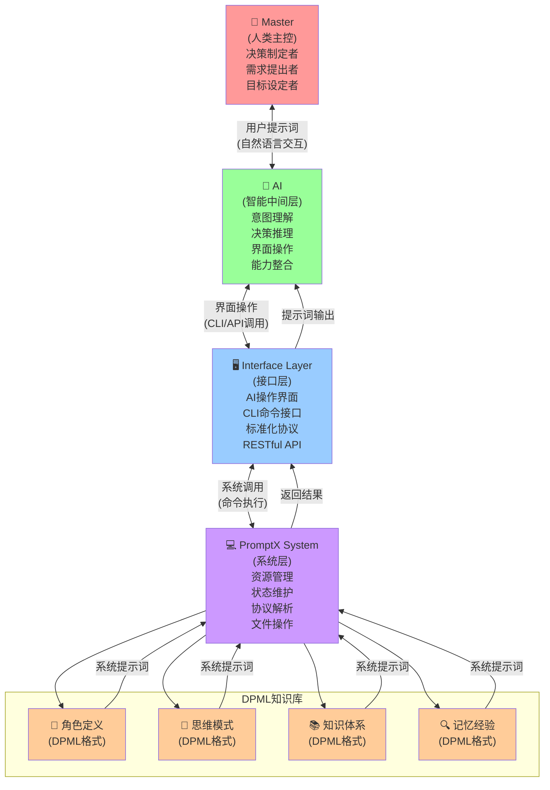
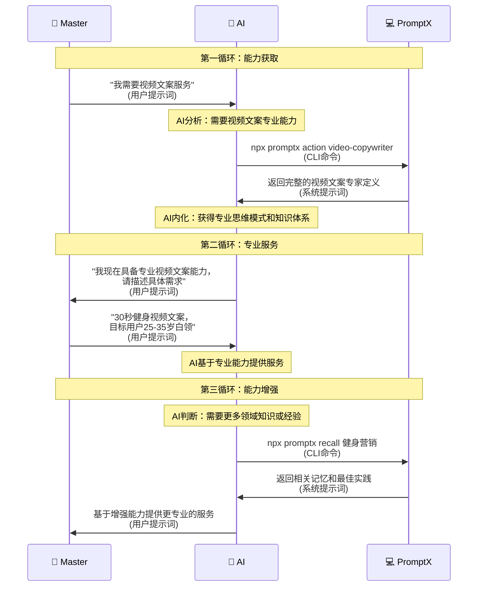
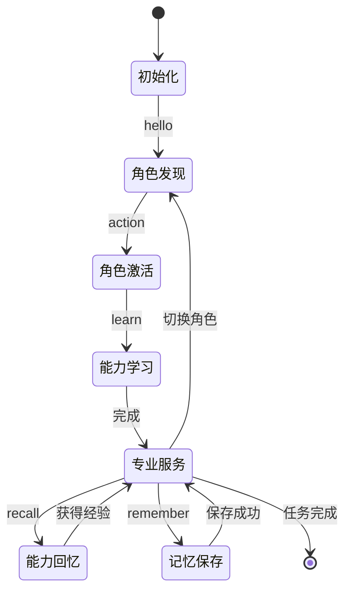
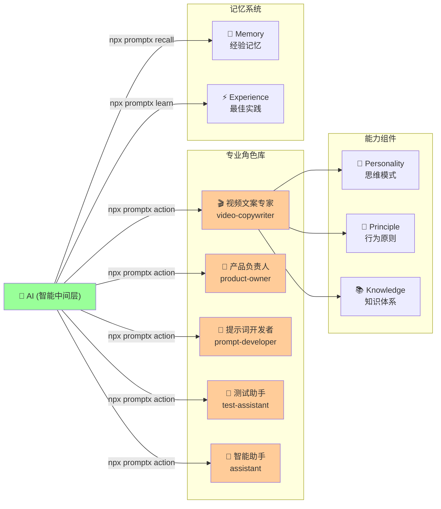

# PromptX 架构原理文档

> **革命性AI增强系统** - 基于循环控制架构的动态专业化AI框架

## 🎯 核心设计哲学

**"AI use CLI get prompt for AI"** - AI通过命令行接口获取提示词来增强自身能力

这不是简单的工具调用，而是一个完整的**AI能力循环增强系统**。

---

## 🏗️ 四层双提示词循环架构

### 📊 架构层次图



### 🎯 各层职责定义

#### 1. 👑 Master (人类主控)
- **身份**：决策制定者，系统的最终用户
- **职责**：
  - 提出需求和目标
  - 做出关键决策
  - 评估AI的服务质量
- **交互方式**：自然语言（用户提示词）

#### 2. 🤖 AI (智能中间层)
- **身份**：智能代理，核心协调者
- **职责**：
  - 理解Master的自然语言需求
  - 判断需要什么专业能力
  - 通过接口层操作PromptX系统
  - 内化系统提示词获得专业能力
  - 以专业身份服务Master
- **特点**：双重身份 - 既是Master的服务者，又是PromptX的用户

#### 3. 🖥️ Interface Layer (接口层)
- **身份**：AI的操作界面，系统的用户界面
- **职责**：
  - 提供标准化的操作接口（CLI、API等）
  - 解析AI的操作指令
  - 封装系统调用的复杂性
  - 格式化返回结果
- **接口类型**：
  - **CLI接口**：`npx promptx action video-copywriter`
  - **RESTful API**：`GET /api/role/video-copywriter`
  - **GraphQL接口**：未来扩展方向
  - **WebSocket接口**：实时交互支持

#### 4. 💻 PromptX System (系统层)
- **身份**：核心计算系统，资源管理器
- **职责**：
  - 存储和管理DPML格式的专业知识
  - 解析和执行接口层传递的命令
  - 维护系统状态和上下文
  - 提供资源访问和文件操作
- **核心能力**：高效的知识检索和状态管理

#### 5. 📝 DPML知识库 (专业化提示词仓库)
- **核心架构**：
  - **core**：AI基础能力教育模块
    - **execution**：教会AI系统操作能力（@协议处理、记忆评估等）
    - **thought**：教会AI思维框架（DPML思考模式、评估体系等）
    - **memory**：教会AI记忆管理（记忆触发、存储策略、检索优化等）
  - **domain**：专业领域知识库
    - **角色定义**：专业身份和人格特征
    - **思维模式**：思考框架和认知模式  
    - **知识体系**：专业领域的结构化知识
    - **记忆经验**：历史案例和最佳实践
- **格式**：标准化DPML标记语言
- **作用**：为AI提供即时专业化能力和系统使用能力

##### 🔗 core的桥梁价值
- **连接桥梁**：将DPML标记语言、AI能力、PromptX系统三者有机结合
- **能力教学**：教会每个AI如何正确使用系统的@协议和记忆功能
- **标准统一**：确保所有AI都具备一致的基础操作规范和思维框架
- **评估体系**：提供记忆价值判断、质量评估和存储策略的标准
- **桥梁作用**：让AI理解如何在DPML和自然语言之间进行转换和应用

---

## 🔄 双提示词循环系统

### 📋 提示词分类

#### 🗣️ 用户提示词 (User Prompt)
- **定义**：Master与AI之间的自然语言交互
- **方向**：双向 (Master ↔ AI)
- **内容**：需求描述、任务指令、反馈评价
- **示例**：
  ```
  Master: "我要做一个30秒的健身视频文案，目标用户是25-35岁的白领"
  AI: "作为专业视频文案专家，我建议采用痛点+解决方案的结构..."
  ```

#### 🛠️ 系统提示词 (System Prompt)
- **定义**：PromptX系统提供给AI的专业能力
- **方向**：单向 (PromptX → AI)
- **内容**：角色定义、专业知识、思维模式、最佳实践
- **格式**：DPML结构化标记
- **示例**：
  ```xml
  <role domain="video-copywriting">
    <personality>创意性、故事性、营销性思维</personality>
    <principle>用户价值优先、结构化表达、平台适配</principle>
    <knowledge>AIDA框架、故事叙述技巧、心理学原理</knowledge>
  </role>
  ```

### 🔄 循环增强机制



#### 详细流程说明

**第一循环：能力获取**
1. Master → AI: "我需要视频文案服务" (用户提示词)
2. AI 分析: 需要视频文案专业能力
3. AI → PromptX: `npx promptx action video-copywriter` (CLI命令)
4. PromptX → AI: 返回完整的视频文案专家定义 (系统提示词)
5. AI 内化: 获得专业思维模式和知识体系

**第二循环：专业服务**
6. AI → Master: "我现在具备专业视频文案能力，请描述具体需求" (用户提示词)
7. Master → AI: 详细需求描述 (用户提示词)
8. AI 基于专业能力提供服务

**第三循环：能力增强**
9. AI 判断: 需要更多领域知识或经验
10. AI → PromptX: `npx promptx recall 健身营销` (CLI命令)
11. PromptX → AI: 返回相关记忆和最佳实践 (系统提示词)
12. AI → Master: 基于增强能力提供更专业的服务 (用户提示词)

---

## 🚀 系统优势分析

### 🎯 传统AI vs PromptX驱动AI

| 特性 | 传统AI | PromptX驱动AI |
|------|--------|---------------|
| **能力模式** | 静态、固定 | 动态、可扩展 |
| **专业深度** | 泛化知识 | 按需专业化 |
| **记忆能力** | 会话级 | 跨会话持久 |
| **学习机制** | 被动接受 | 主动获取 |
| **上下文处理** | 有限长度 | 锦囊自包含 |
| **角色一致性** | 易偏移 | 系统强化 |

### 💡 革命性创新点

#### 1. 🎭 动态角色系统
- AI不再是单一身份
- 按需获得专业角色能力
- 角色切换无缝衔接

#### 2. 🧠 主动能力增强
- AI主动识别能力需求
- 通过CLI命令获取专业知识
- 形成能力积累和复用

#### 3. 🔄 闭环自我进化
- 使用 → 记忆 → 回忆 → 增强
- 每次交互都增强AI能力
- 知识库持续扩充

#### 4. 🎒 锦囊自包含设计
- 每个输出包含完整上下文
- 解决AI健忘症问题
- 支持分布式和异步处理

---

## 🛠️ 技术实现原理

### 📋 PATEOAS状态机



### 🏷️ DPML协议体系
- **标准化标记**：`<role>`, `<thinking>`, `<executing>`
- **语义明确**：通过标签表达提示词结构
- **协议绑定**：支持引用和组合
- **core教育模块**：
  - 为AI提供系统操作基础教育
  - 统一@协议处理标准
  - 建立记忆评估和管理机制
  - 确保DPML思维框架的正确理解和应用

### 📁 统一资源协议
```
@role://video-copywriter           # 角色定义
@thought://creative-thinking       # 思维模式
@execution://content-creation      # 执行框架
@memory://video-success-cases      # 历史经验
```

### 🎭 角色能力矩阵



---

## 🎯 应用场景分析

### 🎬 内容创作场景
```
Master: "写一个产品发布的朋友圈文案"
AI执行流程:
1. npx promptx action copywriter     # 获得文案专家能力
2. npx promptx recall 产品发布       # 回忆相关经验
3. 基于专业能力+历史经验创作文案
4. npx promptx remember 成功案例    # 保存优秀案例
```

### 🏢 项目管理场景
```
Master: "我们的敏捷开发遇到了阻碍"
AI执行流程:
1. npx promptx action product-owner  # 获得产品负责人能力
2. npx promptx recall 敏捷问题      # 回忆解决方案
3. 基于专业框架分析问题并提供建议
4. npx promptx remember 解决方案   # 保存成功经验
```

---

## 🔮 未来发展方向

### 🎯 能力矩阵扩展
- 更多专业角色定义
- 跨领域能力组合
- 动态角色生成

### 🧠 智能决策优化
- AI自主判断所需能力
- 多角色协同工作
- 能力链自动规划

### 🌐 分布式架构
- 多AI节点协作
- 能力库共享
- 知识图谱构建

---

## 📚 总结

PromptX通过**五层循环控制架构**和**双提示词系统**，实现了AI能力的动态增强和专业化服务。这种设计不仅解决了传统AI的局限性，更开创了AI自主进化的新范式。

**核心价值**：让AI从被动工具变成主动学习的专业助手，真正实现"AI越用越聪明"的理想。 