# PromptX 统一资源协议架构设计文档

## 目录
- [1. 概述](#1-概述)
- [2. 核心设计理念](#2-核心设计理念)
- [3. DPML协议体系设计](#3-dpml协议体系设计)
- [4. 多层级资源发现架构](#4-多层级资源发现架构)
- [5. 统一注册表设计](#5-统一注册表设计)
- [6. 协议解析执行流程](#6-协议解析执行流程)
- [7. 资源生命周期管理](#7-资源生命周期管理)
- [8. 扩展性设计](#8-扩展性设计)
- [9. 错误处理与容错机制](#9-错误处理与容错机制)
- [10. 性能优化策略](#10-性能优化策略)

## 1. 概述

PromptX采用统一资源协议架构，支持多层级资源发现与动态注册机制。该架构通过DPML（Domain-Specific Prompt Markup Language）协议实现资源的统一标识、发现、注册和解析。

## 2. 核心设计理念

### 2.1 分层架构原则

- **协议层**: 统一的@协议标识体系
- **发现层**: 多源资源发现机制
- **注册层**: 统一的资源注册表
- **解析层**: 协议到文件系统的映射

### 2.2 职责分离原则

- **Registry**: 专注资源映射存储和查询
- **Discovery**: 专注特定来源的资源发现
- **Protocol**: 专注协议解析和路径转换
- **Manager**: 专注流程编排和生命周期管理

## 3. DPML协议体系设计

### 3.1 协议语法结构

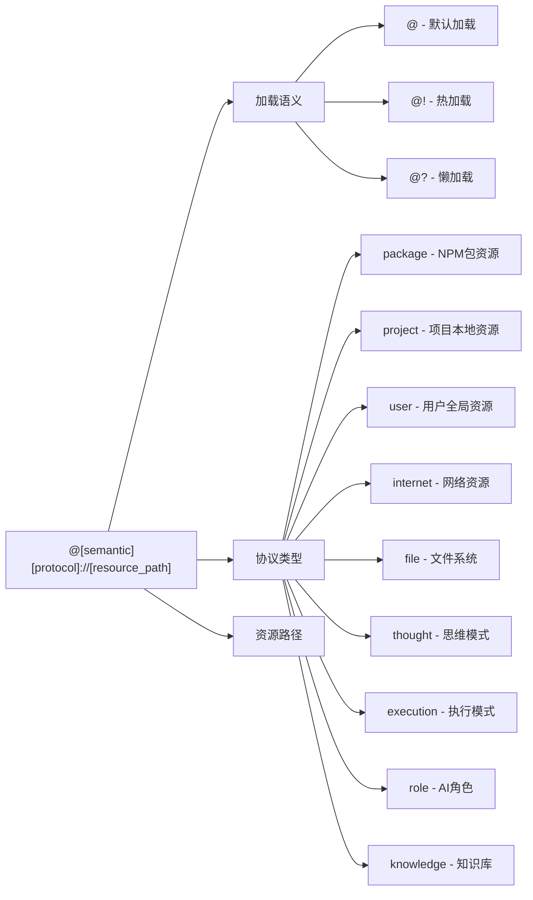

### 3.2 协议层级设计

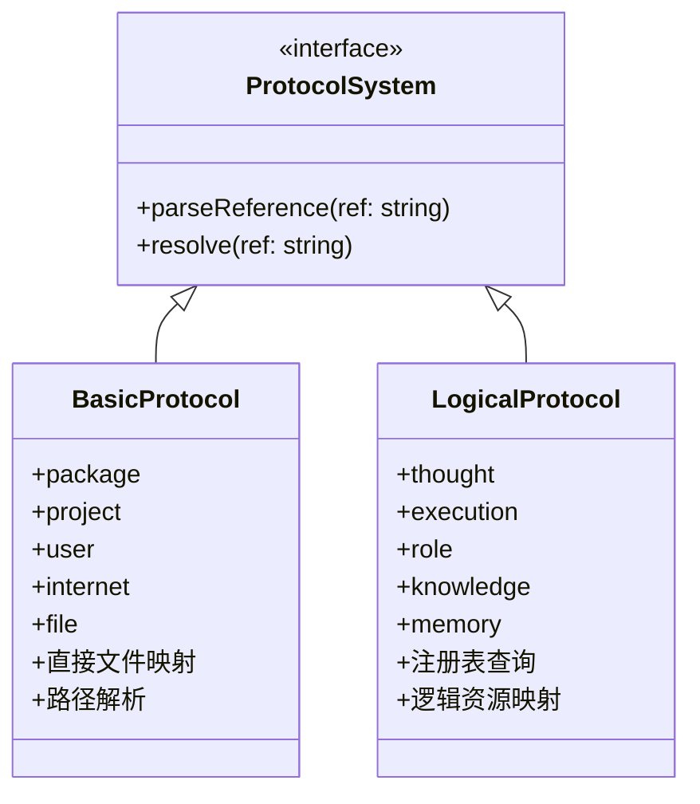

## 4. 多层级资源发现架构

### 4.1 发现层级结构

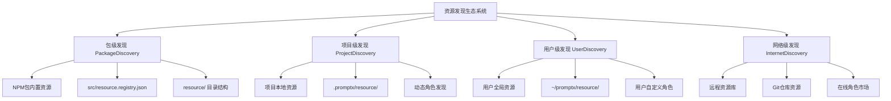

### 4.2 发现优先级机制

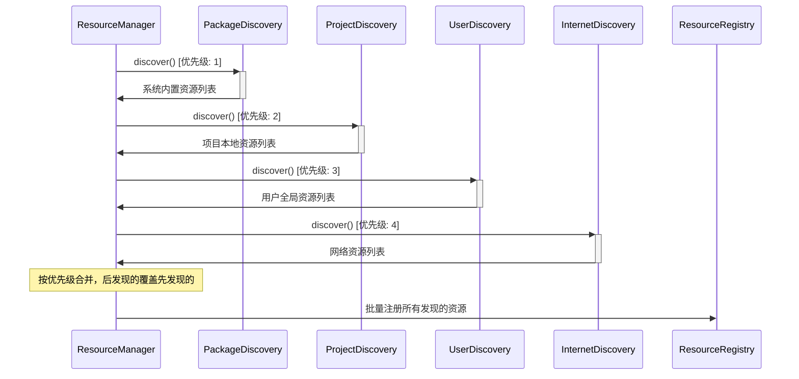

## 5. 统一注册表设计

### 5.1 注册表核心结构

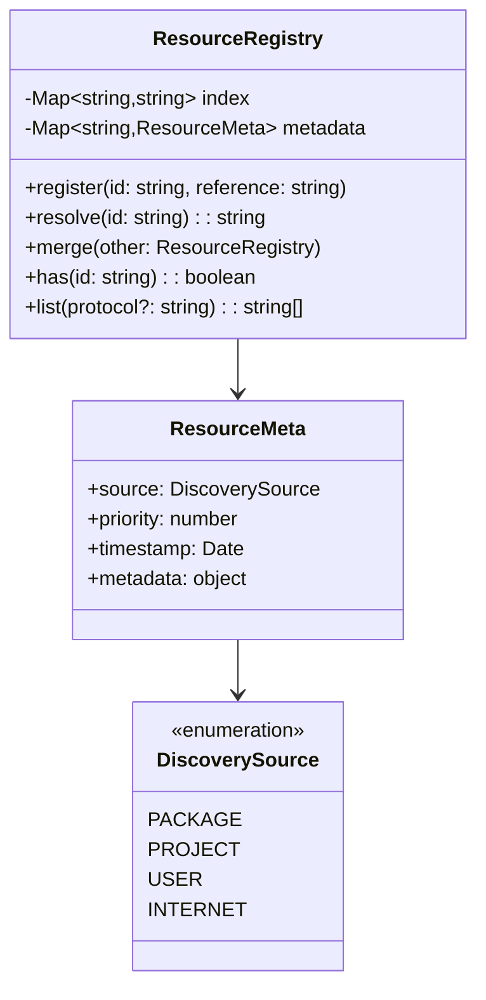

### 5.2 注册表合并策略

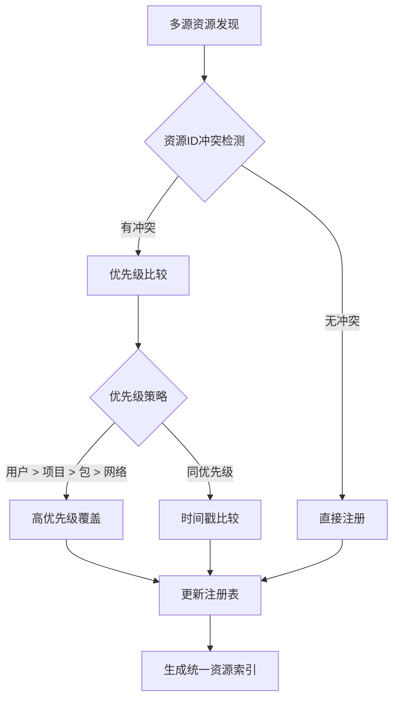

## 6. 协议解析执行流程

### 6.1 完整解析序列

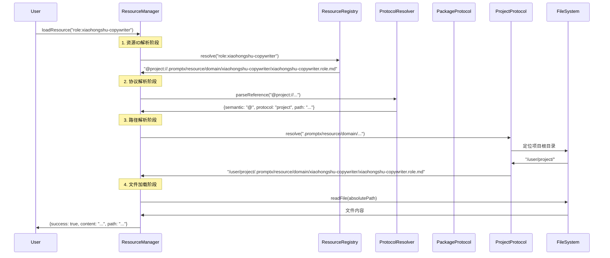

### 6.2 嵌套引用解析

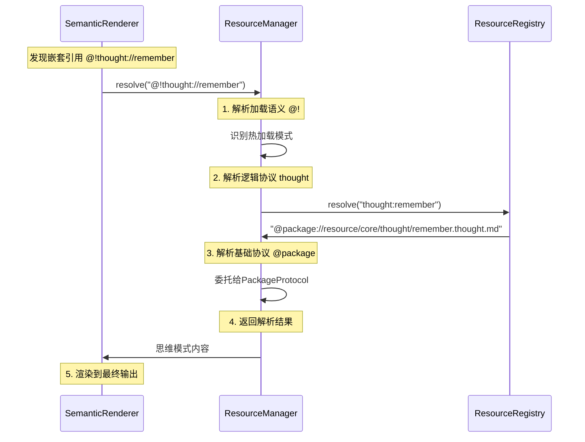

## 7. 资源生命周期管理

### 7.1 初始化流程

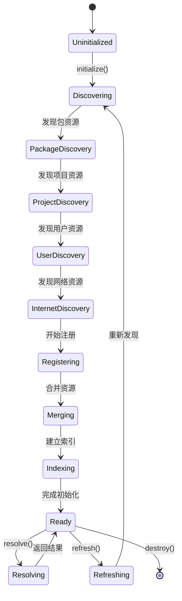

### 7.2 缓存与更新策略

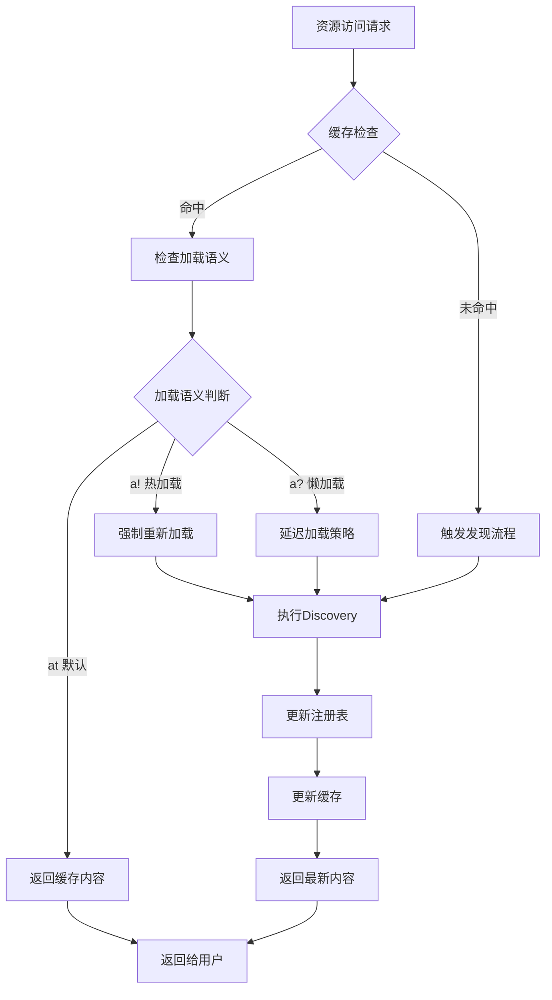

## 8. 扩展性设计

### 8.1 新协议扩展机制

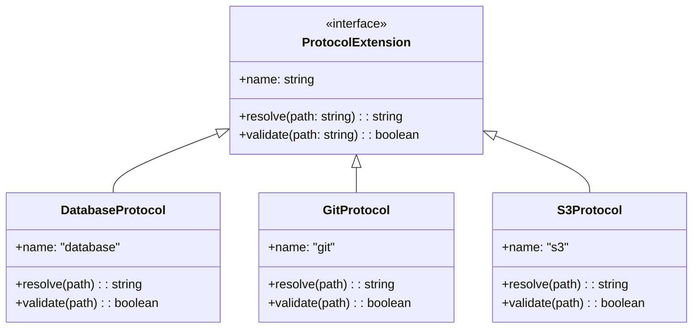

### 8.2 新发现源扩展

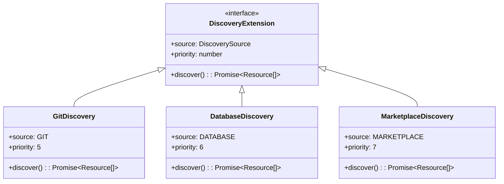

## 9. 错误处理与容错机制

### 9.1 分层错误处理

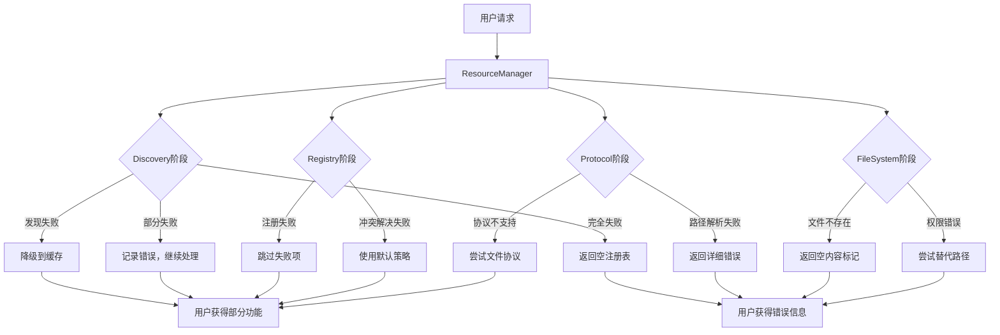

## 10. 性能优化策略

### 10.1 并行发现优化

| 模式 | PackageDiscovery | ProjectDiscovery | UserDiscovery | InternetDiscovery | 合并注册 |
|------|-----------------|------------------|---------------|-------------------|---------|
| 串行模式 | 0-200ms | 200-400ms | 400-600ms | 600-1000ms | - |
| 并行模式 | 0-200ms | 0-250ms | 0-180ms | 0-800ms | 800-850ms |

### 10.2 缓存分层策略

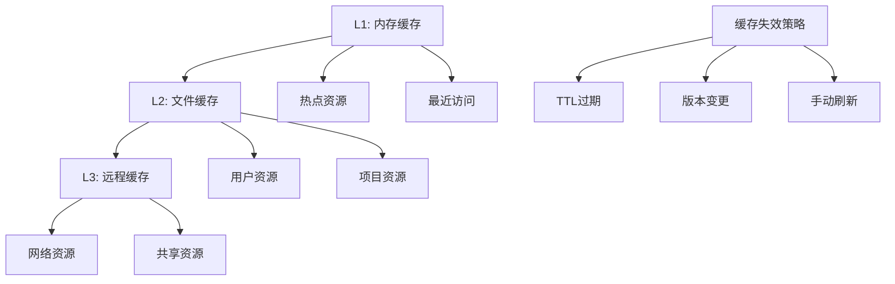

## 总结

这个架构设计确保了PromptX资源系统的高度可扩展性、跨平台兼容性和优秀的性能表现，同时保持了清晰的职责分离和统一的访问接口。

### 核心优势

1. **统一协议体系**: 通过DPML协议实现资源的标准化访问
2. **多层级发现**: 支持包、项目、用户、网络多个层级的资源发现
3. **智能注册表**: 自动处理资源冲突和优先级管理
4. **高性能设计**: 并行发现和多层缓存策略
5. **强容错性**: 完善的错误处理和降级机制
6. **易扩展性**: 支持新协议和新发现源的动态扩展