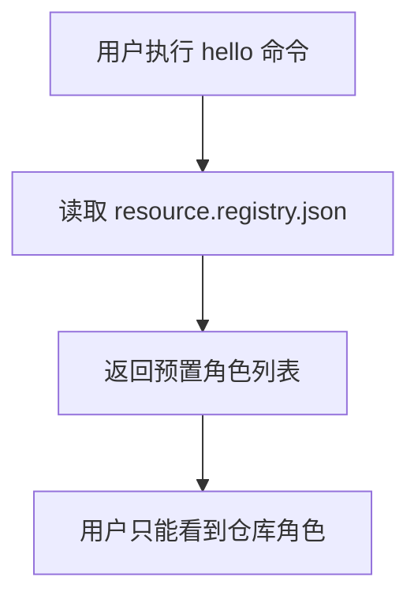
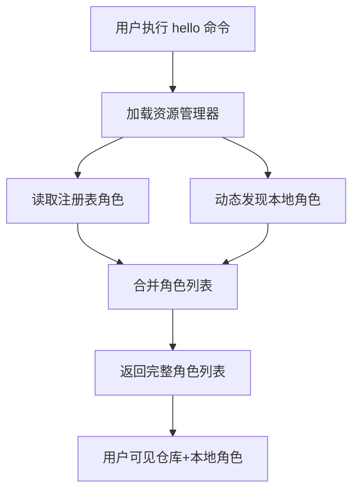

# PromptX 角色激活流程重大改进文档

## 📋 概述

本文档详细说明了PromptX系统在角色激活流程方面的重大改进，重点解决了从npm仓库模式向本地项目角色发现模式的转变。

## 🎯 改进目标

### 问题背景
在改进前，PromptX系统存在以下限制：
- **静态角色库**：只能发现npm包中预置的角色
- **本地角色盲区**：无法识别用户在项目中创建的自定义角色
- **部署环境限制**：不能适应不同的npm安装和部署场景

### 解决方案
通过实现**双重角色发现机制**，系统现在能够：
- ✅ 自动发现本地项目中的自定义角色
- ✅ 保持对npm仓库角色的完全兼容
- ✅ 适应多种部署和开发环境

## 🏗️ 技术架构改进

### 1. 双重角色发现机制

#### 原有架构


#### 改进后架构


### 2. 智能环境检测系统

系统现在能够智能检测并适应以下部署环境：

| 环境类型 | 检测方式 | 角色发现策略 |
|---------|---------|-------------|
| **开发模式** | NODE_ENV=development | 直接扫描源码目录 |
| **NPX执行** | 检测npx相关环境变量 | 从临时缓存目录发现 |
| **全局安装** | 检测全局路径 | 从全局node_modules发现 |
| **本地安装** | 默认情况 | 从项目node_modules发现 |
| **Monorepo** | 检测workspaces字段 | 从工作空间根目录发现 |
| **NPM Link** | 检测符号链接 | 解析真实路径后发现 |

## 🔧 核心功能实现

### 1. 本地角色动态发现

```javascript
// HelloCommand.js 中的核心实现
async discoverLocalRoles() {
  const PackageProtocol = require('../../resource/protocols/PackageProtocol')
  const packageProtocol = new PackageProtocol()
  const glob = require('glob')
  
  try {
    // 获取项目根目录
    const packageRoot = await packageProtocol.getPackageRoot()
    const domainPath = path.join(packageRoot, 'prompt', 'domain')
    
    // 扫描所有角色文件
    const rolePattern = path.join(domainPath, '*', '*.role.md')
    const roleFiles = glob.sync(rolePattern)
    
    const discoveredRoles = {}
    
    for (const roleFile of roleFiles) {
      // 提取角色元数据
      const content = await fs.readFile(roleFile, 'utf-8')
      const roleName = path.basename(roleFile, '.role.md')
      
      // 智能解析name和description
      const nameMatch = content.match(/name:\s*(.+?)(?:\n|$)/i)
      const descMatch = content.match(/description:\s*(.+?)(?:\n|$)/i)
      
      discoveredRoles[roleName] = {
        file: `@package://${relativePath}`,
        name: nameMatch ? nameMatch[1].trim() : `🎭 ${roleName}`,
        description: descMatch ? descMatch[1].trim() : '本地发现的角色',
        source: 'local-discovery'
      }
    }
    
    return discoveredRoles
  } catch (error) {
    console.warn('动态角色发现失败:', error.message)
    return {}
  }
}
```

### 2. 环境智能检测

```javascript
// PackageProtocol.js 中的环境检测
_performInstallModeDetection() {
  // 检测npx执行
  if (this._isNpxExecution()) {
    return 'npx'
  }
  
  // 检测全局安装
  if (this._isGlobalInstall()) {
    return 'global'
  }
  
  // 检测开发模式
  if (this._isDevelopmentMode()) {
    return 'development'
  }
  
  // 检测monorepo
  if (this._isMonorepoWorkspace()) {
    return 'monorepo'
  }
  
  // 检测npm link
  if (this._isNpmLink()) {
    return 'link'
  }
  
  // 默认为本地安装
  return 'local'
}
```

### 3. 角色合并策略

```javascript
// 双重发现并合并
async loadRoleRegistry() {
  try {
    // 1. 加载注册表角色
    const resourceManager = new ResourceManager()
    await resourceManager.initialize()
    const registeredRoles = resourceManager.registry.protocols.role.registry || {}
    
    // 2. 动态发现本地角色
    const discoveredRoles = await this.discoverLocalRoles()
    
    // 3. 合并角色（本地角色优先级更高）
    this.roleRegistry = {
      ...registeredRoles,
      ...discoveredRoles
    }
    
    // 4. 容错处理
    if (Object.keys(this.roleRegistry).length === 0) {
      this.roleRegistry = {
        assistant: {
          file: '@package://resource/domain/assistant/assistant.role.md',
          name: '🙋 智能助手',
          description: '通用助理角色，提供基础的助理服务和记忆支持'
        }
      }
    }
  } catch (error) {
    // 降级到动态发现
    const discoveredRoles = await this.discoverLocalRoles()
    this.roleRegistry = Object.keys(discoveredRoles).length > 0 
      ? discoveredRoles 
      : { /* 基础assistant角色 */ }
  }
}
```

## 📝 使用指南

### 1. 创建本地角色

在项目根目录下创建角色：

```bash
# 创建角色目录结构
mkdir -p resource/domain/my-custom-role/thought
mkdir -p resource/domain/my-custom-role/execution

# 创建主角色文件
cat > resource/domain/my-custom-role/my-custom-role.role.md << 'EOF'
<!--
name: 🎯 项目专属角色
description: 为当前项目量身定制的专业角色
-->

<role>
  <personality>
    @!thought://remember
    @!thought://recall
    @!thought://my-custom-role
  </personality>

  <principle>
    @!execution://my-custom-role
  </principle>
</role>
EOF

# 创建思维组件
cat > resource/domain/my-custom-role/thought/my-custom-role.thought.md << 'EOF'
<thought>
  <exploration>
    # 项目专属思维探索
    ## 核心能力
    - 深度理解项目需求
    - 定制化解决方案
    - 项目上下文感知
  </exploration>
  
  <reasoning>
    # 推理框架
    ## 决策逻辑
    1. 分析项目背景
    2. 识别关键需求
    3. 制定解决方案
    4. 验证可行性
  </reasoning>
  
  <challenge>
    # 风险识别
    ## 潜在挑战
    - 需求变更风险
    - 技术实现难度
    - 时间约束压力
  </challenge>
  
  <plan>
    # 执行计划
    ## 工作流程
    1. 需求收集与分析
    2. 方案设计与评估
    3. 实施与监控
    4. 反馈与优化
  </plan>
</thought>
EOF

# 创建执行组件
cat > resource/domain/my-custom-role/execution/my-custom-role.execution.md << 'EOF'
<execution>
  <constraint>
    # 约束条件
    - 必须符合项目标准
    - 遵循开发规范
    - 保证交付质量
  </constraint>
  
  <rule>
    # 强制规则
    1. 所有方案必须经过验证
    2. 必须提供详细文档
    3. 确保代码质量标准
  </rule>
  
  <guideline>
    # 指导原则
    - 用户需求优先
    - 简洁高效实现
    - 可维护性考虑
  </guideline>
  
  <process>
    # 执行流程
    ```mermaid
    flowchart TD
      A[接收需求] --> B[分析评估]
      B --> C[方案设计]
      C --> D[实施执行]
      D --> E[质量检查]
      E --> F[交付确认]
    ```
  </process>
  
  <criteria>
    # 评价标准
    | 维度 | 标准 |
    |------|------|
    | 功能完整性 | 100% |
    | 代码质量 | A级 |
    | 文档完备性 | 完整 |
    | 用户满意度 | ≥90% |
  </criteria>
</execution>
EOF
```

### 2. 验证角色发现

```bash
# 查看所有可用角色（包括本地角色）
npx dpml-prompt hello

# 激活本地角色
npx dpml-prompt action my-custom-role

# 注册角色到系统（可选）
npx dpml-prompt register my-custom-role
```

### 3. 角色元数据最佳实践

在角色文件顶部使用标准注释格式：

```markdown
<!--
name: 🎯 [角色显示名称]
description: [详细的角色功能描述]
version: 1.0.0
author: [作者名称]
tags: [标签1, 标签2, 标签3]
-->
```

## 🔍 技术细节

### 1. 文件扫描机制

- **扫描路径**：`{项目根}/resource/domain/*/*.role.md`
- **扫描工具**：使用`glob`模块进行高效文件匹配
- **元数据提取**：正则表达式解析注释中的元信息
- **容错处理**：跳过格式错误的文件，记录警告信息

### 2. 路径解析策略

- **@package://协议**：统一的资源访问协议
- **相对路径转换**：自动转换为文件系统绝对路径
- **安全验证**：防止路径遍历攻击
- **权限检查**：基于package.json的files字段验证访问权限

### 3. 缓存机制

- **环境检测缓存**：避免重复检测安装环境
- **角色注册表缓存**：提高重复访问性能
- **失效策略**：支持手动清除缓存

## 🛡️ 安全考虑

### 1. 路径安全

```javascript
// 防止路径遍历攻击
if (!fullPath.startsWith(packageRoot)) {
  throw new Error(`Path traversal detected: ${relativePath}`)
}
```

### 2. 文件访问控制

```javascript
// 基于package.json的files字段验证
validateFileAccess(packageRoot, relativePath) {
  const packageJson = JSON.parse(fs.readFileSync(packageJsonPath, 'utf8'))
  
  if (!packageJson.files || !Array.isArray(packageJson.files)) {
    return // 开发模式允许访问所有文件
  }
  
  // 检查是否匹配files字段中的模式
  const isAllowed = packageJson.files.some(filePattern => {
    // 模式匹配逻辑
  })
  
  if (!isAllowed) {
    throw new Error(`Access denied: Path not in package.json files field`)
  }
}
```

### 3. 容错机制

- **多层降级**：注册表失败 → 动态发现 → 基础角色
- **错误隔离**：单个角色解析失败不影响其他角色
- **日志记录**：详细记录错误信息便于调试

## 📊 性能优化

### 1. 懒加载机制

- **按需初始化**：只在需要时才进行角色发现
- **缓存复用**：避免重复的文件系统操作
- **异步处理**：使用Promise并行处理多个角色文件

### 2. 扫描优化

- **Glob模式**：高效的文件匹配模式
- **路径预过滤**：提前过滤无效路径
- **内容解析**：只解析必要的元数据信息

## 🔄 兼容性保证

### 1. 向后兼容

- ✅ 现有npm包角色完全兼容
- ✅ 原有CLI命令保持不变
- ✅ 配置文件格式保持兼容

### 2. 渐进增强

- ✅ 无本地角色时正常工作
- ✅ 本地角色优先级高于仓库角色
- ✅ 支持角色覆盖和扩展

## 🧪 测试验证

### 1. 单元测试

```bash
# 测试角色发现功能
npm run test:unit -- --grep "discoverLocalRoles"

# 测试环境检测功能
npm run test:unit -- --grep "detectInstallMode"

# 测试路径解析功能
npm run test:unit -- --grep "resolvePath"
```

### 2. 集成测试

```bash
# 测试完整的角色激活流程
npm run test:integration -- --grep "role-activation"

# 测试多环境兼容性
npm run test:e2e -- --grep "multi-environment"
```

### 3. 手动测试场景

| 测试场景 | 预期结果 |
|---------|---------|
| 纯npm包使用 | 只显示仓库角色 |
| 项目中创建本地角色 | 显示仓库+本地角色 |
| 本地角色与仓库角色同名 | 本地角色优先 |
| 无效角色文件 | 跳过并警告 |
| 权限不足 | 优雅降级 |

## 📚 最佳实践

### 1. 角色设计规范

- **命名规范**：使用kebab-case命名
- **目录结构**：遵循标准三件套结构
- **元数据完整**：提供完整的name和description
- **文档齐全**：包含详细的使用说明

### 2. 项目组织建议

```
project-root/
├── resource/
│   └── domain/
│       ├── project-assistant/       # 项目助手角色
│       ├── api-designer/           # API设计师角色
│       ├── code-reviewer/          # 代码审查员角色
│       └── deployment-manager/     # 部署管理员角色
├── package.json
└── README.md
```

### 3. 版本管理

- **语义化版本**：在角色注释中标注版本
- **变更记录**：维护角色变更历史
- **兼容性声明**：明确依赖的系统版本

## 🚀 未来扩展

### 1. 计划中的功能

- **角色市场**：支持从在线市场下载角色
- **角色模板**：提供更多角色创建模板
- **依赖管理**：支持角色间的依赖关系
- **热更新**：支持角色的热重载

### 2. 性能优化方向

- **增量扫描**：只扫描变更的角色文件
- **并行处理**：并行解析多个角色文件
- **智能缓存**：基于文件修改时间的智能缓存

## 📖 总结

本次角色激活流程改进是PromptX系统的一个重要里程碑，它解决了系统从静态npm包模式向动态本地发现模式的转变。主要成果包括：

1. **🎯 问题解决**：完全解决了本地角色无法发现的问题
2. **🏗️ 架构升级**：实现了双重发现机制和智能环境检测
3. **🛡️ 安全保障**：提供了完整的安全验证和容错机制
4. **📈 性能优化**：通过缓存和懒加载提升了系统性能
5. **🔄 兼容保证**：确保了向后兼容和渐进增强

这些改进使得PromptX不仅可以作为npm包提供标准角色，更可以在具体项目中创建和使用专门定制的角色，真正实现了"AI use CLI get prompt for AI"的设计理念。

---

*文档版本：1.0.0*  
*最后更新：2024年12月*  
*维护者：PromptX开发团队* 