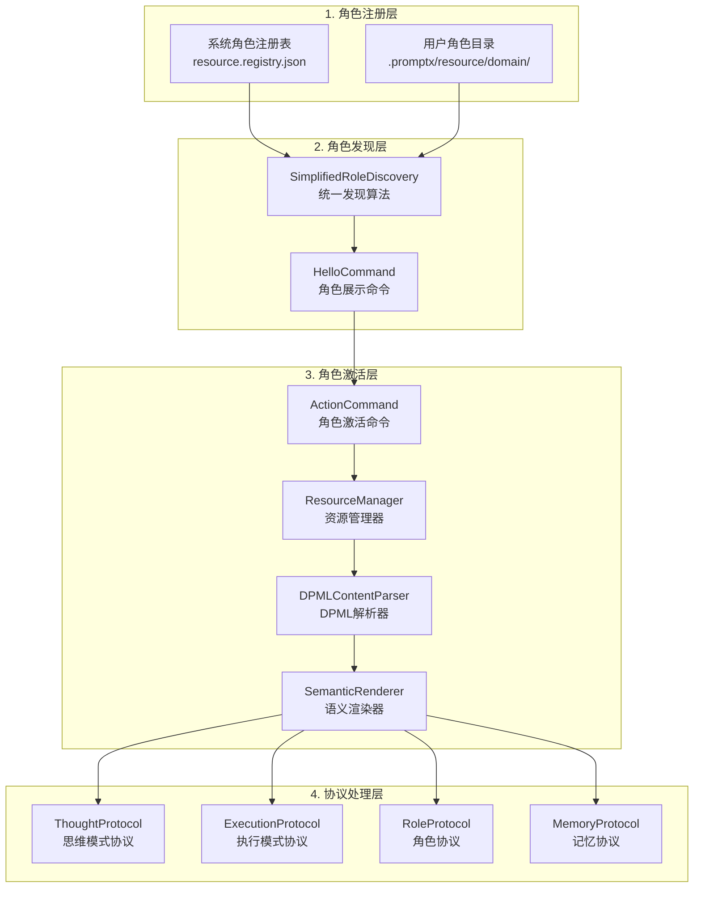
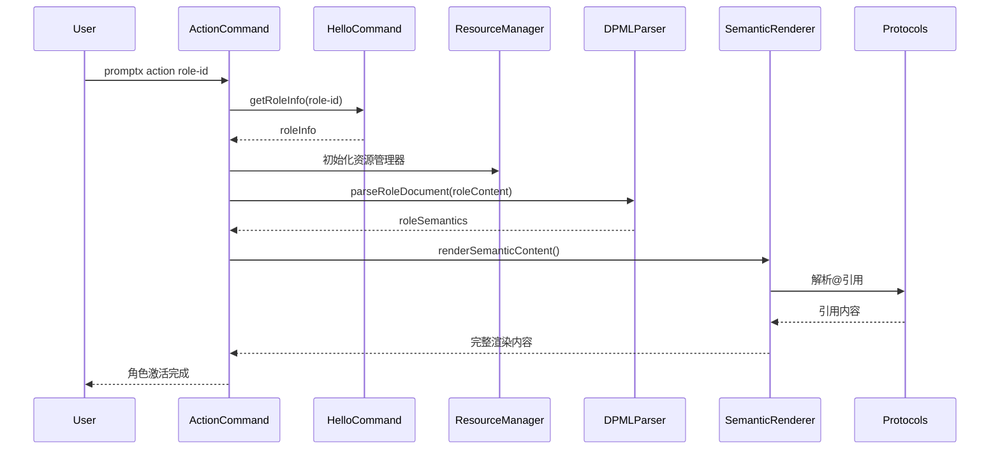
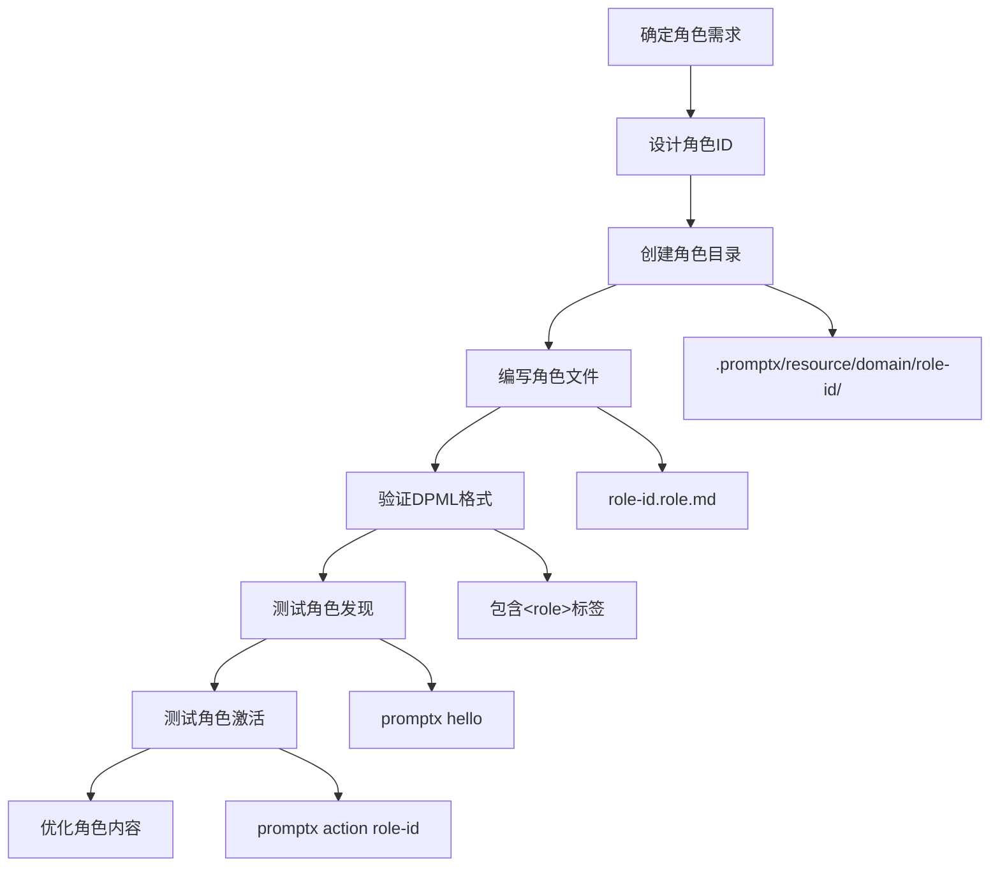
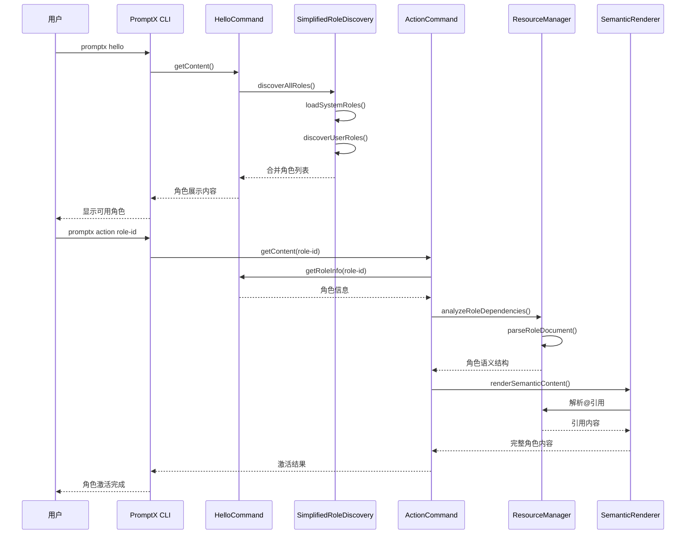

# PromptX 角色系统完整指南

> **适用对象**: 提示词工程师、AI模型集成者、角色创建者
> 
> **文档目的**: 详细说明PromptX角色系统从注册到发现到激活的完整流程和规则，确保提示词编写者和AI能正确理解和使用角色系统

## 📋 文档信息
- **版本**: v1.0.0
- **创建时间**: 2025-06-11
- **更新时间**: 2025-06-11
- **作者**: Claude Code & Sean
- **状态**: 正式发布

## 🎯 核心概念

### 角色系统架构图


### 关键设计原则

1. **协议驱动**: 基于DPML协议的结构化角色定义
2. **零配置发现**: 用户角色自动发现，无需手动注册
3. **语义完整性**: @引用作为语义占位符，保持内容连贯性
4. **分层架构**: 清晰的职责分离，便于扩展和维护
5. **用户优先**: 用户自定义角色覆盖同名系统角色

## 📝 第一部分：角色注册机制

### 1.1 系统角色注册

**注册位置**: `/src/resource.registry.json`

**注册格式**:
```json
{
  "protocols": {
    "role": {
      "registry": {
        "角色ID": {
          "file": "@package://resource/domain/角色名/角色名.role.md",
          "name": "🎭 角色显示名称",
          "description": "角色功能描述"
        }
      }
    }
  }
}
```

**示例**:
```json
"assistant": {
  "file": "@package://resource/domain/assistant/assistant.role.md",
  "name": "🙋 智能助手",
  "description": "通用助理角色，提供基础的助理服务和记忆支持"
}
```

### 1.2 用户角色注册

**自动发现路径**: `{项目根目录}/.promptx/resource/domain/{角色ID}/`

**文件结构要求**:
```
.promptx/
└── resource/
    └── domain/
        └── my-expert/          # 角色ID目录
            ├── my-expert.role.md    # 主角色文件（必需）
            ├── thought/            # 思维模式目录（可选）
            │   └── *.thought.md
            └── execution/          # 执行模式目录（可选）
                └── *.execution.md
```

**角色文件命名规则**:
- 主角色文件: `{角色ID}.role.md`
- 思维文件: `{思维名}.thought.md`
- 执行文件: `{执行名}.execution.md`

### 1.3 角色文件DPML格式要求

**最小有效角色文件**:
```xml
<role>
  <personality>
    # 角色人格特征
    我是一个专业的...
  </personality>

  <principle>
    # 行为原则
    在工作中，我遵循以下原则：
    1. 准确性优先
    2. 用户体验至上
  </principle>
</role>
```

**完整角色文件示例**:
```xml
<role>
  <personality>
    @!thought://remember
    @!thought://recall
    
    # 专业人格特征
    我是一个专注于产品管理的专家，具备：
    - 用户需求洞察能力
    - 市场分析思维
    
    @!thought://product-manager
  </personality>

  <principle>
    @!execution://product-manager
    @!execution://market-analysis
    
    # 核心工作原则
    1. 数据驱动决策
    2. 用户价值导向
  </principle>

  <knowledge>
    # 专业知识体系
    ## 产品管理框架
    - OKR目标管理
    - 用户故事地图
    
    @!execution://user-research
  </knowledge>
</role>
```

## 🔍 第二部分：角色发现机制

### 2.1 SimplifiedRoleDiscovery算法

**核心特性**:
- **并行加载**: 系统角色和用户角色并行发现
- **零缓存**: 每次实时扫描，确保数据一致性
- **跨平台兼容**: 避免glob依赖，使用Node.js原生API
- **容错设计**: 单个角色失败不影响整体发现

**发现流程**:
```javascript
async discoverAllRoles() {
  // 1. 并行加载系统和用户角色
  const [systemRoles, userRoles] = await Promise.all([
    this.loadSystemRoles(),      // 从静态注册表加载
    this.discoverUserRoles()     // 从文件系统扫描
  ])
  
  // 2. 合并角色，用户角色覆盖同名系统角色
  return this.mergeRoles(systemRoles, userRoles)
}
```

### 2.2 用户角色验证规则

**基础验证**:
```javascript
isValidRoleFile(content) {
  return content.includes('<role>') && content.includes('</role>')
}
```

**元数据提取**:
- **角色名称**: 从Markdown标题提取 (`# 角色名称`)
- **角色描述**: 从Markdown引用提取 (`> 角色描述`)
- **文件路径**: 转换为@project://格式的相对路径

### 2.3 HelloCommand显示逻辑

**角色列表格式**:
```markdown
🤖 **AI专业角色服务清单** (共 N 个专业角色可供选择)

## 📋 可用角色列表

### 1. 🙋 智能助手 (系统角色)
**角色ID**: `assistant`  
**专业能力**: 通用助理角色，提供基础的助理服务和记忆支持  
**激活命令**: `promptx action assistant`

---
```

**来源标识**:
- `(系统角色)`: 来自系统注册表
- `(用户生成)`: 来自用户目录
- `(默认角色)`: 系统fallback角色

## ⚡ 第三部分：角色激活流程

### 3.1 ActionCommand激活步骤



### 3.2 DPML语义解析

**DPMLContentParser处理的标签**:
- `<personality>`: 角色人格特征
- `<principle>`: 行为原则
- `<knowledge>`: 专业知识体系

**解析结果结构**:
```javascript
roleSemantics = {
  personality: {
    fullSemantics: "完整内容...",
    references: [
      {
        fullMatch: "@!thought://remember",
        priority: "!",
        protocol: "thought",
        resource: "remember",
        isRequired: true
      }
    ]
  },
  principle: { /* 同上结构 */ },
  knowledge: { /* 同上结构 */ }
}
```

### 3.3 语义渲染机制

**核心理念**: @引用 = 语义占位符

**渲染流程**:
```javascript
async renderSemanticContent(tagSemantics, resourceManager) {
  let content = tagSemantics.fullSemantics
  
  // 按出现顺序处理@引用，保持位置语义
  for (const ref of tagSemantics.references) {
    const refContent = await resourceManager.resolveReference(ref)
    
    // 在原始位置替换@引用为实际内容
    content = content.replace(ref.fullMatch, refContent)
  }
  
  return content.trim()
}
```

**渲染前后对比**:

**渲染前（分离的）**:
```
## 思维模式：remember
[remember的内容]
---
## 角色人格：my-role  
# 核心特征
专业能力...
---
## 思维模式：recall
[recall的内容]
---
```

**渲染后（完整的）**:
```
## 完整人格特征：my-role

[remember的完整内容]

# 核心特征  
专业能力...

[recall的完整内容]

---
```

## 🔗 第四部分：协议与引用系统

### 4.1 @引用语法规范

**基础语法**:
- `@protocol://resource`: 标准引用
- `@!protocol://resource`: 必需引用（高优先级）
- `@?protocol://resource`: 可选引用（低优先级）

**支持的协议**:
- `thought://`: 思维模式引用
- `execution://`: 执行模式引用
- `memory://`: 记忆系统引用
- `package://`: 包内资源引用
- `project://`: 项目相对路径引用
- `user://`: 用户目录引用

### 4.2 协议处理器架构

**ResourceManager协议注册**:
```javascript
// 自动发现和注册协议处理器
const protocolsDir = path.join(__dirname, 'protocols')
const protocolFiles = await fs.readdir(protocolsDir)

for (const file of protocolFiles) {
  const protocolName = file.replace('Protocol.js', '').toLowerCase()
  const ProtocolClass = require(path.join(protocolsDir, file))
  const protocolHandler = new ProtocolClass()
  
  // 注入协议注册表
  const protocolRegistry = this.registry[protocolName]
  if (protocolRegistry) {
    protocolHandler.setRegistry(protocolRegistry)
  }
  
  handlers.set(protocolName, protocolHandler)
}
```

**协议处理器基础结构**:
```javascript
class ThoughtProtocol extends ResourceProtocol {
  setRegistry(registry) { 
    this.registry = registry 
  }
  
  resolvePath(resourcePath) { 
    // 将逻辑路径转换为物理路径
    return this.registry[resourcePath]
  }
  
  async loadContent(resolvedPath) { 
    // 加载并返回文件内容
    return await fs.readFile(resolvedPath, 'utf8')
  }
}
```

### 4.3 路径解析优先级

1. **@package://** - 内部包资源（最高优先级）
2. **@project://** - 项目相对资源
3. **@user://** - 用户特定资源
4. **绝对路径** - 直接文件系统访问（最低优先级）

## 🎯 第五部分：角色编写规范与最佳实践

### 5.1 角色创建清单

**必需元素**:
- [ ] 角色ID符合命名规范（小写字母、数字、连字符）
- [ ] 包含`<role>`和`</role>`标签
- [ ] 至少包含`<personality>`或`<principle>`之一
- [ ] 文件名为`{角色ID}.role.md`

**推荐元素**:
- [ ] 清晰的角色名称（Markdown标题）
- [ ] 简洁的角色描述（Markdown引用）
- [ ] 适当的@引用组合
- [ ] 结构化的内容组织

### 5.2 DPML编写规范

**标签使用指南**:

```xml
<role>
  <!-- 人格特征：定义角色的思维模式和性格特点 -->
  <personality>
    @!thought://基础思维能力
    
    # 专业人格描述
    具体的人格特征描述...
    
    @!thought://专业思维能力
  </personality>

  <!-- 行为原则：定义角色的执行方式和工作流程 -->
  <principle>
    @!execution://核心执行能力
    
    # 工作原则
    1. 原则一
    2. 原则二
    
    @!execution://专业执行能力
  </principle>

  <!-- 知识体系：定义角色的专业知识（可选） -->
  <knowledge>
    # 专业知识框架
    领域知识描述...
    
    @!execution://专业知识执行
  </knowledge>
</role>
```

**@引用最佳实践**:

1. **基础能力引用**（推荐）:
   ```xml
   <personality>
     @!thought://remember  <!-- 记忆能力 -->
     @!thought://recall    <!-- 回忆能力 -->
     
     # 角色特定内容...
   </personality>
   ```

2. **专业能力引用**:
   ```xml
   <principle>
     @!execution://role-specific-skill
     @?execution://optional-enhancement
   </principle>
   ```

3. **内容与引用混合**:
   ```xml
   <personality>
     @!thought://base-thinking
     
     # 角色独特特征
     具体描述...
     
     @!thought://specialized-thinking
   </personality>
   ```

### 5.3 角色命名约定

**角色ID规范**:
- 使用小写字母、数字和连字符
- 避免下划线和特殊字符
- 长度建议3-30字符
- 示例: `product-manager`, `java-developer`, `ai-trainer`

**显示名称规范**:
- 使用合适的emoji前缀
- 清晰表达角色职能
- 控制在2-6个字符
- 示例: `📊 产品经理`, `☕ Java开发者`, `🎨 UI设计师`

### 5.4 常见错误避免

**❌ 错误示例**:

1. **标签未闭合**:
   ```xml
   <role>
     <personality>
       内容...
     <!-- 缺少</personality> -->
   </role>
   ```

2. **引用语法错误**:
   ```xml
   <personality>
     @thought://remember    <!-- 缺少优先级标识 -->
     @!thought//recall      <!-- 缺少冒号 -->
   </personality>
   ```

3. **文件命名不匹配**:
   ```
   目录: my-expert/
   文件: expert.role.md    <!-- 应该是 my-expert.role.md -->
   ```

**✅ 正确示例**:

```xml
<role>
  <personality>
    @!thought://remember
    @!thought://recall
    
    # 专业产品经理
    我具备敏锐的市场洞察力和用户需求分析能力。
    
    @!thought://product-manager
  </personality>

  <principle>
    @!execution://product-manager
    
    # 核心工作原则
    1. 数据驱动决策
    2. 用户价值优先
    3. 迭代优化改进
  </principle>
</role>
```

## 🔄 第六部分：完整工作流程

### 6.1 用户创建角色流程



### 6.2 系统处理流程



### 6.3 错误处理机制

**发现阶段错误处理**:
- 单个角色文件错误不影响其他角色
- 目录访问失败时优雅降级
- 提供有意义的错误日志

**激活阶段错误处理**:
- @引用解析失败时的占位符处理
- DPML格式错误的友好提示
- 资源加载超时的重试机制

## 📚 第七部分：扩展与定制

### 7.1 自定义协议开发

**创建新协议处理器**:
```javascript
class CustomProtocol extends ResourceProtocol {
  constructor() {
    super()
    this.name = 'custom'
    this.description = '自定义协议描述'
  }

  async resolve(resourcePath, queryParams) {
    // 实现自定义解析逻辑
    const resolvedPath = this.resolvePath(resourcePath)
    return await this.loadContent(resolvedPath)
  }
  
  resolvePath(resourcePath) {
    // 路径解析逻辑
    return this.registry[resourcePath]
  }
}
```

**注册新协议**:
1. 将协议文件放入`/src/lib/core/resource/protocols/`
2. 在`resource.registry.json`中添加协议配置
3. ResourceManager会自动发现和注册

### 7.2 角色模板系统

**基础角色模板**:
```xml
<role>
  <personality>
    @!thought://remember
    @!thought://recall
    
    # {ROLE_NAME}
    {ROLE_DESCRIPTION}
    
    @!thought://{ROLE_ID}
  </personality>

  <principle>
    @!execution://{ROLE_ID}
    
    # 核心工作原则
    {WORK_PRINCIPLES}
  </principle>
</role>
```

**高级角色模板**:
```xml
<role>
  <personality>
    @!thought://remember
    @!thought://recall
    @!thought://assistant
    
    # {ROLE_NAME}
    {DETAILED_PERSONALITY}
    
    @!thought://{ROLE_ID}
  </personality>

  <principle>
    @!execution://{ROLE_ID}
    @!execution://{SPECIALTY_1}
    @!execution://{SPECIALTY_2}
    
    # 专业工作流程
    {DETAILED_WORKFLOW}
  </principle>

  <knowledge>
    # 专业知识体系
    {KNOWLEDGE_FRAMEWORK}
    
    @!execution://{KNOWLEDGE_EXECUTION}
  </knowledge>
</role>
```

## 🎯 总结

PromptX角色系统通过以下核心机制实现了强大而灵活的AI角色管理：

### 关键特性
1. **统一发现机制**: 自动发现系统和用户角色
2. **DPML语义渲染**: @引用作为语义占位符保持内容完整性
3. **协议化扩展**: 清晰的协议接口支持功能扩展
4. **用户友好**: 零配置使用，直观的角色激活流程

### 设计优势
1. **模块化**: 清晰的职责分离便于维护和扩展
2. **可扩展**: 协议驱动的架构支持新功能集成
3. **用户优先**: 用户自定义角色覆盖系统默认
4. **错误容错**: 优雅的错误处理确保系统稳定性

### 最佳实践要点
1. **遵循DPML格式**: 确保角色文件包含正确的标签结构
2. **合理使用@引用**: 平衡内容完整性和模块复用
3. **规范命名**: 使用清晰一致的角色ID和显示名称
4. **测试验证**: 创建角色后及时测试发现和激活功能

这个角色系统为AI应用提供了完整的角色管理解决方案，支持从简单的助手角色到复杂的专业角色的全面定制和管理。

---

**参考文档**:
- [DPML基础协议](../resource/protocol/dpml.protocol.md)
- [DPML语义渲染升级方案](./dpml-semantic-rendering-upgrade.md)
- [角色发现优化文档](./role-discovery-optimization.md)