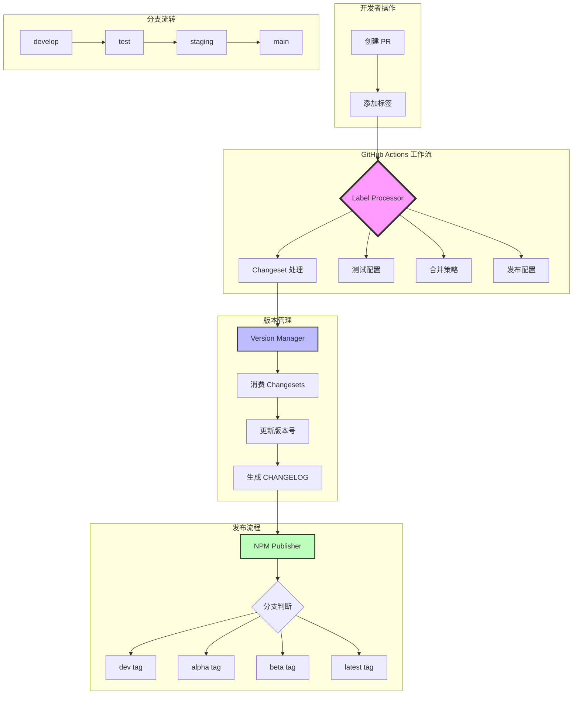
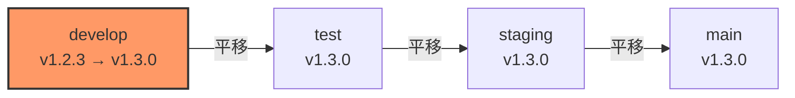
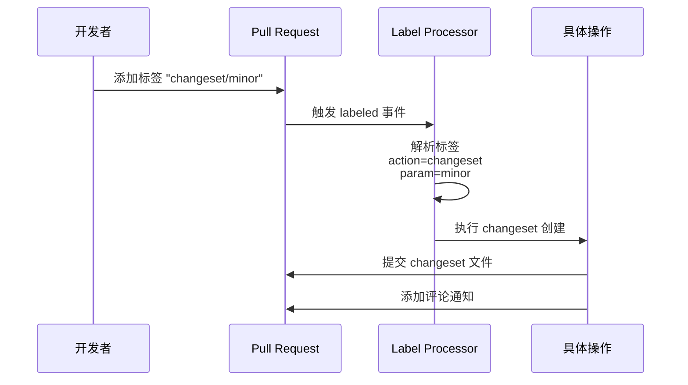
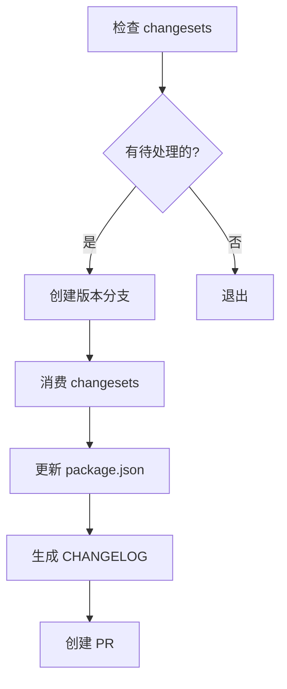
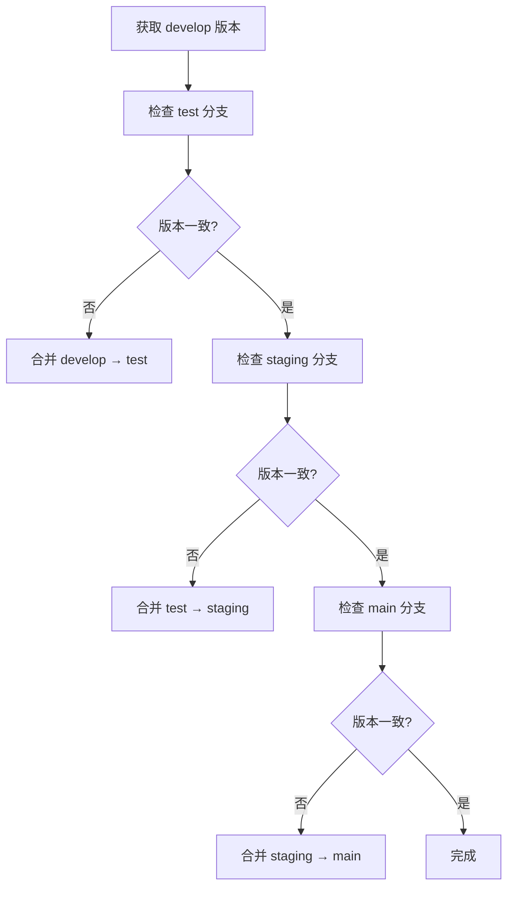
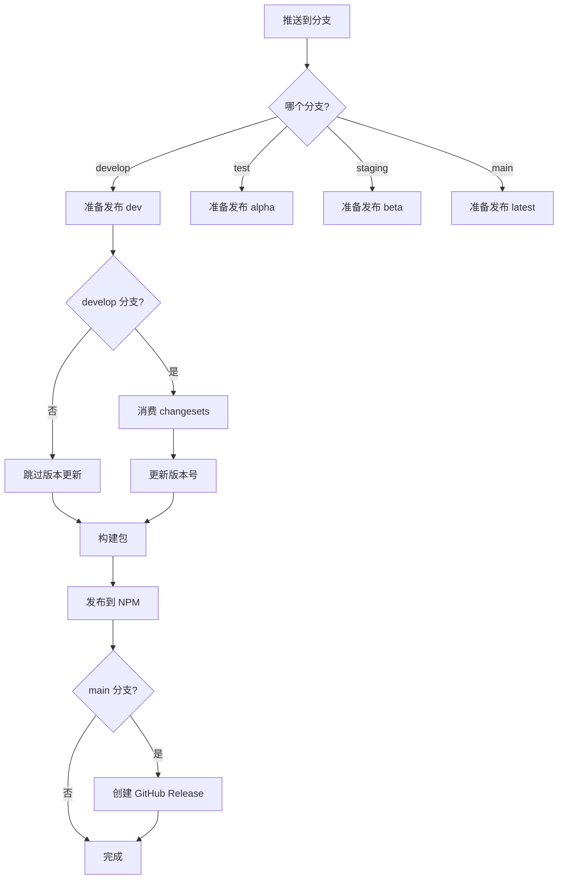
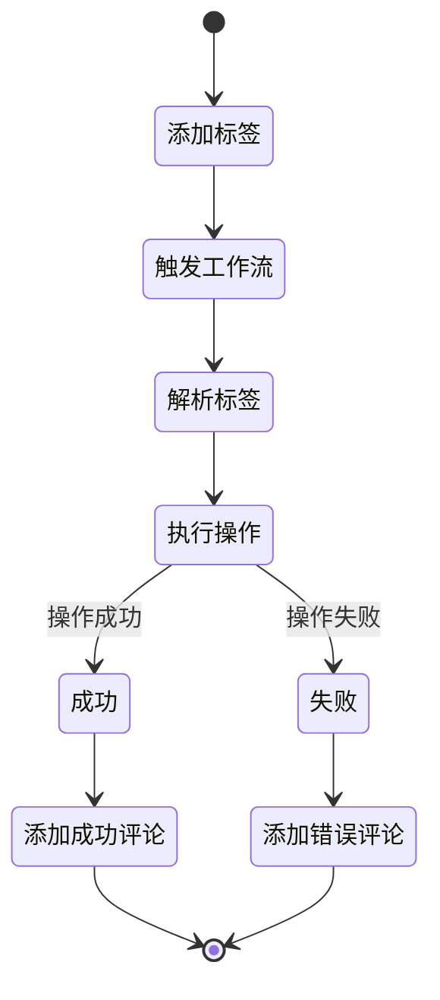
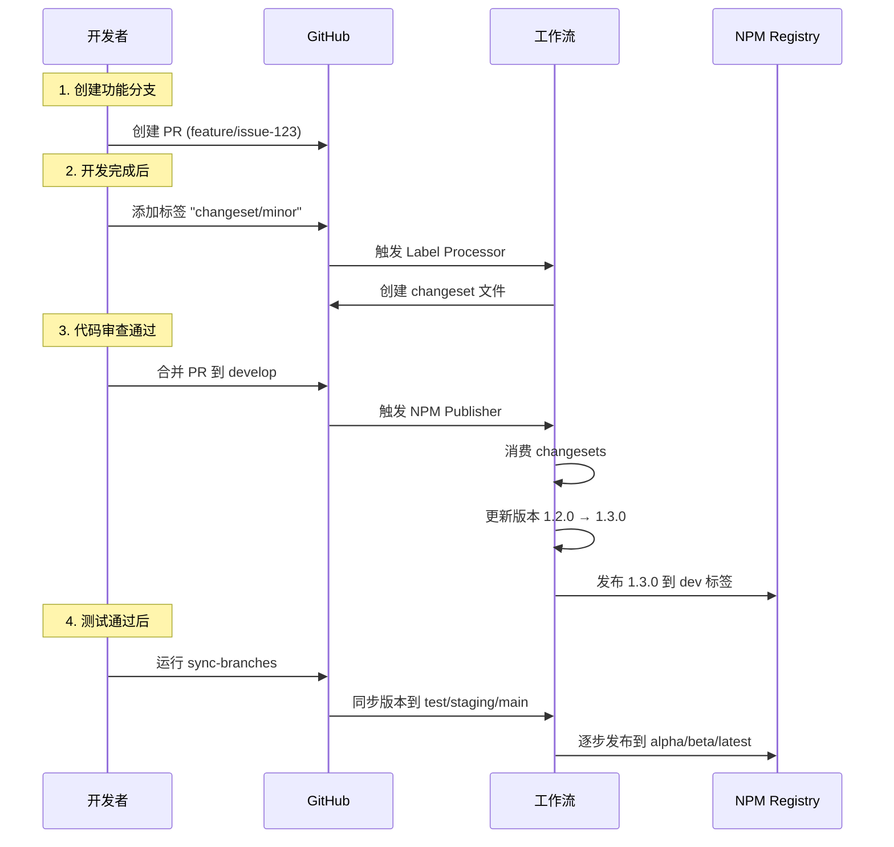

# PromptX 工作流架构完全指南

## 📚 目录

1. [架构概览](#架构概览)
2. [核心设计理念](#核心设计理念)
3. [工作流组件详解](#工作流组件详解)
4. [标签驱动系统](#标签驱动系统)
5. [分支策略与版本管理](#分支策略与版本管理)
6. [实际使用场景](#实际使用场景)
7. [最佳实践](#最佳实践)
8. [故障排除](#故障排除)

## 架构概览

PromptX 采用了**标签驱动的自动化工作流架构**，通过 PR 标签作为指令触发不同的自动化流程。这种设计让开发流程既灵活又可控。

### 🏗️ 整体架构图



## 核心设计理念

### 1. 🏷️ 标签即指令 (Labels as Commands)

我们将 PR 标签设计为可执行的指令，每个标签都能触发特定的自动化操作：

```yaml
标签格式: action/parameter
示例:
  - changeset/minor     # 创建 minor 版本的 changeset
  - publish/beta        # 设置发布到 beta 标签
  - test/extended       # 运行扩展测试
  - merge/squash        # 使用 squash 合并
```

### 2. 📦 单点版本提升 (Single Version Bump Point)

版本号只在 `develop` 分支提升，其他分支通过平移获得相同版本：



### 3. 🔄 渐进式发布 (Progressive Publishing)

通过分支自动映射到 NPM 标签，实现渐进式发布：

```
develop → dev tag      # 开发版本
test → alpha tag       # 内测版本
staging → beta tag     # 公测版本
main → latest tag      # 正式版本
```

## 工作流组件详解

### 📋 Label Processor (标签处理器)

**文件**: `.github/workflows/label-processor.yml`

标签处理器是整个系统的入口，负责解析标签并执行相应操作。

#### 工作原理



#### 支持的标签操作

##### 1. Changeset 操作 (`changeset/*`)

创建版本变更记录：

```bash
changeset/patch   # 补丁版本 (1.0.0 → 1.0.1)
changeset/minor   # 次要版本 (1.0.0 → 1.1.0)
changeset/major   # 主要版本 (1.0.0 → 2.0.0)
changeset/none    # 不需要版本变更
```

**执行流程**：
1. 从 PR 描述中提取 User Impact 部分
2. 生成 changeset 文件名（基于 PR 号和标题）
3. 创建 changeset 文件并提交到 PR 分支
4. 自动添加贡献者信息

##### 2. 测试配置 (`test/*`)

配置测试执行策略：

```bash
test/skip-e2e     # 跳过端到端测试
test/extended     # 运行扩展测试套件
test/performance  # 运行性能测试
```

##### 3. 合并策略 (`merge/*`)

设置 PR 合并方式：

```bash
merge/squash      # Squash 合并（压缩提交）
merge/rebase      # Rebase 合并（变基）
merge/merge       # 创建合并提交
merge/auto        # 自动合并（通过检查后）
```

##### 4. 发布配置 (`publish/*`)

控制合并后的发布行为：

```bash
publish/dev       # 发布到 dev 标签
publish/alpha     # 发布到 alpha 标签
publish/beta      # 发布到 beta 标签
publish/latest    # 发布到 latest 标签
publish/hold      # 暂不发布
```

### 🔢 Version Manager (版本管理器)

**文件**: `.github/workflows/version-manager.yml`

版本管理器负责处理版本提升和分支同步。

#### 主要功能

##### 1. 准备发布 (`prepare-release`)



**使用场景**：
- 准备新版本发布
- 批量处理积累的 changesets
- 生成版本变更记录

##### 2. 分支同步 (`sync-branches`)



**使用场景**：
- 版本发布后同步到各环境
- 修复分支版本不一致问题
- 批量更新所有分支

##### 3. 检查 Changesets (`check-changesets`)

显示当前待处理的 changesets 和预期的版本影响。

### 📦 NPM Publisher (发布器)

**文件**: `.github/workflows/npm-publisher.yml`

自动化 NPM 包发布流程。

#### 发布流程



#### 特殊功能

##### 1. 干运行模式 (Dry Run)

手动触发时可选择干运行，模拟发布过程但不实际发布：

```yaml
workflow_dispatch:
  inputs:
    dry_run: true
```

##### 2. 快照版本 (Snapshot)

发布带时间戳的快照版本：

```bash
1.2.3 → 1.2.3-snapshot.20240115120000
```

##### 3. 自动版本消费

只在 `develop` 分支自动消费 changesets，避免版本号在多个分支重复提升。

## 标签驱动系统

### 🎯 设计原则

1. **语义化命名**：使用 `/` 分隔动作和参数
2. **即时反馈**：每个操作都有明确的反馈（评论或状态更新）
3. **幂等性**：重复添加相同标签不会产生副作用
4. **可追溯**：所有操作都有日志记录

### 🔄 标签生命周期



## 分支策略与版本管理

### 📊 分支流转策略

```mermaid
gitGraph
    commit id: "Initial"
    branch develop
    checkout develop
    commit id: "Base"
    
    branch feature/issue-1
    checkout feature/issue-1
    commit id: "Implementation"
    
    checkout develop
    merge feature/issue-1 tag: "PR merged"
    commit id: "v1.1.0"
    
    branch test
    checkout test
    merge develop tag: "v1.1.0-alpha"
    
    branch staging
    checkout staging
    merge test tag: "v1.1.0-beta"
    
    checkout main
    merge staging tag: "v1.1.0"
```

### 🔖 版本号管理规则

1. **版本提升时机**：
   - 只在 `develop` 分支消费 changesets
   - 通过 Version Manager 手动触发
   - 或在 PR 合并时自动处理

2. **版本同步机制**：
   - 使用 `sync-branches` 操作平移版本
   - 保持所有分支版本号一致
   - 通过 NPM 标签区分不同环境

3. **版本号格式**：
   ```
   主版本.次版本.补丁版本[-预发布标识.序号]
   1.2.3-alpha.1
   1.2.3-beta.2
   1.2.3
   ```

## 实际使用场景

### 场景 1：开发新功能



### 场景 2：紧急修复

```bash
# 1. 创建修复分支
git checkout -b fix/issue-456

# 2. 提交修复并创建 PR
git push origin fix/issue-456

# 3. 在 PR 上添加标签
- changeset/patch    # 补丁版本
- test/skip-e2e      # 跳过 E2E 测试加快流程
- merge/auto         # 自动合并

# 4. 合并后自动发布
```

### 场景 3：预发布测试

```yaml
# 手动触发发布到特定标签
workflow: NPM Publisher
inputs:
  publish_tag: alpha
  dry_run: false

# 或通过标签控制
PR 标签: publish/alpha
```

## 最佳实践

### ✅ 推荐做法

1. **尽早添加 changeset 标签**
   - 在 PR 创建后立即添加，避免遗忘
   - 使用 `changeset/none` 明确标记不需要版本变更的 PR

2. **合理使用版本类型**
   ```
   major: 破坏性变更，API 不兼容
   minor: 新功能，向后兼容
   patch: 问题修复，性能优化
   ```

3. **利用自动化减少手动操作**
   - 使用 `merge/auto` 自动合并
   - 配置 `publish/*` 标签控制发布流程

4. **保持分支清洁**
   - 定期运行 `sync-branches` 保持版本一致
   - 及时清理已合并的功能分支

### ❌ 避免事项

1. **不要手动修改版本号**
   - 始终通过 changesets 管理版本
   - 避免直接编辑 package.json

2. **不要在非 develop 分支创建 changesets**
   - Changesets 应该随 PR 创建
   - 通过标签系统自动生成

3. **不要跳过测试环境**
   - 遵循 dev → alpha → beta → latest 的发布流程
   - 紧急情况使用 hotfix 分支

## 故障排除

### 常见问题

#### 1. Changeset 创建失败

**症状**：添加 `changeset/*` 标签后没有生成文件

**可能原因**：
- PR 分支保护规则阻止推送
- GitHub Token 权限不足
- Changeset 已经存在

**解决方案**：
```bash
# 检查工作流日志
GitHub Actions → Label Processor → 查看具体错误

# 手动创建 changeset
npx changeset add
```

#### 2. 版本同步失败

**症状**：分支版本号不一致

**解决方案**：
```bash
# 手动触发同步
workflow_dispatch:
  workflow: Version Manager
  action: sync-branches
```

#### 3. 发布失败

**症状**：代码合并但包未发布

**检查清单**：
- [ ] NPM_TOKEN 是否配置正确
- [ ] package.json 中的包名是否正确
- [ ] 是否有网络连接问题
- [ ] NPM Registry 是否正常

### 🔍 调试技巧

1. **查看工作流日志**
   ```
   Actions → 选择工作流 → 查看运行详情
   ```

2. **本地测试工作流**
   ```bash
   # 使用 act 工具本地运行
   act -j process-label
   ```

3. **验证标签解析**
   ```bash
   # 测试标签格式
   echo "changeset/minor" | cut -d'/' -f1  # changeset
   echo "changeset/minor" | cut -d'/' -f2  # minor
   ```

## 附录

### 环境变量配置

```yaml
必需的 Secrets:
  GITHUB_TOKEN: 默认提供
  NPM_TOKEN: npm发布凭证

可选配置:
  SKIP_CHANGELOG: 跳过changelog生成
  AUTO_MERGE_ENABLED: 启用自动合并
```

### 相关文件

```
.github/
├── workflows/
│   ├── label-processor.yml    # 标签处理器
│   ├── version-manager.yml    # 版本管理
│   ├── npm-publisher.yml      # NPM发布
│   ├── branch-validator.yml   # 分支验证
│   ├── auto-merge.yml         # 自动合并
│   └── ci.yml                 # 持续集成
├── .changeset/
│   ├── config.json            # Changeset配置
│   └── README.md              # Changeset说明
```

### 命令速查

```bash
# 添加 changeset
npx changeset add

# 消费 changesets（更新版本）
npx changeset version

# 发布包
npx changeset publish

# 查看 changeset 状态
npx changeset status

# 手动同步分支
gh workflow run version-manager.yml -f action=sync-branches
```

---

## 总结

PromptX 的工作流系统通过**标签驱动**的设计理念，实现了：

1. 🎯 **精确控制**：每个操作都可以通过标签精确控制
2. 🔄 **自动化流程**：减少手动操作，提高效率
3. 📊 **版本一致性**：单点版本提升，多分支同步
4. 🚀 **渐进式发布**：从开发到生产的平滑过渡

这套系统让我们能够在保持灵活性的同时，确保发布流程的稳定性和可预测性。通过合理使用标签系统，开发者可以轻松管理从开发到发布的整个生命周期。