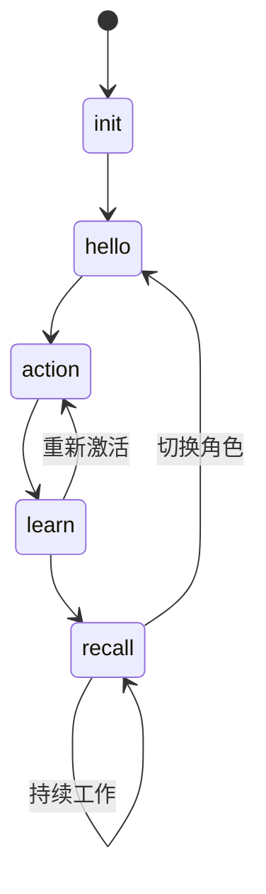

# PATEOAS 协议 - Prompt as the Engine of Application State

> **TL;DR:** PromptX = AI的诸葛锦囊，通过 PATEOAS 让 AI 无需记忆，仅凭 Prompt 引导完成专家级任务

## 🎯 核心理念

**AI use CLI get prompt for AI**

```
通用AI → PromptX CLI → 获取专业提示词 → 变身专家AI → 提供专业服务
```

### 三大解决方案
- **上下文遗忘** → 锦囊自包含，每个命令独立执行
- **注意力分散** → 分阶段专注，每锦囊专注单一任务  
- **能力局限** → 即时专家化，通过提示词获得专业能力

## 🎒 五大锦囊状态机

```
🏗️init → 👋hello → ⚡action → 📚learn → 🔍recall → 循环
```

| 锦囊 | 职责 | 输出 |
|------|------|------|
| `init` | 环境准备 + 理念传达 | 系统介绍 + PATEOAS导航 |
| `hello` | 角色发现 | 专家角色清单 + 激活指引 |
| `action` | 角色激活 | 专业提示词 + 学习建议 |
| `learn` | 专家变身 | 领域知识 + 应用指引 |
| `recall` | 经验检索 | 相关记忆 + 持续工作 |

## 📋 PATEOAS 实现要求

每个锦囊输出必须包含三层：

### 1. 锦囊目的 (Purpose)
```
🎯 锦囊目的：[功能描述]
```

### 2. 锦囊内容 (Content)  
```
📜 锦囊内容：
[核心提示词/专业知识]
```

### 3. PATEOAS导航 (Navigation)
```
🔄 下一步行动：
  - [操作名]: [描述]
    命令: promptx [command]

📍 当前状态：[state]
```

## 🎨 设计原则

- **锦囊自包含**：每个命令包含完整执行信息
- **串联无依赖**：即使AI忘记上文，也能继续执行
- **分阶段专注**：每个锦囊只关注当前任务
- **Prompt驱动**：每个输出引导AI发现下一步操作

## ⚡ 状态转换规则



---

**核心价值：** 让AI既是工具使用者，也是被工具赋能者，实现"AI use CLI get prompt for AI"的革命性设计。 