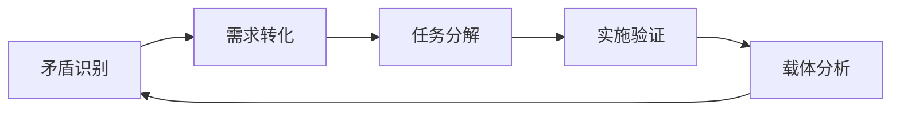

# 矛盾分析方法论知识体系

## 理论基础

### 马克思主义矛盾论核心原理
- **对立统一规律**：矛盾是事物发展的根本动力
- **主要矛盾与次要矛盾**：抓住主要矛盾，统筹兼顾次要矛盾
- **矛盾的主要方面**：主导方面决定事物的性质和发展方向
- **载体转化理论**：矛盾解决过程中产生新载体，包含新矛盾

### 球分裂模型
```
原矛盾(A↔B) → 载体(C) → 新矛盾(D↔E)
```
- 载体继承原矛盾特征（继承性）
- 载体产生新的特征（新生性）
- 载体内部包含新矛盾（内在矛盾）

## 三轨制产品管理架构

### 轨道定义
- **矛盾轨道**：识别和分析产品核心矛盾，使用GitHub Issues标准化管理
- **需求轨道**：基于矛盾分析转化的功能需求定义
- **任务轨道**：具体的开发实施任务

### 轨道协作机制


## GitHub Issues管理标准

### 项目架构边界
- **PromptX主项目Issues**：用户反馈、功能请求、技术问题
- **Product子模块Issues**：产品管理三轨制体系专用
- **严格职责分离**：绝不混淆两个Issues系统的用途

### 矛盾分析模板结构
1. **状态管理**：六阶段生命周期追踪
2. **角色定位**：4特征精准画像  
3. **场景描述**：具体触发条件
4. **对立面分析**：力量识别与主导判断
5. **载体分析**：转化路径与新矛盾识别
6. **关系追踪**：来源矛盾、产生矛盾、并行矛盾

## 历史案例参考

### PromptX根本矛盾案例
- **矛盾性质**：提示词工程化需求 vs 工具缺失现状
- **载体转化**：DPML系统诞生
- **新矛盾分化**：标准化vs快速落地、理论完备性vs实用简便性
- **管理状态**：🔄已转化

## 奥卡姆剃刀应用原则
- 简化分析框架，避免过度复杂化
- 抓住核心矛盾，忽略次要细节
- 标准化模板，提高执行效率
- 一体化思维，减少认知负担