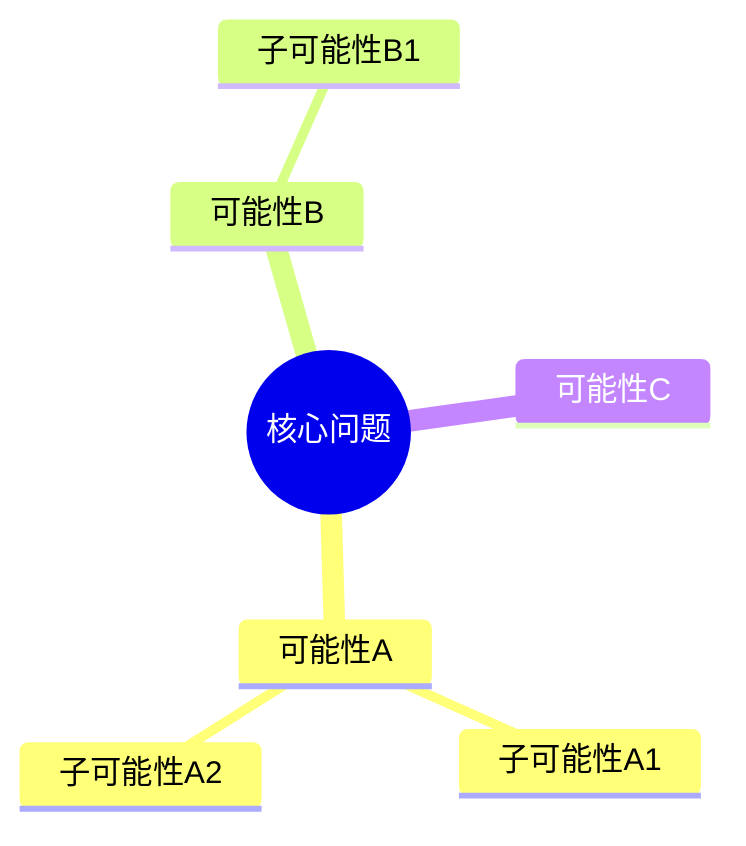
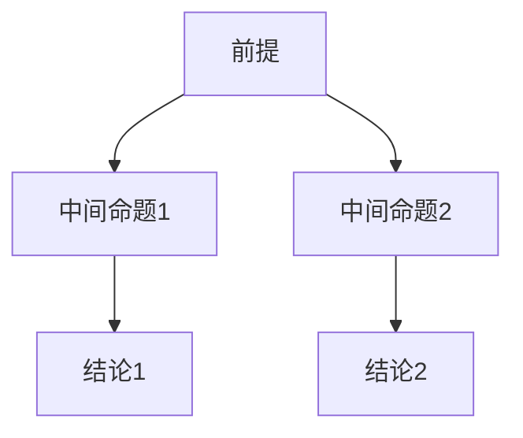
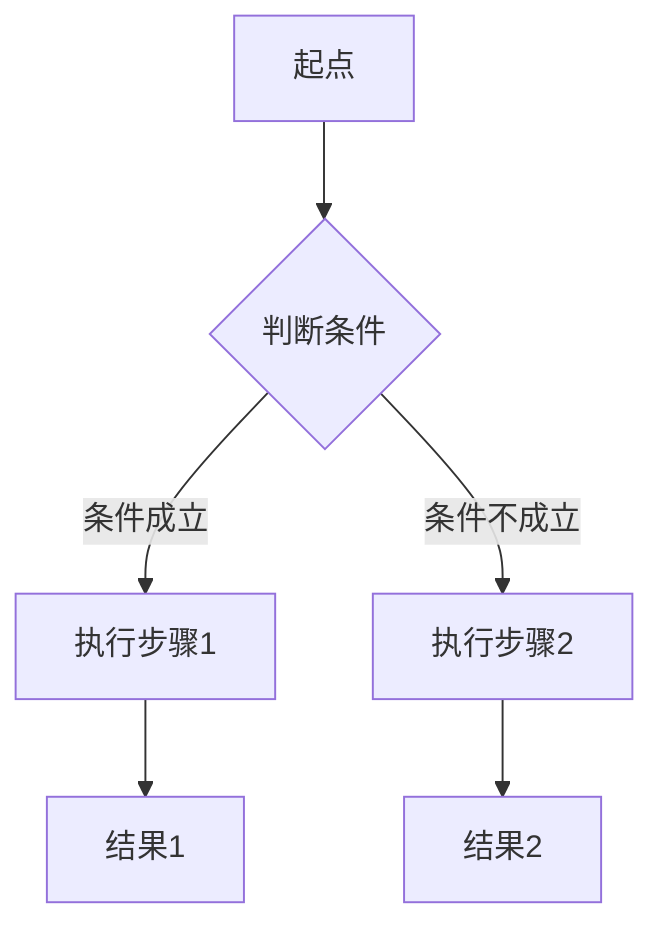
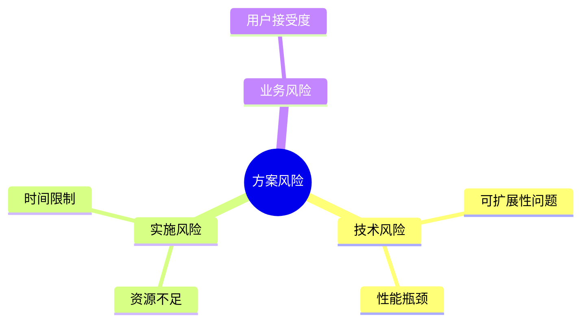

# DPML思考模式提示词框架最佳实践

> **TL;DR:** 本文档提供DPML思考模式提示词框架的最佳实践指南，包括图形化表达原则、各类思维模式的推荐用法和具体示例。

## 💡 最佳实践

### 图形化表达原则

thought标签内应以图形为主要表达方式，辅以简洁文字说明。这样做的优势：
- 思维结构直观可见
- 关系与逻辑一目了然
- 跨语言理解更容易
- 思维模式界限更清晰

### 各子标签推荐图形

每种思维模式都有最适合的图形表达方式：

#### exploration - 思维导图

用于表达横向思维和概念发散，简单文字仅需说明核心问题和主要分支。



#### reasoning - 推理图

用于表达纵向思维和逻辑推导，文字说明只需点明前提和结论间的关系。



#### plan - 流程图

用于表达计划思维和决策路径，文字仅需标注关键决策点和行动步骤。



#### challenge - 逆向思维导图

用于表达批判性思维和风险探索，与exploration采用相似的图形表达，但关注的是潜在问题和限制条件。



### Mermaid图表分类参考表

下表系统地列出了各种Mermaid图表类型及其适用的思维模式：

| 图表类型 | 思维模式 | 适用场景 | 优势 |
|---------|----------|---------|------|
| 思维导图(mindmap) | Exploration/Challenge | 概念发散、头脑风暴、风险识别 | 展示中心概念及其分支关系 |
| 四象限图(quadrantChart) | Exploration/Challenge | 方案评估、风险分析、优先级划分 | 在两个维度上评估选项或风险 |
| 流程图(flowchart) | Reasoning/Challenge | 逻辑推导、算法思路、决策分析、故障分析 | 清晰表达推理过程中的逻辑关系 |
| 饼图(pie) | Reasoning | 比例分析、相对重要性评估 | 直观展示整体中各部分的占比 |
| 类图(classDiagram) | Plan | 结构设计、概念分类、系统架构 | 展示实体间的层次和组织关系 |
| 甘特图(gantt) | Plan | 项目规划、时间安排、任务依赖 | 展示任务的时间跨度和先后关系 |
| 序列图(sequenceDiagram) | Plan | 交互设计、通信计划、协作过程 | 清晰展示实体间的消息传递和时序 |
| 状态图(stateDiagram) | Plan | 状态管理、过程转换、行为模式 | 展示系统状态和触发转换的事件 |
| 实体关系图(erDiagram) | Plan | 数据结构设计、系统建模 | 展示实体间的关系和属性 |
| 时间线(timeline) | Reasoning | 历史分析、演变过程、发展轨迹 | 按时间顺序展示事件发展 |
| 用户旅程图(journey) | Plan | 体验设计、流程优化、情感映射 | 展示用户交互过程和体验变化 |

## 📋 使用示例

### 基础示例

```xml
<thought domain="design">
  <exploration>
    # 功能需求探索
    
    ```mermaid
    mindmap
      root((用户需求))
        基础功能
          用户认证
          数据管理
        高级特性
          数据分析
          报表生成
        用户体验
          响应速度
          界面美观
    ```
  </exploration>
  
  <reasoning>
    # 技术选型分析
    
    ```mermaid
    graph TD
      A[需求分析] --> B[前端技术选型]
      A --> C[后端技术选型]
      B --> D[React]
      B --> E[Vue]
      C --> F[Node.js]
      C --> G[Python]
    ```
  </reasoning>
</thought>
```

### 高级示例

```xml
<thought domain="architecture">
  <exploration>
    # 系统架构探索
    
    ```mermaid
    mindmap
      root((微服务架构))
        服务拆分
          用户服务
          订单服务
          支付服务
        技术栈
          Spring Cloud
          Docker
          Kubernetes
        数据存储
          MySQL
          Redis
          MongoDB
    ```
  </exploration>
  
  <plan>
    # 实施计划
    
    ```mermaid
    gantt
      title 项目实施计划
      dateFormat YYYY-MM-DD
      section 基础设施
      环境搭建    :a1, 2024-01-01, 5d
      CI/CD配置   :a2, after a1, 3d
      section 开发
      用户服务    :a3, 2024-01-08, 10d
      订单服务    :a4, after a3, 12d
      section 测试
      集成测试    :a5, after a4, 5d
    ```
  </plan>
  
  <challenge>
    # 风险评估
    
    ```mermaid
    mindmap
      root((潜在风险))
        技术风险
          服务间通信延迟
          数据一致性问题
        运维风险
          服务器成本
          监控复杂度
        团队风险
          学习曲线
          人员配置
    ```
  </challenge>
</thought>
```

### 组件选择的灵活性

实际应用中，可根据角色定位和任务目标灵活选择所需的思考组件（exploration、challenge、reasoning、plan），不必全部包含四种模式。例如，执行者角色更侧重于reasoning和challenge，而设计者或决策者则更需要exploration和plan。可根据实际需求进行裁剪和组合，以适应不同的思考任务和角色分工。 