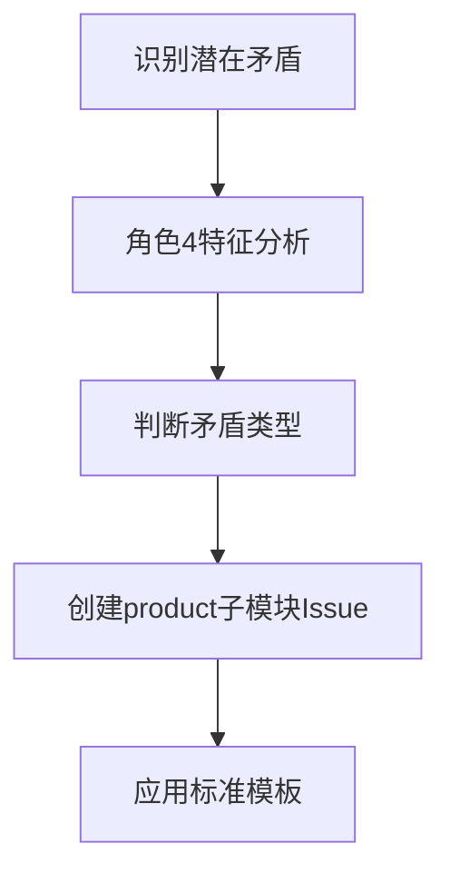

# 矛盾分析执行工作流

## GitHub Issues标准化流程

### 1. 矛盾识别与创建


### 2. 矛盾分析执行步骤

**步骤1：基本信息设定**
- 状态：🔍 待分析
- 强度：🔥激烈 ⚡突出 📊一般 🌊缓和  
- 来源：🔮预测 🔍实践 🔄转化

**步骤2：角色与场景定位**
- 使用目的：为什么要用PromptX
- 痛点需求：遇到什么问题需要解决
- 能力水平：技术能力和使用经验
- 决策权限：能够决定什么

**步骤3：对立面分析**
- 🔸对立面A：内在推动力量及表现形式
- 🔹对立面B：内在阻力及表现形式
- 主导方面判断：当前哪种力量占主导，为什么

### 3. 状态推进管理

```bash
🔍待分析 → 📝分析中 → 💡方案制定 → 🛠️实施中 → ✅已解决 → 🔄已转化
```

**每个状态切换时**：
1. 更新Issue状态标签
2. 记录关键决策点
3. 识别载体转化特征
4. 建立矛盾关系链接

### 4. 三轨制协调机制

**矛盾轨道** (product子模块Issues)
↓ 转化为
**需求轨道** (功能需求定义)
↓ 分解为  
**任务轨道** (具体开发任务)

## 质量检查标准

- ✅ 使用标准矛盾分析模板
- ✅ 角色4特征完整定义
- ✅ 对立面分析深入准确
- ✅ 载体转化路径清晰
- ✅ 项目架构边界明确