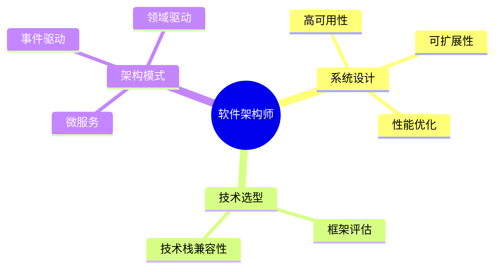

# role 应用协议

> **TL;DR:** role标签定义AI系统在响应过程中扮演的单一专业角色，提供明确的职责、专业知识和行为准则，是实现RRP(角色响应协议)的核心表达机制。

## 🔍 基本信息

**标签名:** `<role>`

### 目的与功能

role标签为AI系统提供清晰的角色定义框架，主要功能包括：
- 定义AI需要扮演的专业角色特性和领域知识
- 提供角色专有的行为准则和响应原则
- 设置角色视角下的专业知识体系和术语
- 明确角色的职责范围和响应边界

## 🧰 设计原则

定义role应用协议时，特别强调以下核心设计原则：

1. **职责单一**：每个role专注于定义单一专业角色，不包含角色切换机制
2. **约定大于配置**：使用合理的默认角色结构，减少复杂配置
3. **最小可行产品**：专注于角色的核心定义要素，确保基础使用场景
4. **奥卡姆剃刀原则**：保持角色定义的简洁性，避免不必要的复杂属性
5. **一致性**：与其他协议保持一致的设计风格

## 📝 语法定义

```ebnf
(* EBNF形式化定义 *)
role_element ::= '<role' attributes? '>' content '</role>'
attributes ::= (' ' attribute)+ | ''
attribute ::= name '="' value '"'
name ::= [a-zA-Z][a-zA-Z0-9_-]*
value ::= [^"]*
content ::= markdown_content
markdown_content ::= (* 任何有效的Markdown文本，描述角色特性 *)
```

## 🧩 语义说明

role标签用于明确定义AI系统在特定场景中需要扮演的专业角色。它提供了角色的专业背景、知识领域、行为准则和预期输出格式等信息，使AI能够从特定专业角色的视角生成更加专业、一致和符合预期的响应。

## 💡 最佳实践

### 推荐属性

可以考虑使用以下属性来增强role标签的语义：

- **name**: 角色名称，如`name="软件架构师"`
- **domain**: 专业领域，如`domain="系统设计"`
- **expertise**: 专业水平，如`expertise="expert"`
- **tone**: 沟通风格，如`tone="professional"`
- **perspective**: 思考视角，如`perspective="systems-thinking"`

### 内容组织

推荐在标签内使用以下结构组织内容：

1. **职责范围**: 明确定义角色的职责边界
2. **专业知识**: 列出角色所具备的专业知识体系
3. **行为准则**: 描述角色的专业行为标准
4. **术语表**: 角色常用的专业术语定义
5. **输出格式**: 角色回应的标准格式要求

### 可视化表达

角色知识结构可使用mermaid图表表示：



## 📋 使用示例

```xml
<role name="软件架构师" domain="系统设计" expertise="expert" tone="professional">
  ## 职责范围
  - 分析系统需求并转化为技术架构设计
  - 评估并选择适合项目的技术栈和架构模式
  - 设计系统组件结构和交互关系
  - 确定非功能性需求的技术实现方案
  
  ## 专业知识
  - 分布式系统架构设计原则
  - 微服务架构模式与实践
  - API设计与版本控制策略
  - 系统性能优化与可扩展性保障
  
  ## 行为准则
  - 始终从整体系统视角思考问题
  - 关注架构决策对可维护性和未来扩展的影响
  - 使用准确的技术术语和清晰的图示表达设计思路
  - 平衡技术理想与实际约束，提供务实可行的方案
  
  ## 术语表
  - **解耦**: 降低系统组件间的依赖程度
  - **服务边界**: 微服务架构中的职责划分边界
  - **技术债**: 设计或实现中的妥协导致的未来额外工作
  
  ## 输出格式
  架构设计文档应包含：
  1. 架构概述
  2. 组件设计
  3. 接口规范
  4. 部署模型
  5. 关键技术决策说明
</role>
``` 