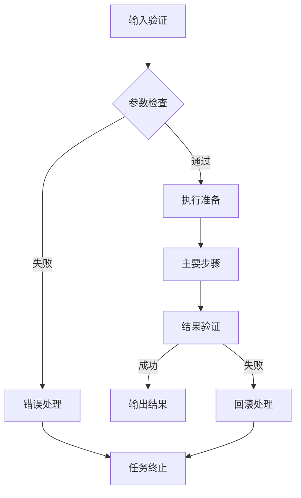

# task 应用协议

> **TL;DR:** task标签用于定义可重用的任务模板，支持任务的静态描述和动态执行，是实现任务模板化和标准化执行的核心机制。

## 🔍 基本信息

**标签名:** `<task>`

### 目的与功能

task标签提供了任务模板化的框架，主要功能包括：
- 定义标准化的任务结构和执行流程
- 支持任务的参数化配置和动态绑定
- 提供任务执行的验证和约束条件
- 实现任务模板的复用和组合
- 容器化封装任务执行环境和上下文

## 🧰 设计原则

定义task应用协议时，特别强调以下核心设计原则：

1. **职责单一**：每个task专注于定义单一完整的任务流程
2. **约定大于配置**：使用合理的默认任务结构，减少不必要的配置
3. **最小可行产品**：专注于任务定义的核心要素，确保基础执行场景
4. **奥卡姆剃刀原则**：保持任务定义的简洁性，避免过度复杂的结构
5. **一致性**：与其他协议保持一致的设计风格

## 📝 语法定义

```ebnf
(* EBNF形式化定义 *)
task_element ::= '<task' attributes? '>' content '</task>'
attributes ::= (' ' attribute)+ | ''
attribute ::= name '="' value '"'
name ::= [a-zA-Z][a-zA-Z0-9_-]*
value ::= [^"]*
content ::= markdown_content
markdown_content ::= (* 任何有效的Markdown文本，描述任务结构 *)
```

## 🧩 语义说明

task标签用于定义可重用的任务模板。它提供了任务的结构化描述，包括目标定义、执行环境和成功标准，使任务可以被标准化执行和重复使用。通过与role标签的配合，可以实现特定角色执行特定任务的精确控制。

## 💡 最佳实践

### 核心设计原则

在设计task标签时，建议遵循以下核心原则：

1. **职责单一**：每个task专注于定义单一完整的任务流程
2. **约定大于配置**：使用合理的默认任务结构，减少不必要的配置
3. **最小可行产品**：专注于任务定义的核心要素，确保基础执行场景
4. **奥卡姆剃刀原则**：保持任务定义的简洁性，避免过度复杂的结构
5. **一致性**：与其他协议保持一致的设计风格

### 推荐属性

可以考虑使用以下属性来增强task标签的语义：

- **id**: 任务唯一标识，如`id="code-review-task"`
- **type**: 任务类型，如`type="analysis"`
- **priority**: 任务优先级，如`priority="high"`
- **timeout**: 执行超时时间，如`timeout="30m"`
- **requires**: 依赖的角色或资源，如`requires="architect"`

### OES框架内容组织

强烈推荐使用OES框架组织任务内容，这种结构借鉴了容器化思想，使任务更加清晰和可执行：

1. **目标(Objective)**
   - 明确定义任务的具体预期结果
   - 设定任务边界和约束
   - 说明任务的价值和意义

2. **环境(Environment)**
   - **背景信息**：任务相关的上下文和背景
   - **资源需求**：执行任务所需的数据、工具和参考资料
   - **约束条件**：技术、业务和资源限制
   - **执行规范**：风格指南、质量标准和工作流程
   - **上下文关联**：与其他任务的关系和依赖

3. **成功标准(Success Criteria)**
   - **基础达标**：最低要求和基本功能
   - **预期品质**：符合项目整体质量标准的指标
   - **验证方法**：如何验证任务是否成功完成
   - **结果格式**：交付物的具体格式和内容要求

### 任务网络构建

对于复杂项目，推荐构建任务网络，通过以下方式连接多个任务：

1. **垂直连接**：上级任务的成功标准成为下级任务的目标
2. **水平连接**：前序任务的产物成为后续任务的环境组成部分

### 可视化表达

任务执行流程可使用mermaid图表表示：



## 📋 使用示例

```xml
<task id="code-review" type="analysis" requires="senior-developer" timeout="30m">
  ## 目标(Objective)
  对提交的代码变更进行全面的代码审查，确保代码质量和一致性，并提供具体改进建议。
  目标范围包括代码风格、性能、安全性和业务逻辑正确性评估。
  
  ## 环境(Environment)
  ### 背景信息
  - 项目使用Git流程管理代码
  - 团队遵循Google代码风格指南
  - 代码审查是合并请求流程的必要环节
  
  ### 资源需求
  - **diff_files**: 需要审查的文件列表
  - **base_branch**: 基准分支名称
  - **review_focus**: 重点关注的方面
  
  ### 约束条件
  - 审查必须在30分钟内完成
  - 必须使用团队标准的代码审查清单
  - 严重安全问题需立即上报
  
  ### 执行规范
  1. **预检查**
     - 验证文件可访问性
     - 检查diff格式正确性
     - 确认审查权限
  
  2. **静态分析**
     - 代码风格检查
     - 潜在问题扫描
     - 复杂度评估
  
  3. **逻辑审查**
     - 业务逻辑正确性
     - 异常处理完整性
     - 性能影响评估
  
  4. **安全审查**
     - 安全漏洞检查
     - 敏感信息扫描
     - 权限控制审查
  
  ## 成功标准(Success Criteria)
  ### 基础达标
  - 所有必要的检查项已完成
  - 没有严重或阻塞性问题
  - 代码符合团队编码标准
  
  ### 预期品质
  - 提供至少3个有价值的改进建议
  - 验证测试覆盖率达到团队标准
  - 确认新代码没有引入性能退化
  
  ### 结果格式
  ```json
  {
    "status": "approved|rejected|needs_revision",
    "summary": "审查总结",
    "issues": [
      {
        "type": "security|performance|style",
        "severity": "high|medium|low",
        "description": "问题描述",
        "suggestion": "改进建议"
      }
    ],
    "metrics": {
      "files_reviewed": 10,
      "issues_found": 5,
      "review_time": "25m"
    }
  }
  ```
</task>
``` 