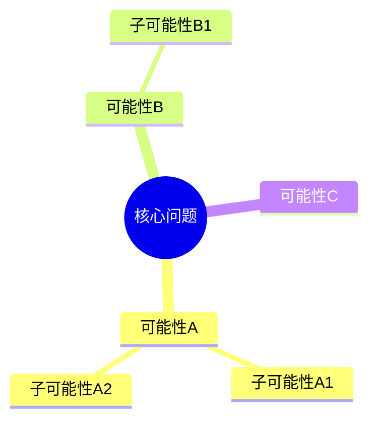
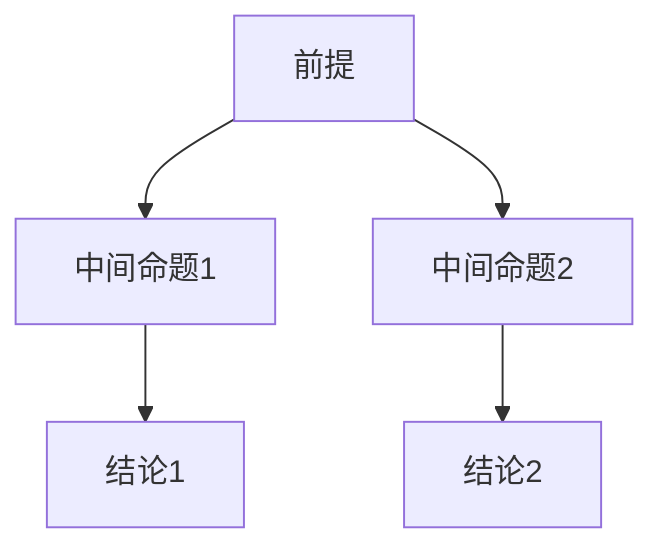
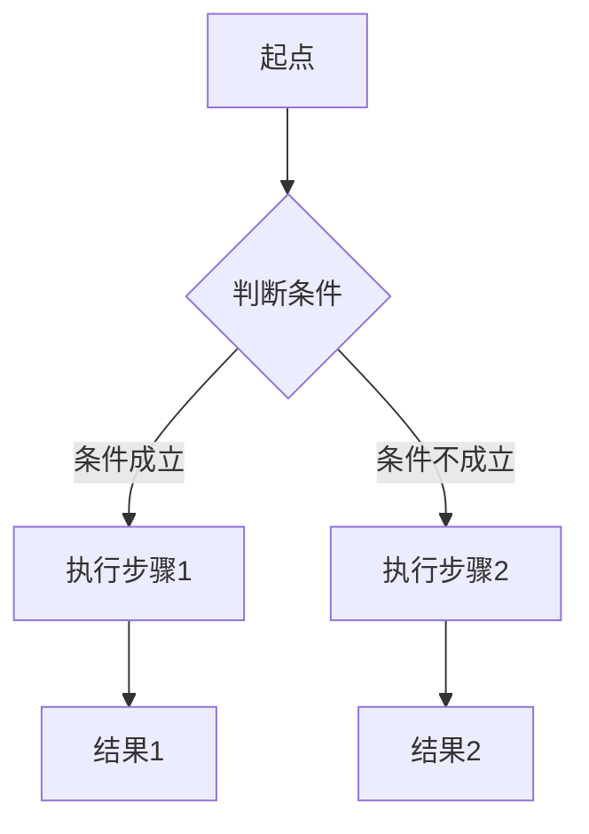
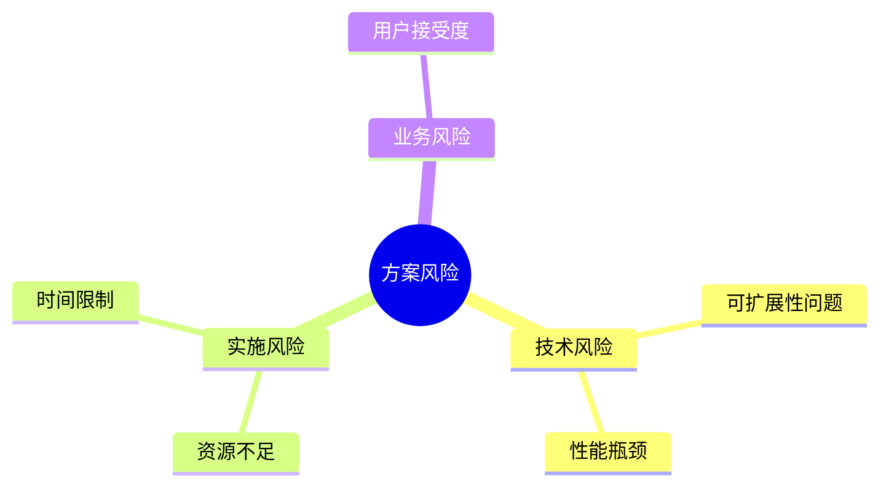

# thought 应用协议

> **TL;DR:** thought标签用于定义结构化的思考框架，帮助AI系统进行系统性分析和推理，支持四种思维模式：横向探索(exploration)、纵向推理(reasoning)、流程计划(plan)和批判挑战(challenge)。

## 🔍 基本信息

**标签名:** `<thought>`
**版本:** 1.0.0
**类别:** 思考
**状态:** 草稿
**创建日期:** 2023-06-20

### 目的与功能

thought标签定义了AI系统进行思考分析的框架和流程，它的主要功能是：
- 提供结构化的思维分析模式
- 组织和展示概念关系与逻辑推理
- 支持可视化思维导图和决策树
- 帮助AI系统进行系统性、全面性的问题分析
- 区分不同类型的思维模式：探索、推理、计划和挑战

## 📝 语法定义

```ebnf
(* EBNF形式化定义 *)
thought_element ::= '<thought' attributes? '>' content '</thought>'
attributes ::= (' ' attribute)+ | ''
attribute ::= name '="' value '"'
name ::= [a-zA-Z][a-zA-Z0-9_-]*
value ::= [^"]*
content ::= (markdown_content | exploration_element | reasoning_element | plan_element | challenge_element)+
markdown_content ::= (* 任何有效的Markdown文本，包括Mermaid图表 *)

exploration_element ::= '<exploration' attributes? '>' markdown_content '</exploration>'
reasoning_element ::= '<reasoning' attributes? '>' markdown_content '</reasoning>'
plan_element ::= '<plan' attributes? '>' markdown_content '</plan>'
challenge_element ::= '<challenge' attributes? '>' markdown_content '</challenge>'
```

## 🧩 语义说明

thought标签表示一个完整的思考过程或思维框架。标签内容可以包含四种不同思维模式的子标签，或直接使用Markdown格式表达思考内容。

子标签具有明确的语义：
- **exploration**: 表示跳跃思考，发散性思维，生成可能性，寻找多种可能性、创新点和关联性
- **reasoning**: 表示连续思考，收敛性思维，验证可能性，深入分析因果关系、逻辑链条
- **plan**: 表示秩序思考，结构性思维，固化可能性，设计行动步骤、决策路径、组织结构、系统架构
- **challenge**: 表示逆向跳跃思考，批判性思维，质疑可能性，寻找假设漏洞、识别潜在风险、测试极限条件

exploration和challenge是一对思维模式的正反两面：exploration向外发散寻找"可能是什么"，而challenge向内批判探究"可能不是什么"。二者都采用跳跃式思考，但方向相反。reasoning负责系统验证，而challenge主要提出问题点。

thought标签特别适合表达概念关系、逻辑推理和系统性思考，为AI提供思考分析的参考框架。

## 💡 最佳实践

以下是使用thought标签的一些建议做法，这些并非强制要求，仅作为参考：


### 图形化表达原则

thought标签内应以图形为主要表达方式，辅以简洁文字说明。这样做的优势：
- 思维结构直观可见
- 关系与逻辑一目了然
- 跨语言理解更容易
- 思维模式界限更清晰

### 各子标签推荐图形

每种思维模式都有最适合的图形表达方式：

#### exploration - 思维导图

用于表达横向思维和概念发散，简单文字仅需说明核心问题和主要分支。



#### reasoning - 推理图

用于表达纵向思维和逻辑推导，文字说明只需点明前提和结论间的关系。



#### plan - 流程图

用于表达计划思维和决策路径，文字仅需标注关键决策点和行动步骤。



#### challenge - 逆向思维导图

用于表达批判性思维和风险探索，与exploration采用相似的图形表达，但关注的是潜在问题和限制条件。



### Mermaid图表分类参考表

下表系统地列出了各种Mermaid图表类型及其适用的思维模式：

| 图表类型 | 思维模式 | 适用场景 | 优势 |
|---------|----------|---------|------|
| 思维导图(mindmap) | Exploration/Challenge | 概念发散、头脑风暴、风险识别 | 展示中心概念及其分支关系 |
| 四象限图(quadrantChart) | Exploration/Challenge | 方案评估、风险分析、优先级划分 | 在两个维度上评估选项或风险 |
| 流程图(flowchart) | Reasoning/Challenge | 逻辑推导、算法思路、决策分析、故障分析 | 清晰表达推理过程中的逻辑关系 |
| 饼图(pie) | Reasoning | 比例分析、相对重要性评估 | 直观展示整体中各部分的占比 |
| 类图(classDiagram) | Plan | 结构设计、概念分类、系统架构 | 展示实体间的层次和组织关系 |
| 甘特图(gantt) | Plan | 项目规划、时间安排、任务依赖 | 展示任务的时间跨度和先后关系 |
| 序列图(sequenceDiagram) | Plan | 交互设计、通信计划、协作过程 | 清晰展示实体间的消息传递和时序 |
| 状态图(stateDiagram) | Plan | 状态管理、过程转换、行为模式 | 展示系统状态和触发转换的事件 |
| 实体关系图(erDiagram) | Plan | 数据结构设计、系统建模 | 展示实体间的关系和属性 |
| 时间线(timeline) | Reasoning | 历史分析、演变过程、发展轨迹 | 按时间顺序展示事件发展 |
| 用户旅程图(journey) | Plan | 体验设计、流程优化、情感映射 | 展示用户交互过程和体验变化 |

选择合适的图表类型能大幅提高思维表达的清晰度和直观性，建议根据具体思维模式和内容特点从上表中选择最佳匹配的图表类型。

## 📋 使用示例

<thought domain="software" focus="performance">
  <exploration>
    # 性能优化方向探索
    
    ```mermaid
    mindmap
      root((性能优化))
        算法优化
          时间复杂度
          空间复杂度
        数据结构
          查询效率
          内存占用
        并发处理
          线程模型
          资源锁定
        缓存策略
          本地缓存
          分布式缓存
    ```
  </exploration>
  
  <reasoning>
    # 性能瓶颈分析
    
    ```mermaid
    flowchart TD
      A[高延迟问题] --> B{数据库查询?}
      B -->|是| C[查询优化]
      B -->|否| D{网络延迟?}
      D -->|是| E[网络优化]
      D -->|否| F[应用逻辑]
      
      C --> G[索引优化]
      C --> H[SQL重构]
      E --> I[协议优化]
      E --> J[连接池化]
      F --> K[算法优化]
      F --> L[缓存引入]
    ```
    
    ```mermaid
    pie
      title 延迟占比分析
      "数据库查询" : 65
      "网络传输" : 20
      "应用逻辑" : 15
    ```
  </reasoning>
  
  <plan>
    # 优化实施计划
    
    ```mermaid
    gantt
      title 性能优化项目计划
      dateFormat YYYY-MM-DD
      section 数据库优化
      索引重建      :a1, 2023-06-01, 3d
      查询重构      :a2, after a1, 5d
      section 应用优化
      缓存实现      :a3, 2023-06-01, 4d
      算法优化      :a4, after a3, 7d
      section 网络优化
      连接池化      :a5, 2023-06-08, 2d
      测试验证      :a6, after a2 a4 a5, 3d
    ```
    
    ```mermaid
    sequenceDiagram
      客户端->>缓存层: 数据请求
      缓存层->>缓存层: 检查缓存
      alt 缓存命中
        缓存层-->>客户端: 返回缓存数据
      else 缓存未命中
        缓存层->>数据库: 查询数据
        数据库-->>缓存层: 返回结果
        缓存层->>缓存层: 更新缓存
        缓存层-->>客户端: 返回数据
      end
    ```
  </plan>
  
  <challenge>
    # 方案风险评估
    
    ```mermaid
    mindmap
      root((性能优化风险))
        缓存相关
          一致性问题
          内存溢出
        数据库相关
          连接耗尽
          索引失效
          查询超时
        并发相关
          死锁风险
          资源争用
        网络相关
          超时问题
          带宽限制
    ```
    
    ```mermaid
    flowchart TD
      A[缓存方案失效] --> B{原因分析}
      B -->|高负载| C[连接池耗尽]
      B -->|数据一致性| D[缓存过期策略问题]
      B -->|极端情况| E[内存不足]
      
      C --> F[增加连接上限]
      D --> G[实施两阶段提交]
      E --> H[添加内存监控和自动扩容]
      
      I[查询优化失效] --> J{可能原因}
      J -->|数据倾斜| K[分区优化]
      J -->|索引失效| L[强制索引]
    ```
  </challenge>
</thought>
