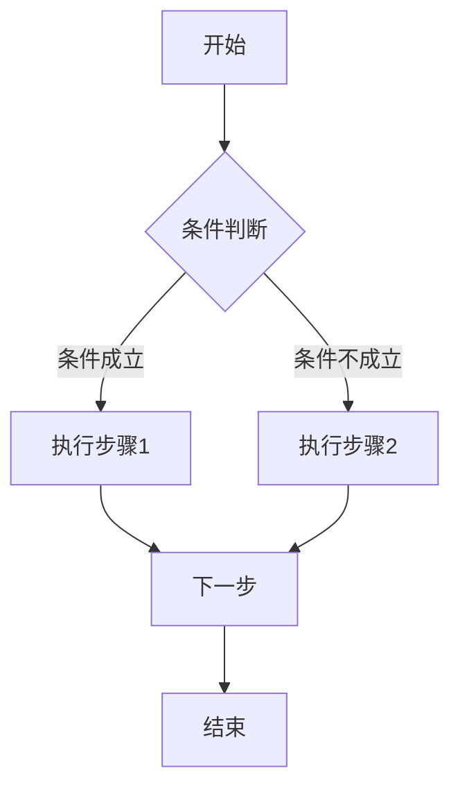

# DPML执行模式提示词框架最佳实践

> **TL;DR:** 本文档提供DPML执行模式提示词框架的最佳实践指南，包括表达原则和具体示例。

## 💡 最佳实践

### 表达原则

各子概念推荐使用不同的表达方式：

#### process - 适合使用图形表达

流程是最适合使用图形表达的元素，推荐使用流程图或时序图：



#### guideline - 适合使用列表表达

建议性指导原则适合使用有序或无序列表，突出推荐性质：

```
- 提供用户友好的错误信息
- 对敏感操作进行二次确认
- 使用渐进式信息收集方式
```

#### rule - 适合使用编号列表表达

强制性规则适合使用编号列表，突出其必须遵守的性质：

```
1. 密码必须包含大小写字母、数字和特殊字符
2. 敏感数据传输必须使用加密通道
3. 用户操作必须记录审计日志
```

#### constraint - 适合使用分类列表表达

约束条件适合使用分类列表，按约束类型组织：

```
技术约束：
- 服务器内存限制: 16GB
- 数据库连接数上限: 100

业务约束：
- 用户年龄限制: >13岁
- 服务区域限制: 指定国家/地区
```

#### criteria - 适合使用表格表达

评价标准最适合使用表格，清晰展示指标和目标值：

```
| 指标 | 目标值 | 最低要求 |
|-----|-------|---------|
| 响应时间 | <200ms | <500ms |
| 成功率 | >99% | >95% |
| 用户满意度 | >4.5/5 | >4/5 |
```

## 📋 使用示例

### 用户注册流程示例

```xml
<execution domain="web" context="server">
  <process>
    # 用户注册流程
    
    ```mermaid
    flowchart TD
      A[开始] --> B[验证输入]
      B --> C{输入有效?}
      C -->|是| D[检查用户是否存在]
      C -->|否| E[返回错误信息]
      D --> F{用户存在?}
      F -->|是| G[返回用户已存在]
      F -->|否| H[创建用户]
      H --> I[发送确认邮件]
      I --> J[结束]
      E --> J
      G --> J
    ```
    
    ## 异常处理路径
    1. 数据库连接失败：重试3次，仍失败则返回系统错误
    2. 邮件服务不可用：将邮件加入队列，返回部分成功信息
    3. 输入验证失败：返回具体的字段错误信息
  </process>
  
  <guideline>
    # 用户体验建议
    
    ```mermaid
    mindmap
      root((注册体验))
        表单设计
          字段顺序从简单到复杂
          实时字段验证
          进度指示器
        错误提示
          友好明确的错误信息
          提供修正建议
        流程优化
          最少必填字段
          分步注册可选
    ```
    
    - 使用渐进式表单，先收集必要信息，成功后再补充其他信息
    - 提供社交媒体快捷注册选项
    - 密码强度视觉指示器
  </guideline>
  
  <rule>
    # 必须遵循的规则
    
    1. 密码必须至少8个字符，包含大小写字母、数字和特殊字符
    2. 用户邮箱必须通过验证才能激活账户
    3. 敏感个人信息必须加密存储
    4. 用户协议必须显式接受
    5. IP地址和注册时间必须记录日志
  </rule>
  
  <constraint>
    # 系统限制条件
    
    ```mermaid
    graph TD
      A[技术约束] --> B[数据库连接池上限: 100]
      A --> C[API调用频率: 10次/秒]
      D[业务约束] --> E[注册用户年龄: >13岁]
      D --> F[服务区域: 指定国家/地区]
    ```
    
    - 存储空间限制：用户头像最大2MB
    - 处理时间约束：注册流程必须在3秒内完成
    - 并发限制：同一IP每分钟最多5次注册请求
  </constraint>
  
  <criteria>
    # 成功标准
    
    | 指标 | 目标值 | 最低要求 |
    |-----|-------|---------|
    | 注册成功率 | >95% | >90% |
    | 平均完成时间 | <60秒 | <90秒 |
    | 邮箱验证率 | >80% | >70% |
    | 表单放弃率 | <20% | <30% |
    
    ## 质量检查点
    1. 所有必填字段已验证
    2. 用户记录已正确创建
    3. 确认邮件已发送或进入队列
    4. 欢迎信息已显示
  </criteria>
</execution>
``` 