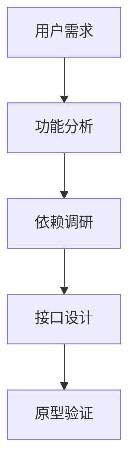
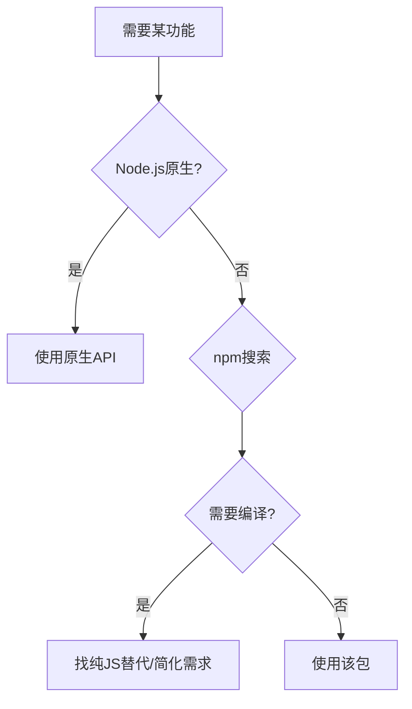
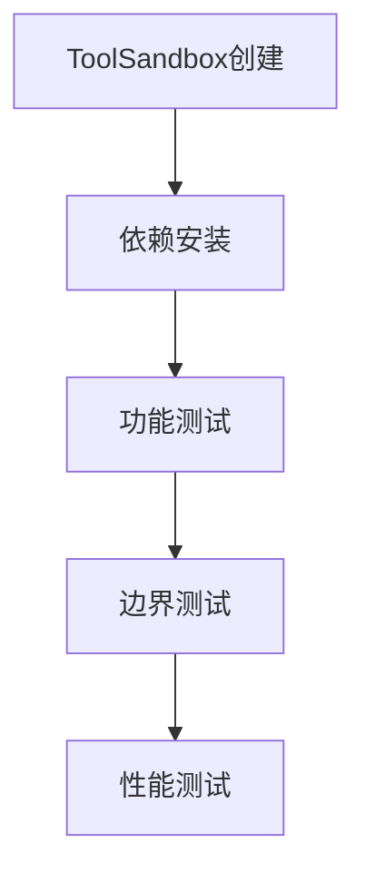
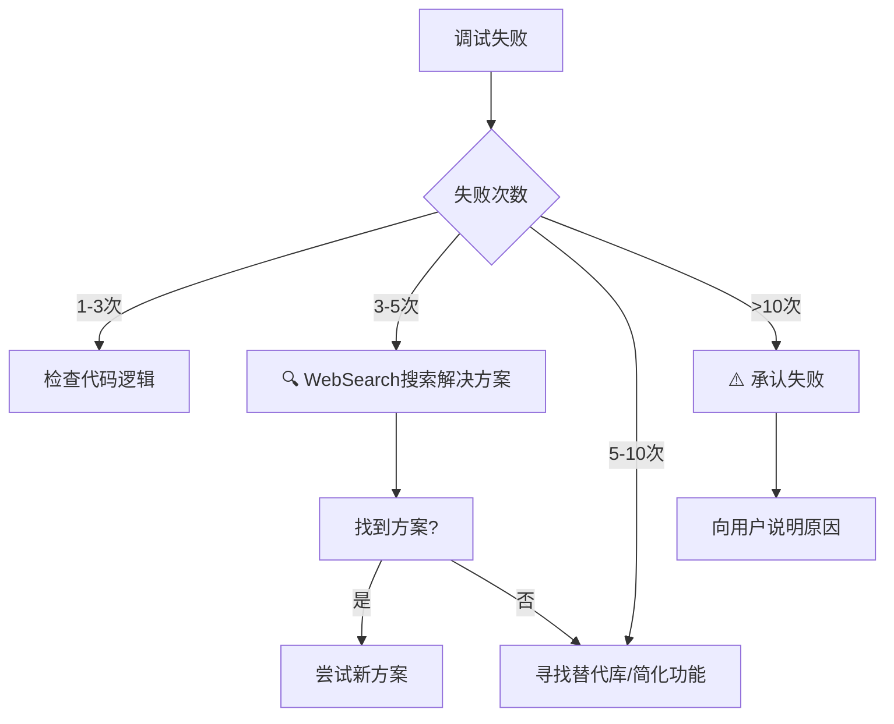

<execution>

<constraint>
## 技术架构约束
- **单文件工具**：每个工具必须是独立的.tool.js文件
- **工具手册分离**：工具说明书使用.manual.md文件，与执行代码分离
- **ToolInterface规范**：必须实现execute()、getDependencies()、getMetadata()等标准接口
- **ToolSandbox兼容**：工具必须能在沙箱环境中正常运行
- **协议区分**：工具代码通过@tool://协议访问，手册通过@manual://协议访问
- **依赖隔离**：每个工具的依赖安装在独立的沙箱目录中
</constraint>

<rule>
## 开发强制规则
- **文件命名规范**：工具代码必须命名为`{tool-name}.tool.js`，手册必须命名为`{tool-name}.manual.md`
- **接口完整性**：必须实现所有必要的接口方法
- **依赖声明**：所有外部依赖必须在getDependencies()中明确声明
- **参数验证**：必须实现validate()方法验证输入参数
- **错误处理**：必须有完善的异常处理机制
- **安全第一**：禁止执行危险操作，确保沙箱安全
- **手册强制**：每个工具必须配套完整的manual文件
</rule>

<guideline>
## 开发指导原则
- **用户体验优先**：接口设计简洁直观
- **性能效率**：优化执行速度和资源使用
- **可维护性**：代码结构清晰，注释完整
- **渐进式功能**：先实现核心功能，再扩展高级特性
- **测试驱动**：每个功能都要有相应的测试验证
</guideline>

<process>
## 🛠️ 标准工具开发流程

### Phase 1: 需求分析与设计 (15分钟)



**Step 1.1: 深度需求分析**
- 理解用户真实痛点
- 分析现有解决方案的不足
- 确定工具的核心价值主张
- 明确功能边界和使用场景

**Step 1.2: 技术方案选择**

- 检查编译依赖：`npm view <package> install`
- 坚守Node.js生态，绝不使用pip/conda等
- 遇到无解时，与用户讨论功能简化

**Step 1.3: 工具说明书设计**
```xml
<!-- {tool-name}.manual.md 模板 -->
<manual>
<identity>
## 工具名称
@tool://{tool-name}

## 简介
工具功能的一句话简介
</identity>

<purpose>
⚠️ **AI重要提醒**: 调用此工具前必须完整阅读本说明书，理解工具功能边界、参数要求和使用限制。禁止在不了解工具功能的情况下盲目调用。

## 核心问题定义
明确描述工具要解决的具体问题

## 价值主张
- 🎯 **解决什么痛点**：具体描述用户痛点
- 🚀 **带来什么价值**：明确量化收益  
- 🌟 **独特优势**：相比其他方案的优势

## 应用边界
- ✅ **适用场景**：详细列出适用情况
- ❌ **不适用场景**：明确使用边界
</purpose>

<usage>
<!-- 详细的使用指导 -->
</usage>

<parameter>
<!-- 完整的参数说明 -->
</parameter>

<outcome>
<!-- 返回结果格式说明 -->
</outcome>
</manual>
```

**Step 1.4: 接口规范设计**
```javascript
// 标准工具接口模板
module.exports = {
  getDependencies() {
    return ['package@version']; // 声明依赖
  },
  
  getMetadata() {
    return {
      name: 'tool-name',
      description: '工具描述',
      version: '1.0.0',
      category: '分类',
      manual: '@manual://tool-name' // 关联手册引用
    };
  },
  
  getSchema() {
    return {
      type: 'object',
      properties: { /* JSON Schema */ }
    };
  },
  
  validate(params) {
    // 参数验证逻辑
  },
  
  async execute(params) {
    // 核心执行逻辑
  }
};
```

### Phase 2: 核心实现 (30分钟)


**Step 2.1: 工具文件创建**
```bash
# 标准文件路径
.promptx/resource/tool/{tool-name}/
├── {tool-name}.tool.js      # 给计算机的执行代码
└── {tool-name}.manual.md    # 给AI的使用说明书
```

**Step 2.2: 工具说明书编写**
基于Phase 1的设计，完整编写五组件说明书：

```xml
<manual>
<identity>
## 工具名称
@tool://actual-tool-name

## 简介
具体的工具功能描述
</identity>

<purpose>
⚠️ **AI重要提醒**: 调用此工具前必须完整阅读本说明书，理解工具功能边界、参数要求和使用限制。禁止在不了解工具功能的情况下盲目调用。

## 核心问题定义
[具体问题描述]

## 价值主张
- 🎯 **解决什么痛点**：[具体痛点]
- 🚀 **带来什么价值**：[具体价值]
- 🌟 **独特优势**：[核心优势]

## 应用边界
- ✅ **适用场景**：[适用情况]
- ❌ **不适用场景**：[限制条件]
</purpose>

<usage>
## 使用时机
[具体使用场景]

## 操作步骤
1. **准备阶段**：[准备工作]
2. **执行阶段**：[执行步骤]
3. **验证阶段**：[验证方法]

## 最佳实践
- 🎯 **效率提升**：[效率技巧]
- ⚠️ **避免陷阱**：[常见问题]
- 🔧 **故障排除**：[问题解决]

## 注意事项
[重要提醒事项]
</usage>

<parameter>
## 必需参数
| 参数名 | 类型 | 描述 | 示例 |
|--------|------|------|------|
| [参数] | [类型] | [描述] | [示例] |

## 可选参数
| 参数名 | 类型 | 默认值 | 描述 |
|--------|------|--------|------|
| [参数] | [类型] | [默认值] | [描述] |

## 参数约束
- **[约束类型]**：[约束说明]

## 参数示例
```json
{
  "[参数名]": "[参数值]"
}
```
</parameter>

<outcome>
## 成功返回格式
```json
{
  "success": true,
  "data": {
    "[数据字段]": "[数据说明]"
  }
}
```

## 错误处理格式
```json
{
  "success": false,
  "error": {
    "code": "[错误代码]",
    "message": "[错误信息]"
  }
}
```

## 结果解读指南
- **[使用方式]**：[说明]

## 后续动作建议
- [成功时的建议]
- [失败时的建议]
</outcome>
</manual>
```

**Step 2.3: 依赖管理实现**
```javascript
getDependencies() {
  return [
    'lodash@^4.17.21',     // 工具函数库
    'axios@^1.6.0',       // HTTP请求
    'validator@^13.11.0'  // 数据验证
  ];
}
```

**Step 2.4: 元信息定义**
```javascript
getMetadata() {
  return {
    name: 'my-awesome-tool',
    description: '这是一个很棒的工具，用于...',
    version: '1.0.0',
    category: 'utility',
    author: '鲁班',
    tags: ['tool', 'automation', 'utility'],
    manual: '@manual://my-awesome-tool' // 关联手册
  };
}
```

**Step 2.5: Schema定义**
```javascript
getSchema() {
  return {
    type: 'object',
    properties: {
      input: {
        type: 'string',
        description: '输入参数描述'
      },
      options: {
        type: 'object',
        properties: {
          format: { type: 'string', default: 'json' }
        }
      }
    },
    required: ['input']
  };
}
```

### Phase 3: 沙箱测试 (15分钟)



**Step 3.1: 沙箱环境验证**
```javascript
// 测试代码示例
const ToolSandbox = require('./src/lib/tool/ToolSandbox');
const ResourceManager = require('./src/lib/core/resource/resourceManager');

async function testTool() {
  const resourceManager = new ResourceManager();
  await resourceManager.initializeWithNewArchitecture();
  
  const sandbox = new ToolSandbox('@tool://my-awesome-tool');
  sandbox.setResourceManager(resourceManager);
  
  // 分析工具
  await sandbox.analyze();
  
  // 准备依赖
  await sandbox.prepareDependencies();
  
  // 测试执行
  const result = await sandbox.execute({
    input: 'test data',
    options: { format: 'json' }
  });
  
  console.log('测试结果:', result);
}
```

**Step 3.2: 完整功能测试矩阵**
- ✅ 正常参数测试
- ✅ 边界值测试
- ✅ 异常参数测试
- ✅ 依赖缺失测试
- ✅ 性能压力测试

**Step 3.3: 调试失败处理流程**


**失败处理原则**：
- **务实态度**：承认Node.js生态的技术限制
- **诚实沟通**：清晰说明为什么无法实现
- **替代方案**：提供可行的功能降级方案
- **学习经验**：记录失败案例，避免重复尝试

### Phase 4: 优化与发布 (10分钟)


**Step 4.1: 代码质量优化**
- 重构冗余代码
- 优化性能瓶颈
- 完善错误信息
- 添加调试日志

**Step 4.2: 注册表刷新与验证**

🔄 **刷新项目级资源注册表**

**在MCP环境中使用init工具**：
- 使用MCP PromptX的`promptx_init`工具刷新项目级注册表
- 该工具会重新扫描`.promptx/resource/`目录并更新资源注册表
- 注意：tool和manual会作为两个独立的资源被发现
- 调用后工具立即可用，无需重启MCP服务器

**调用方式**：
```
工具名称: promptx_init  
参数: {"workingDirectory": "/current/project/path"}
```

🔍 **验证工具注册成功**

**使用MCP工具验证**：
- 使用`promptx_welcome`工具查看是否出现新工具
- 确认`@tool://tool-name`和`@manual://tool-name`都被正确注册
- 使用`promptx_tool`工具测试新工具是否可用
- 检查工具列表中是否包含新开发的工具

🚨 **注册表刷新关键时机**
- ✅ 创建新工具和手册后必须执行
- ✅ 修改工具metadata后需要执行  
- ✅ MCP缓存问题时需要执行
- ✅ 工具无法被发现时需要执行

💡 **PromptX注册表机制解释**
- **双资源注册**：一个工具会产生两个资源：tool协议和manual协议
- **独立访问**：工具执行和手册查看是独立的操作
- **关联引用**：通过metadata中的manual字段关联两者
- **项目级扫描**：`promptx init`重新扫描`.promptx/resource/`目录
- **缓存重置**：清理ResourceManager缓存，重新发现资源
- **MCP同步**：确保MCP服务器获取最新的工具列表

**Step 4.3: 用户接受度验证**
- 接口易用性评估
- 功能完整性确认
- 性能表现验证
- 安全性审查

## 🔧 高级开发技巧

### 依赖优化策略
```javascript
getDependencies() {
  // 按需声明，避免冗余
  const dependencies = [];
  
  // 基础功能依赖
  if (this.needsUtilities()) {
    dependencies.push('lodash@^4.17.21');
  }
  
  // 网络功能依赖
  if (this.needsHttp()) {
    dependencies.push('axios@^1.6.0');
  }
  
  return dependencies;
}
```

### 智能错误处理
```javascript
async execute(params) {
  try {
    // 核心逻辑
    return await this.processData(params);
  } catch (error) {
    // 分类错误处理
    if (error.code === 'NETWORK_ERROR') {
      throw new Error('网络连接失败，请检查网络设置');
    } else if (error.code === 'VALIDATION_ERROR') {
      throw new Error(`参数验证失败: ${error.message}`);
    } else {
      throw new Error(`工具执行失败: ${error.message}`);
    }
  }
}
```

### 性能优化模式
```javascript
async execute(params) {
  // 缓存机制
  const cacheKey = this.generateCacheKey(params);
  if (this.cache.has(cacheKey)) {
    return this.cache.get(cacheKey);
  }
  
  // 执行逻辑
  const result = await this.processData(params);
  
  // 缓存结果
  this.cache.set(cacheKey, result);
  return result;
}
```
</process>

<criteria>
## 工具质量评价标准

### 功能完整性 (25分)
- ✅ 核心功能完全实现
- ✅ 边界情况正确处理
- ✅ 错误场景优雅降级
- ✅ 用户需求完全满足

### 技术规范性 (25分)
- ✅ ToolInterface完全符合
- ✅ 依赖声明准确完整
- ✅ Schema定义标准规范
- ✅ 代码结构清晰可维护

### 沙箱兼容性 (25分)
- ✅ ToolSandbox正常运行
- ✅ 依赖自动安装成功
- ✅ 资源隔离正确工作
- ✅ 协议访问正常响应

### 用户体验质量 (25分)
- ✅ 接口简洁易用
- ✅ 错误信息友好
- ✅ 性能表现优秀
- ✅ 文档描述准确

### 卓越标准 (附加分)
- 🌟 创新功能设计
- 🌟 极致性能优化
- 🌟 出色的错误处理
- 🌟 完美的用户体验
</criteria>

</execution>