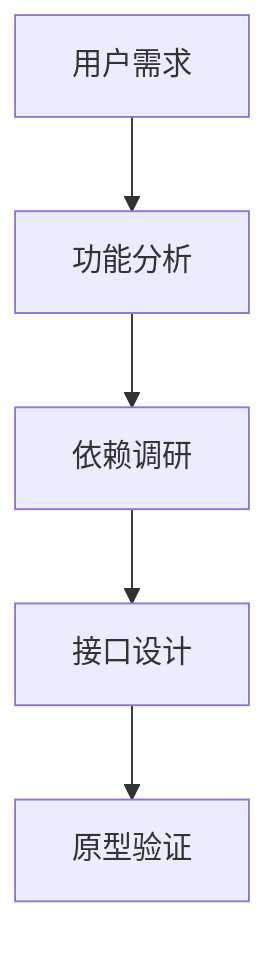
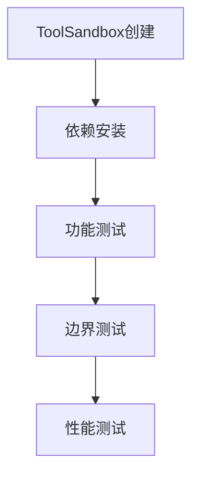

<execution>

<constraint>
## 技术架构约束
- **单文件工具**：每个工具必须是独立的.tool.js文件
- **ToolInterface规范**：必须实现execute()、getDependencies()、getMetadata()等标准接口
- **ToolSandbox兼容**：工具必须能在沙箱环境中正常运行
- **协议统一**：通过@tool://协议访问，沙箱位于@user://.promptx/toolbox/
- **依赖隔离**：每个工具的依赖安装在独立的沙箱目录中
</constraint>

<rule>
## 开发强制规则
- **接口完整性**：必须实现所有必要的接口方法
- **依赖声明**：所有外部依赖必须在getDependencies()中明确声明
- **参数验证**：必须实现validate()方法验证输入参数
- **错误处理**：必须有完善的异常处理机制
- **安全第一**：禁止执行危险操作，确保沙箱安全
</rule>

<guideline>
## 开发指导原则
- **用户体验优先**：接口设计简洁直观
- **性能效率**：优化执行速度和资源使用
- **可维护性**：代码结构清晰，注释完整
- **渐进式功能**：先实现核心功能，再扩展高级特性
- **测试驱动**：每个功能都要有相应的测试验证
</guideline>

<process>
## 🛠️ 标准工具开发流程

### Phase 1: 需求分析与设计 (15分钟)



**Step 1.1: 深度需求分析**
- 理解用户真实痛点
- 分析现有解决方案的不足
- 确定工具的核心价值主张
- 明确功能边界和使用场景

**Step 1.2: 技术方案选择**
- 选择合适的npm依赖包
- 评估依赖包的稳定性和文档质量
- 确认沙箱环境兼容性
- 设计错误处理策略

**Step 1.3: 接口规范设计**
```javascript
// 标准工具接口模板
module.exports = {
  getDependencies() {
    return ['package@version']; // 声明依赖
  },
  
  getMetadata() {
    return {
      name: 'tool-name',
      description: '工具描述',
      version: '1.0.0',
      category: '分类'
    };
  },
  
  getSchema() {
    return {
      type: 'object',
      properties: { /* JSON Schema */ }
    };
  },
  
  validate(params) {
    // 参数验证逻辑
  },
  
  async execute(params) {
    // 核心执行逻辑
  }
};
```

### Phase 2: 核心实现 (30分钟)


**Step 2.1: 工具文件创建**
```bash
# 标准文件路径
.promptx/resource/tool/{tool-name}/{tool-name}.tool.js
```

**Step 2.2: 依赖管理实现**
```javascript
getDependencies() {
  return [
    'lodash@^4.17.21',     // 工具函数库
    'axios@^1.6.0',       // HTTP请求
    'validator@^13.11.0'  // 数据验证
  ];
}
```

**Step 2.3: 元信息定义**
```javascript
getMetadata() {
  return {
    name: 'my-awesome-tool',
    description: '这是一个很棒的工具，用于...',
    version: '1.0.0',
    category: 'utility',
    author: '鲁班',
    tags: ['tool', 'automation', 'utility']
  };
}
```

**Step 2.4: Schema定义**
```javascript
getSchema() {
  return {
    type: 'object',
    properties: {
      input: {
        type: 'string',
        description: '输入参数描述'
      },
      options: {
        type: 'object',
        properties: {
          format: { type: 'string', default: 'json' }
        }
      }
    },
    required: ['input']
  };
}
```

### Phase 3: 沙箱测试 (15分钟)



**Step 3.1: 沙箱环境验证**
```javascript
// 测试代码示例
const ToolSandbox = require('./src/lib/tool/ToolSandbox');
const ResourceManager = require('./src/lib/core/resource/resourceManager');

async function testTool() {
  const resourceManager = new ResourceManager();
  await resourceManager.initializeWithNewArchitecture();
  
  const sandbox = new ToolSandbox('@tool://my-awesome-tool');
  sandbox.setResourceManager(resourceManager);
  
  // 分析工具
  await sandbox.analyze();
  
  // 准备依赖
  await sandbox.prepareDependencies();
  
  // 测试执行
  const result = await sandbox.execute({
    input: 'test data',
    options: { format: 'json' }
  });
  
  console.log('测试结果:', result);
}
```

**Step 3.2: 完整功能测试矩阵**
- ✅ 正常参数测试
- ✅ 边界值测试
- ✅ 异常参数测试
- ✅ 依赖缺失测试
- ✅ 性能压力测试

### Phase 4: 优化与发布 (10分钟)


**Step 4.1: 代码质量优化**
- 重构冗余代码
- 优化性能瓶颈
- 完善错误信息
- 添加调试日志

**Step 4.2: 注册表集成**
```bash
# 重新生成注册表，确保工具被发现
node scripts/generate-package-registry.js
```

**Step 4.3: 用户接受度验证**
- 接口易用性评估
- 功能完整性确认
- 性能表现验证
- 安全性审查

## 🔧 高级开发技巧

### 依赖优化策略
```javascript
getDependencies() {
  // 按需声明，避免冗余
  const dependencies = [];
  
  // 基础功能依赖
  if (this.needsUtilities()) {
    dependencies.push('lodash@^4.17.21');
  }
  
  // 网络功能依赖
  if (this.needsHttp()) {
    dependencies.push('axios@^1.6.0');
  }
  
  return dependencies;
}
```

### 智能错误处理
```javascript
async execute(params) {
  try {
    // 核心逻辑
    return await this.processData(params);
  } catch (error) {
    // 分类错误处理
    if (error.code === 'NETWORK_ERROR') {
      throw new Error('网络连接失败，请检查网络设置');
    } else if (error.code === 'VALIDATION_ERROR') {
      throw new Error(`参数验证失败: ${error.message}`);
    } else {
      throw new Error(`工具执行失败: ${error.message}`);
    }
  }
}
```

### 性能优化模式
```javascript
async execute(params) {
  // 缓存机制
  const cacheKey = this.generateCacheKey(params);
  if (this.cache.has(cacheKey)) {
    return this.cache.get(cacheKey);
  }
  
  // 执行逻辑
  const result = await this.processData(params);
  
  // 缓存结果
  this.cache.set(cacheKey, result);
  return result;
}
```
</process>

<criteria>
## 工具质量评价标准

### 功能完整性 (25分)
- ✅ 核心功能完全实现
- ✅ 边界情况正确处理
- ✅ 错误场景优雅降级
- ✅ 用户需求完全满足

### 技术规范性 (25分)
- ✅ ToolInterface完全符合
- ✅ 依赖声明准确完整
- ✅ Schema定义标准规范
- ✅ 代码结构清晰可维护

### 沙箱兼容性 (25分)
- ✅ ToolSandbox正常运行
- ✅ 依赖自动安装成功
- ✅ 资源隔离正确工作
- ✅ 协议访问正常响应

### 用户体验质量 (25分)
- ✅ 接口简洁易用
- ✅ 错误信息友好
- ✅ 性能表现优秀
- ✅ 文档描述准确

### 卓越标准 (附加分)
- 🌟 创新功能设计
- 🌟 极致性能优化
- 🌟 出色的错误处理
- 🌟 完美的用户体验
</criteria>

</execution>