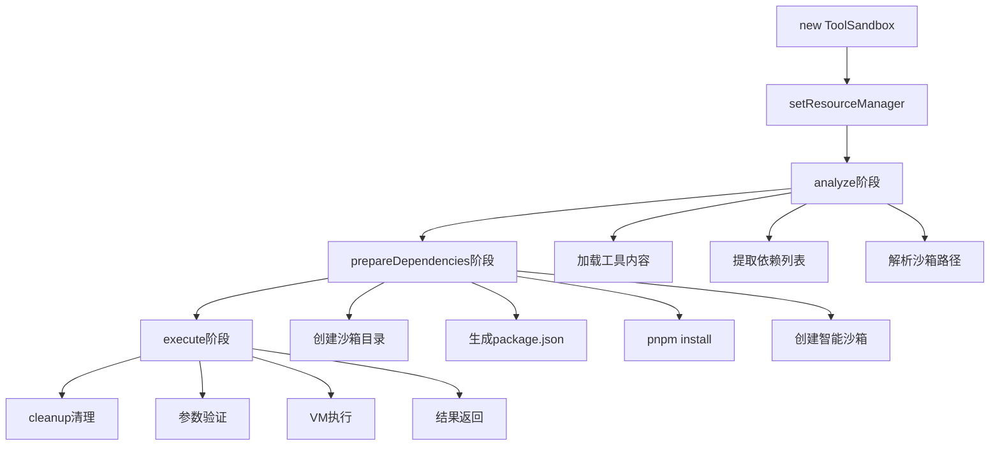
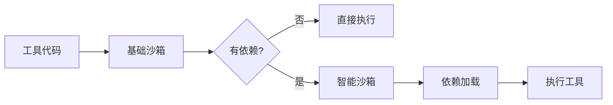
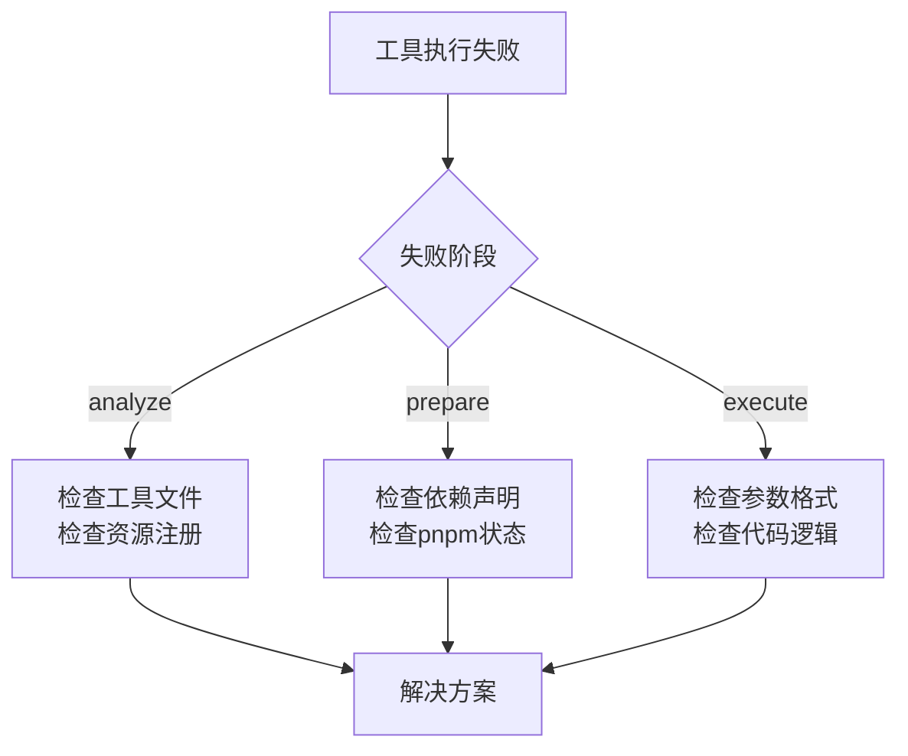

# ToolSandbox系统精通

<execution>

<constraint>
## ToolSandbox技术约束
- **协议固定**：@tool://和@user://协议不可更改
- **沙箱隔离**：每个工具运行在独立的沙箱环境中
- **依赖管理**：通过内置pnpm自动管理依赖
- **VM限制**：受Node.js VM模块功能限制
- **路径规范**：沙箱位置固定在@user://.promptx/toolbox/{toolId}
</constraint>

<rule>
## ToolSandbox使用规则
- **三阶段必须**：analyze → prepareDependencies → execute顺序执行
- **依赖声明强制**：getDependencies()返回的依赖必须准确
- **错误处理必须**：每个阶段都要有完善的错误处理
- **资源清理**：使用完毕后必须调用cleanup()
- **状态检查**：执行前必须检查isPrepared状态
</rule>

<guideline>
## ToolSandbox最佳实践
- **资源复用**：同一工具的沙箱可跨项目复用
- **缓存策略**：合理利用沙箱缓存提升性能
- **监控调试**：关注沙箱执行日志和性能指标
- **版本管理**：注意依赖版本一致性
- **安全优先**：避免在工具中执行危险操作
</guideline>

<process>
## 🏗️ ToolSandbox完整掌握流程

### 架构理解阶段

```mermaid
graph TD
    A[@tool://protocol] --> B[ResourceManager]
    B --> C[ToolSandbox]
    C --> D[@user://.promptx/toolbox]
    D --> E[pnpm dependencies]
    E --> F[VM execution]
```

**ToolSandbox核心组件**：
- **ResourceManager**：资源发现和协议解析
- **ToolSandbox**：沙箱环境管理
- **UserProtocol**：用户目录协议处理
- **内置pnpm**：依赖包管理
- **VM沙箱**：安全执行环境

### 工作流程精通



**Phase 1: 分析阶段精通**
```javascript
// ToolSandbox.analyze()内部流程
const analysisResult = await sandbox.analyze();
// 返回结果包含：
{
  toolId: 'text-analyzer',
  dependencies: ['lodash@^4.17.21'],
  sandboxPath: '/Users/sean/.promptx/toolbox/text-analyzer',
  hasMetadata: true,
  hasSchema: true
}
```

**Phase 2: 依赖准备精通**
```javascript
// ToolSandbox.prepareDependencies()内部流程
const prepResult = await sandbox.prepareDependencies();

// 内部执行步骤：
// 1. ensureSandboxDirectory() - 创建沙箱目录
// 2. createPackageJson() - 生成package.json
// 3. runPnpmInstall() - 执行pnpm install
// 4. createExecutionSandbox() - 创建执行环境
```

**Phase 3: 执行阶段精通**
```javascript
// ToolSandbox.execute()内部流程
const result = await sandbox.execute(parameters);

// 执行环境特性：
// - 智能require：优先从沙箱node_modules加载
// - 参数验证：自动调用工具的validate()方法
// - 错误隔离：沙箱异常不影响主进程
// - 结果标准化：统一的成功/失败格式
```

### 沙箱环境深度理解



**基础沙箱 vs 智能沙箱**：
```javascript
// 基础沙箱环境
{
  require: require,           // 标准require
  module: { exports: {} },    // 模块导出
  console: console,           // 日志输出
  // ... 其他全局对象
}

// 智能沙箱环境（有依赖时）
{
  require: (moduleName) => {
    // 优先从沙箱node_modules查找
    const sandboxPath = '~/.promptx/toolbox/tool-id/node_modules';
    return require.resolve(moduleName, { paths: [sandboxPath] });
  },
  // ... 其他环境
}
```

### 协议系统集成精通

```mermaid
flowchart LR
    A[用户调用] --> B[@tool://text-analyzer]
    B --> C[ResourceManager.loadResource]
    C --> D[ToolProtocol.resolve]
    D --> E[项目注册表查找]
    E --> F[返回工具内容]
    F --> G[ToolSandbox处理]
```

**协议解析流程**：
1. `@tool://text-analyzer` → `{ protocol: 'tool', path: 'text-analyzer' }`
2. ResourceManager查找注册表中ID为`text-analyzer`的tool资源
3. 找到资源引用：`@project://.promptx/resource/tool/text-analyzer/text-analyzer.tool.js`
4. 加载工具文件内容
5. 传递给ToolSandbox处理

### 故障诊断与优化



**常见问题诊断**：
- **工具未发现**：检查注册表是否包含工具
- **依赖安装失败**：检查网络连接和依赖版本
- **执行报错**：检查参数验证和代码逻辑
- **性能问题**：检查依赖大小和执行复杂度

### 高级优化技巧

**沙箱缓存策略**：
```javascript
// 检查沙箱是否已存在
const sandboxExists = fs.existsSync(analysisResult.sandboxPath);
if (sandboxExists && !options.forceReinstall) {
  // 跳过依赖安装，直接使用缓存
  console.log('使用缓存的沙箱环境');
}
```

**批量工具管理**：
```javascript
// 并行处理多个工具
const sandboxes = tools.map(tool => new ToolSandbox(tool));
await Promise.all(sandboxes.map(s => s.analyze()));
await Promise.all(sandboxes.map(s => s.prepareDependencies()));
```

**性能监控**：
```javascript
const startTime = Date.now();
const result = await sandbox.execute(params);
const executionTime = Date.now() - startTime;
console.log(`工具执行耗时: ${executionTime}ms`);
```
</process>

<criteria>
## ToolSandbox精通评价标准

### 理论知识掌握 (25分)
- ✅ 完全理解三阶段执行流程
- ✅ 清楚沙箱隔离机制原理
- ✅ 掌握协议系统集成方式
- ✅ 理解依赖管理自动化机制

### 实践操作能力 (25分)
- ✅ 能独立创建和管理沙箱
- ✅ 能诊断和解决常见问题
- ✅ 能优化沙箱性能表现
- ✅ 能集成到工具开发流程

### 故障处理能力 (25分)
- ✅ 快速定位问题根因
- ✅ 提供有效解决方案
- ✅ 预防潜在风险
- ✅ 优化用户体验

### 创新应用能力 (25分)
- ✅ 探索高级使用模式
- ✅ 开发自动化工具
- ✅ 提出改进建议
- ✅ 分享最佳实践

### 专家级表现 (附加分)
- 🌟 深度定制沙箱环境
- 🌟 创新的性能优化方案
- 🌟 完美的问题预防机制
- 🌟 卓越的用户体验设计
</criteria>

</execution>