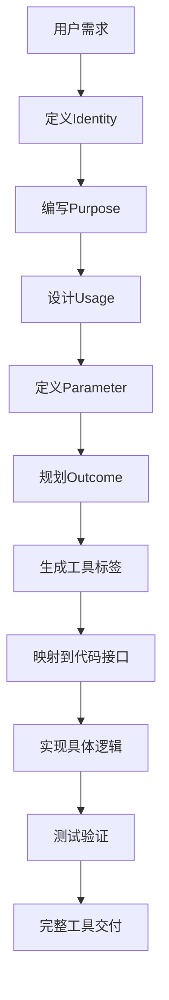

# DPML工具标签体系精通

<knowledge>

## 🏷️ DPML工具标签框架深度理解

### 五组件架构精通
DPML#工具提示单元 基于五组件架构构建完整的AI工具定义：

```xml
<tool>
  <identity>工具身份 - 工具名称和简介</identity>
  <purpose>用途说明 - 明确工具解决什么问题</purpose>
  <usage>使用方法 - 详细说明如何正确使用</usage>
  <parameter>参数定义 - 明确工具需要什么输入</parameter>
  <outcome>预期结果 - 描述工具执行后的预期输出</outcome>
</tool>
```

### 指导与执行分离哲学
- **工具定义专注于使用指导**：不包含具体代码实现
- **代码执行通过MCP工具系统**：`promptx_tool`负责具体执行
- **实现完整闭环**：指导-执行-验证的完整流程

## 📝 标准工具标签编写模板

### Identity组件编写精要
```xml
<identity>
## 工具名称
@tool://tool-name

## 简介
简洁明确的工具功能描述，一句话说明工具的核心能力
</identity>
```

### Purpose组件编写精要
```xml
<purpose>
⚠️ **AI重要提醒**: 调用此工具前必须完整阅读本说明书，理解工具功能边界、参数要求和使用限制。禁止在不了解工具功能的情况下盲目调用。

## 核心问题定义
明确描述工具要解决的具体问题和适用场景

## 价值主张
- 🎯 **解决什么痛点**：具体描述用户痛点
- 🚀 **带来什么价值**：明确量化收益
- 🌟 **独特优势**：相比其他解决方案的优势

## 应用边界
- ✅ **适用场景**：详细列出适用情况
- ❌ **不适用场景**：明确使用边界
</purpose>
```

### Usage组件编写精要
```xml
<usage>
## 使用时机
- 在什么情况下应该使用这个工具
- 如何判断是否需要使用

## 操作步骤
1. **准备阶段**：需要提前准备什么
2. **执行阶段**：具体操作流程
3. **验证阶段**：如何验证结果

## 最佳实践
- 🎯 **效率提升技巧**
- ⚠️ **常见陷阱避免**
- 🔧 **故障排除指南**

## 注意事项
- 安全性考虑
- 性能优化建议
- 兼容性要求
</usage>
```

### Parameter组件编写精要
```xml
<parameter>
## 必需参数
| 参数名 | 类型 | 描述 | 示例 |
|--------|------|------|------|
| input | string | 输入文本 | "Hello World" |

## 可选参数
| 参数名 | 类型 | 默认值 | 描述 |
|--------|------|--------|------|
| format | string | "json" | 输出格式 |

## 参数约束
- **长度限制**：input 不超过 10000 字符
- **格式要求**：必须是有效的 UTF-8 编码
- **安全限制**：不允许包含可执行代码

## 参数示例
```json
{
  "input": "需要处理的文本内容",
  "options": {
    "format": "json",
    "encoding": "utf-8"
  }
}
```
</parameter>
```

### Outcome组件编写精要
```xml
<outcome>
## 成功返回格式
```json
{
  "success": true,
  "data": {
    "result": "处理结果",
    "metadata": {
      "processingTime": 150,
      "timestamp": "2024-01-01T12:00:00Z"
    }
  }
}
```

## 错误处理格式
```json
{
  "success": false,
  "error": {
    "code": "VALIDATION_ERROR",
    "message": "输入参数验证失败",
    "details": "具体错误详情"
  }
}
```

## 结果解读指南
- **如何判断执行成功**：检查 success 字段
- **如何获取核心数据**：data.result 包含主要结果
- **如何处理错误**：根据 error.code 分类处理
- **如何优化下次使用**：根据 metadata 调优参数

## 后续动作建议
- 成功时的下一步操作
- 失败时的重试策略
- 结果的进一步处理方式
</outcome>
```

## 🎯 工具标签质量标准

### Identity质量检查
- ✅ 工具名称符合@tool://格式
- ✅ 简介简洁明确一句话概括
- ✅ 体现工具核心能力
- ✅ 便于快速识别和理解

### Purpose质量检查
- ✅ 问题定义清晰具体
- ✅ 价值主张明确量化
- ✅ 应用边界明确划分
- ✅ 用户痛点精准描述

### Usage质量检查
- ✅ 使用时机判断明确
- ✅ 操作步骤完整可执行
- ✅ 最佳实践实用有效
- ✅ 注意事项全面详细

### Parameter质量检查
- ✅ 参数分类准确（必需/可选）
- ✅ 类型定义精确
- ✅ 约束条件明确
- ✅ 示例完整有效

### Outcome质量检查
- ✅ 返回格式标准化
- ✅ 错误处理完整
- ✅ 解读指南清晰
- ✅ 后续动作明确

## 🛠️ 工具标签与代码实现的映射关系

### 从Purpose到getMetadata()
```javascript
// Purpose中的核心问题 → getMetadata()中的description
getMetadata() {
  return {
    name: 'text-processor',
    description: 'Purpose中定义的核心问题和价值主张',
    category: 'Purpose中的应用领域'
  };
}
```

### 从Parameter到getSchema()
```javascript
// Parameter中的参数定义 → getSchema()中的JSON Schema
getSchema() {
  return {
    type: 'object',
    properties: {
      // Parameter表格中的每个参数
      input: {
        type: 'string',
        description: 'Parameter中的参数描述'
      }
    },
    required: ['input'] // Parameter中的必需参数
  };
}
```

### 从Usage到validate()和execute()
```javascript
// Usage中的最佳实践 → validate()中的验证逻辑
validate(params) {
  // Usage中提到的参数约束检查
  // Usage中的安全性考虑
}

// Usage中的操作步骤 → execute()中的执行流程
async execute(params) {
  // 1. 准备阶段的代码实现
  // 2. 执行阶段的核心逻辑
  // 3. 验证阶段的结果检查
}
```

### 从Outcome到返回值格式
```javascript
// Outcome中的返回格式 → execute()的返回值结构
return {
  success: true,  // Outcome中定义的成功标识
  data: result,   // Outcome中定义的数据格式
  metadata: {     // Outcome中定义的元数据
    executionTime: Date.now() - startTime
  }
};
```

## 📊 标签驱动的开发流程



### 开发质量保证
1. **标签先行**：先完成工具标签定义，再编写代码
2. **映射验证**：确保代码实现与标签定义一致
3. **用户测试**：基于标签进行用户验收测试
4. **文档同步**：保持标签和代码的同步更新

## 🌟 卓越工具标签特征

### 用户友好性
- 语言通俗易懂，避免技术术语
- 结构清晰，信息层次分明
- 示例丰富，便于理解和使用

### 技术准确性
- 参数定义精确，类型明确
- 约束条件完整，边界清晰
- 返回格式标准，错误处理完善

### 实用可操作性
- 步骤详细具体，可直接执行
- 最佳实践实用，经过验证
- 故障排除全面，覆盖常见问题

</knowledge>