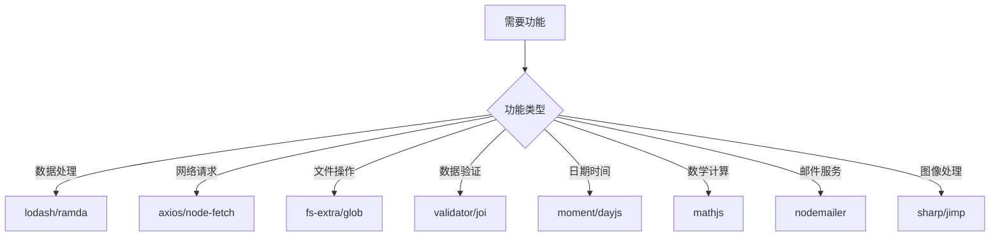
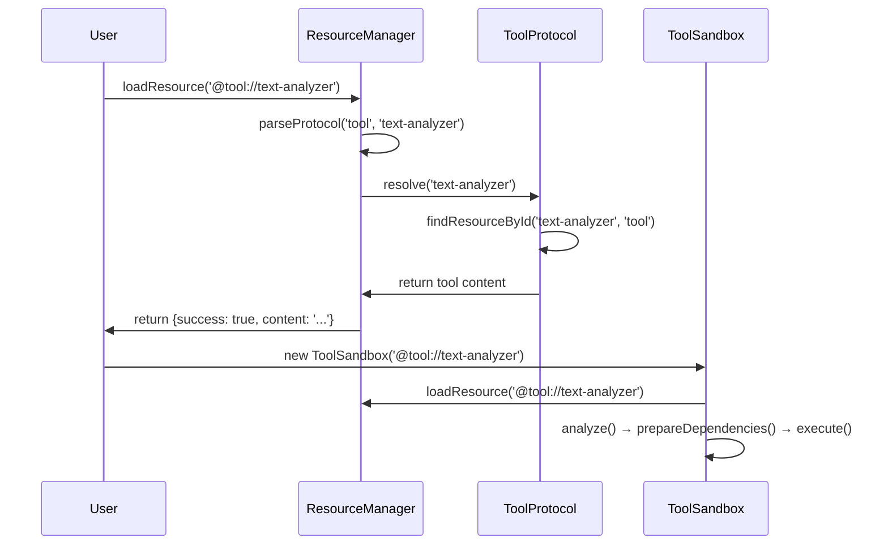

# PromptX工具架构知识体系

<knowledge>

## 🏗️ 核心架构组件

### ToolSandbox系统架构
```mermaid
graph TD
    A[Tool Request] --> B[ResourceManager]
    B --> C[Protocol Resolution]
    C --> D[ToolSandbox Creation]
    D --> E[Dependency Management]
    E --> F[VM Execution]
    F --> G[Result Return]
    
    subgraph "沙箱环境"
        H[@user://.promptx/toolbox]
        I[pnpm dependencies]
        J[isolated execution]
    end
    
    D --> H
    E --> I
    F --> J
```

### 工具接口标准
```javascript
// PromptX ToolInterface v2.0
module.exports = {
  // 🆕 新接口：依赖管理
  getDependencies() {
    return ['lodash@^4.17.21', 'axios@^1.6.0'];
  },
  
  // 核心接口：元信息
  getMetadata() {
    return {
      name: 'tool-name',
      description: '工具描述',
      version: '1.0.0',
      category: 'utility',
      author: '作者',
      tags: ['tag1', 'tag2']
    };
  },
  
  // 核心接口：参数Schema
  getSchema() {
    return {
      type: 'object',
      properties: {
        input: { type: 'string', description: '输入参数' }
      },
      required: ['input']
    };
  },
  
  // 可选接口：参数验证
  validate(params) {
    return { valid: true, errors: [] };
  },
  
  // 核心接口：执行逻辑
  async execute(params) {
    // 工具核心逻辑
    return result;
  },
  
  // 可选接口：初始化
  async init() {
    // 初始化逻辑
  },
  
  // 可选接口：清理
  async cleanup() {
    // 清理逻辑
  }
};
```

## 🔧 技术栈知识

### Node.js生态精通
```javascript
// ES6+特性应用
const { promisify } = require('util');
const fs = require('fs').promises;

// 异步编程模式
async function processData(data) {
  try {
    const result = await Promise.all(
      data.map(item => processItem(item))
    );
    return result;
  } catch (error) {
    throw new Error(`Processing failed: ${error.message}`);
  }
}

// 错误处理最佳实践
class ToolError extends Error {
  constructor(message, code, details) {
    super(message);
    this.name = 'ToolError';
    this.code = code;
    this.details = details;
  }
}
```

### 依赖管理精通
```json
// package.json最佳实践
{
  "name": "toolbox-text-analyzer",
  "version": "1.0.0",
  "description": "Sandbox for tool: text-analyzer",
  "private": true,
  "dependencies": {
    "lodash": "^4.17.21",
    "axios": "^1.6.0",
    "validator": "^13.11.0"
  }
}
```

**依赖选择原则**：
- **成熟度**：选择下载量大、维护活跃的包
- **轻量化**：避免过重的依赖，注意bundle size
- **兼容性**：确保Node.js版本兼容
- **安全性**：定期检查安全漏洞

### VM沙箱技术
```javascript
// 基础沙箱环境
const basicSandbox = {
  require: require,
  module: { exports: {} },
  exports: {},
  console: console,
  Buffer: Buffer,
  process: {
    env: process.env,
    hrtime: process.hrtime
  },
  // JavaScript内置对象
  Object, Array, String, Number, Boolean,
  Date, JSON, Math, RegExp, Error, URL
};

// 智能沙箱环境（支持依赖）
const smartSandbox = {
  require: (moduleName) => {
    try {
      // 优先从沙箱目录查找
      return require(require.resolve(moduleName, {
        paths: [
          path.join(sandboxPath, 'node_modules'),
          sandboxPath,
          process.cwd() + '/node_modules'
        ]
      }));
    } catch (error) {
      return require(moduleName);
    }
  },
  // ... 其他环境对象
};
```

## 📚 工具库生态

### 常用工具库分类

**🔧 工具函数库**
- **lodash** `^4.17.21` - 全功能工具函数库
- **ramda** `^0.29.0` - 函数式编程工具
- **validator** `^13.11.0` - 数据验证工具

**🌐 网络请求库**
- **axios** `^1.6.0` - HTTP客户端库
- **node-fetch** `^3.3.0` - Fetch API实现
- **got** `^13.0.0` - 轻量HTTP请求库

**📄 文件处理库**
- **fs-extra** `^11.1.0` - 增强文件系统操作
- **glob** `^10.3.0` - 文件模式匹配
- **chokidar** `^3.5.0` - 文件监控

**📊 数据处理库**
- **moment** `^2.29.0` - 日期时间处理
- **mathjs** `^11.11.0` - 数学计算库
- **csv-parser** `^3.0.0` - CSV文件解析

**📧 服务集成库**
- **nodemailer** `^6.9.0` - 邮件发送
- **node-cron** `^3.0.0` - 定时任务
- **sharp** `^0.32.0` - 图像处理

### 库选择决策树


## 🛡️ 安全与最佳实践

### 安全编程原则
```javascript
// 输入验证
function validateInput(input) {
  if (typeof input !== 'string') {
    throw new Error('输入必须是字符串');
  }
  
  if (input.length > 10000) {
    throw new Error('输入内容过长');
  }
  
  // 防止代码注入
  if (/[<>'"&]/.test(input)) {
    throw new Error('输入包含危险字符');
  }
  
  return true;
}

// 错误信息安全
function safeErrorMessage(error) {
  // 不暴露敏感信息
  const safeMessage = error.message.replace(
    /\/Users\/[^\/]+/g, '~/***'
  );
  return safeMessage;
}

// 资源限制
function executeWithTimeout(fn, timeout = 30000) {
  return Promise.race([
    fn(),
    new Promise((_, reject) => 
      setTimeout(() => reject(new Error('执行超时')), timeout)
    )
  ]);
}
```

### 性能优化模式
```javascript
// 缓存机制
const cache = new Map();
function memoize(fn) {
  return function(...args) {
    const key = JSON.stringify(args);
    if (cache.has(key)) {
      return cache.get(key);
    }
    const result = fn.apply(this, args);
    cache.set(key, result);
    return result;
  };
}

// 批处理优化
function batchProcess(items, batchSize = 10) {
  const batches = [];
  for (let i = 0; i < items.length; i += batchSize) {
    batches.push(items.slice(i, i + batchSize));
  }
  return batches;
}

// 资源池管理
class ResourcePool {
  constructor(createFn, maxSize = 10) {
    this.createFn = createFn;
    this.maxSize = maxSize;
    this.pool = [];
    this.active = new Set();
  }
  
  async acquire() {
    if (this.pool.length > 0) {
      const resource = this.pool.pop();
      this.active.add(resource);
      return resource;
    }
    
    if (this.active.size < this.maxSize) {
      const resource = await this.createFn();
      this.active.add(resource);
      return resource;
    }
    
    throw new Error('资源池已满');
  }
  
  release(resource) {
    this.active.delete(resource);
    this.pool.push(resource);
  }
}
```

## 🔄 协议系统深度理解

### ResourceManager工作流程


### 协议引用系统
```javascript
// 协议解析示例
const parsed = protocolParser.parse('@tool://text-analyzer');
// 结果: { protocol: 'tool', path: 'text-analyzer', queryParams: {} }

// 用户协议解析
const userPath = protocolParser.parse('@user://.promptx/toolbox/text-analyzer');
// 结果: { protocol: 'user', path: '.promptx/toolbox/text-analyzer' }

// 资源查找逻辑
const resourceData = registryData.findResourceById('text-analyzer', 'tool');
// 查找ID为'text-analyzer'且protocol为'tool'的资源
```

## 📈 监控与调试

### 调试技巧
```javascript
// 沙箱状态监控
function debugSandbox(sandbox) {
  console.log('沙箱状态:', {
    toolId: sandbox.toolId,
    isAnalyzed: sandbox.isAnalyzed,
    isPrepared: sandbox.isPrepared,
    dependencies: sandbox.dependencies,
    sandboxPath: sandbox.sandboxPath
  });
}

// 性能监控
function profileExecution(fn, name) {
  return async (...args) => {
    const start = process.hrtime.bigint();
    const result = await fn(...args);
    const end = process.hrtime.bigint();
    const duration = Number(end - start) / 1000000; // 转换为毫秒
    console.log(`${name} 执行耗时: ${duration.toFixed(2)}ms`);
    return result;
  };
}

// 错误追踪
function trackError(error, context) {
  console.error('错误详情:', {
    message: error.message,
    stack: error.stack,
    context: context,
    timestamp: new Date().toISOString()
  });
}
```

### 日志系统
```javascript
const logger = {
  debug: (message, data) => {
    if (process.env.DEBUG) {
      console.log(`[DEBUG] ${message}`, data);
    }
  },
  
  info: (message, data) => {
    console.log(`[INFO] ${message}`, data);
  },
  
  warn: (message, data) => {
    console.warn(`[WARN] ${message}`, data);
  },
  
  error: (message, error) => {
    console.error(`[ERROR] ${message}`, {
      message: error.message,
      stack: error.stack
    });
  }
};
```

</knowledge>