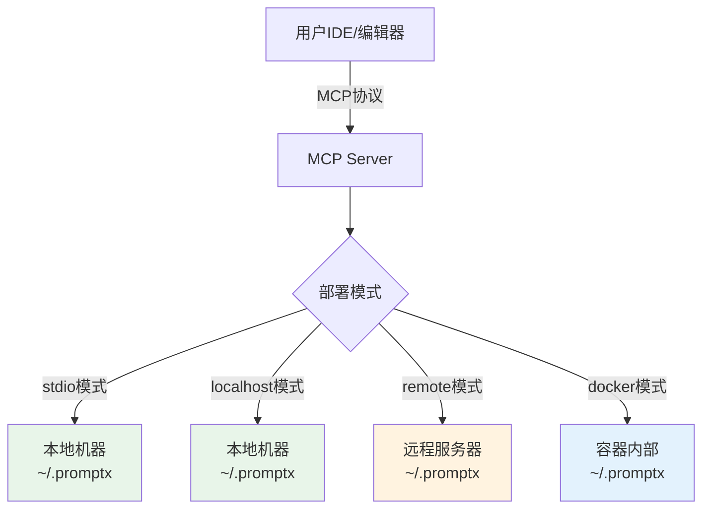

# Filesystem 工具使用手册

<manual>
<identity>
## 工具名称
@tool://filesystem

## 简介
基于MCP filesystem协议的统一文件系统操作工具，提供读写、搜索、编辑等完整文件操作功能，自动限制在~/.promptx目录范围内确保安全。
</identity>

<purpose>
⚠️ **AI重要提醒**: 调用此工具前必须完整阅读本说明书，理解工具功能边界、参数要求和使用限制。禁止在不了解工具功能的情况下盲目调用。

## 🏗️ 架构说明
**重要概念**：filesystem工具操作的是**MCP Server部署机器**的文件系统，而非IDE/编辑器所在机器。

### 部署模式与文件系统位置



### 文件系统隔离性
- **完全隔离**：filesystem工具是一个封闭环境，只能访问MCP Server机器的`~/.promptx`目录
- **不同于IDE文件系统**：IDE的Read/Write工具操作的是项目本地文件，filesystem操作的是MCP Server端文件
- **统一接口**：无论MCP Server在哪里部署，接口保持一致

### 典型场景
1. **stdio/localhost模式**：MCP Server与IDE在同一台机器，`~/.promptx`是本地目录
2. **remote模式**：MCP Server在远程服务器，`~/.promptx`是远程服务器的目录
3. **docker模式**：MCP Server在容器中，`~/.promptx`是容器内的目录
4. **云部署模式**：MCP Server在云端，`~/.promptx`是云实例的持久化存储

## 核心问题定义
解决PromptX在不同部署环境（本地/远程/容器/云端）下的文件系统访问问题，为角色（如女娲、鲁班）提供统一的文件操作接口，确保所有操作安全地限制在MCP Server机器的~/.promptx目录内。

## 价值主张
- 🎯 **解决什么痛点**：角色直接使用fs模块导致远程部署时无法访问文件，且存在安全风险
- 🚀 **带来什么价值**：统一接口，本地和远程部署无缝切换，自动安全隔离
- 🌟 **独特优势**：基于MCP标准协议，自动路径限制，支持14种文件操作方法

## 应用边界
- ✅ **适用场景**：
  - 管理MCP Server端的PromptX资源（角色、工具、思维模式等）
  - 跨项目共享的User级资源管理
  - MCP Server端的持久化数据存储
  - 远程部署时的资源同步和管理
  - 容器化部署的配置文件管理
  
- ❌ **不适用场景**：
  - 操作IDE本地项目文件（应使用IDE的Read/Write/Edit工具）
  - 访问MCP Server机器~/.promptx目录之外的文件（安全限制）
  - 执行系统命令或脚本
  - 处理超大二进制文件（建议使用read_media_file）
  - 需要实时同步到IDE的文件操作
</purpose>

<usage>
## 使用时机
- 需要创建或更新角色、工具、思维模式等资源文件时
- 需要读取现有资源文件内容时（支持分行读取）
- 需要批量处理多个文件时
- 需要搜索特定模式的文件时
- 需要管理目录结构或查看目录树时
- 需要编辑文件内容而不完全重写时
- 需要移动或重命名文件时

## 操作步骤
1. **准备阶段**：确定要操作的文件路径（相对于~/.promptx的相对路径）
2. **执行阶段**：通过promptx_tool调用，指定method和相关参数
3. **验证阶段**：检查返回结果，根据method不同会有不同的返回格式

## 最佳实践
- 🎯 **效率提升**：使用read_multiple_files批量读取，使用edit_file精确修改内容
- ⚠️ **避免陷阱**：路径不要包含~/.promptx前缀，始终使用相对路径
- 🔧 **故障排除**：检查路径是否正确，确认文件权限，验证method名称拼写

## 注意事项
- 所有路径都相对于**MCP Server机器**的~/.promptx目录，无需包含此前缀
- 文件操作在MCP Server所在环境执行，不是IDE本地环境
- filesystem工具创建的文件存储在MCP Server端，与IDE项目文件是两个独立的文件系统
- write_file操作会覆盖已存在的文件
- edit_file操作支持预览模式（dryRun）
- 不能同时指定head和tail参数
- search_files返回的是相对路径数组
- 如需在IDE项目中操作文件，应使用IDE提供的Read/Write/Edit工具，而非filesystem工具
</usage>

<parameter>
## 核心参数
| 参数名 | 类型 | 描述 | 必需性 |
|--------|------|------|--------|
| method | string | MCP方法名（见下方method列表） | 必需 |

## Method列表及其专属参数

### read_text_file - 读取文本文件
| 参数名 | 类型 | 描述 | 示例 |
|--------|------|------|------|
| path | string | 文件路径 | "resource/role/test.md" |
| head | number | 可选，读取前N行 | 10 |
| tail | number | 可选，读取后N行 | 20 |

### read_media_file - 读取媒体文件
| 参数名 | 类型 | 描述 | 示例 |
|--------|------|------|------|
| path | string | 媒体文件路径 | "resource/images/logo.png" |

### read_multiple_files - 批量读取文件
| 参数名 | 类型 | 描述 | 示例 |
|--------|------|------|------|
| paths | string[] | 文件路径数组 | ["file1.md", "file2.js"] |

### write_file - 写入文件
| 参数名 | 类型 | 描述 | 示例 |
|--------|------|------|------|
| path | string | 文件路径 | "resource/role/new.md" |
| content | string | 文件内容 | "# Role Definition..." |

### edit_file - 编辑文件
| 参数名 | 类型 | 描述 | 示例 |
|--------|------|------|------|
| path | string | 文件路径 | "resource/role/existing.md" |
| edits | array | 编辑操作列表 | [{"oldText": "旧", "newText": "新"}] |
| dryRun | boolean | 可选，仅预览不执行 | true |

### create_directory - 创建目录
| 参数名 | 类型 | 描述 | 示例 |
|--------|------|------|------|
| path | string | 目录路径 | "resource/new-folder" |

### list_directory - 列出目录内容
| 参数名 | 类型 | 描述 | 示例 |
|--------|------|------|------|
| path | string | 目录路径 | "resource/role/" |

### list_directory_with_sizes - 列出目录内容（含大小）
| 参数名 | 类型 | 描述 | 示例 |
|--------|------|------|------|
| path | string | 目录路径 | "resource/" |
| sortBy | string | 可选，排序方式(name/size) | "size" |

### directory_tree - 获取目录树
| 参数名 | 类型 | 描述 | 示例 |
|--------|------|------|------|
| path | string | 目录路径 | "resource/" |

### move_file - 移动/重命名文件
| 参数名 | 类型 | 描述 | 示例 |
|--------|------|------|------|
| source | string | 源路径 | "resource/old.md" |
| destination | string | 目标路径 | "resource/new.md" |

### search_files - 搜索文件
| 参数名 | 类型 | 描述 | 示例 |
|--------|------|------|------|
| path | string | 搜索起始路径 | "resource/" |
| pattern | string | 搜索模式 | "*.md" |
| excludePatterns | string[] | 可选，排除模式 | ["test/*", "backup/*"] |

### get_file_info - 获取文件信息
| 参数名 | 类型 | 描述 | 示例 |
|--------|------|------|------|
| path | string | 文件路径 | "resource/file.txt" |

### list_allowed_directories - 列出允许访问的目录
无需额外参数，返回["/Users/username/.promptx"]

## 参数示例集合
```json
// 读取文本文件
{
  "method": "read_text_file",
  "path": "resource/role/assistant/assistant.role.md"
}

// 读取文件前10行
{
  "method": "read_text_file",
  "path": "resource/tool/calculator/calculator.tool.js",
  "head": 10
}

// 批量读取文件
{
  "method": "read_multiple_files",
  "paths": ["file1.md", "file2.js", "file3.txt"]
}

// 写入文件
{
  "method": "write_file",
  "path": "resource/role/fullstack-developer/fullstack-developer.role.md",
  "content": "<role>\n  <personality>...</personality>\n</role>"
}

// 编辑文件（预览模式）
{
  "method": "edit_file",
  "path": "resource/role/existing.md",
  "edits": [
    {"oldText": "旧内容", "newText": "新内容"},
    {"oldText": "另一处", "newText": "替换内容"}
  ],
  "dryRun": true
}

// 创建目录
{
  "method": "create_directory",
  "path": "resource/role/new-role"
}

// 列出目录（带文件大小，按大小排序）
{
  "method": "list_directory_with_sizes",
  "path": "resource/",
  "sortBy": "size"
}

// 获取目录树
{
  "method": "directory_tree",
  "path": "resource/role/"
}

// 移动文件
{
  "method": "move_file",
  "source": "resource/temp/draft.md",
  "destination": "resource/role/assistant/assistant.role.md"
}

// 搜索Markdown文件
{
  "method": "search_files",
  "path": "resource/",
  "pattern": "*.md",
  "excludePatterns": ["node_modules/*", ".*"]
}

// 获取文件信息
{
  "method": "get_file_info",
  "path": "resource/tool/filesystem/filesystem.tool.js"
}
```
</parameter>

<outcome>
## 返回格式说明
每个method返回不同的数据结构，ToolSandbox会自动包装为标准格式。

### read_text_file 返回
```json
// 成功时直接返回文件内容字符串
"文件的完整内容或指定行数的内容"
```

### read_media_file 返回
```json
{
  "base64": "base64编码的文件内容",
  "mimeType": "image/png"  // 自动检测MIME类型
}
```

### read_multiple_files 返回
```json
[
  {
    "path": "file1.md",
    "content": "文件1的内容",
    "success": true
  },
  {
    "path": "file2.js",
    "error": "文件不存在",
    "success": false
  }
]
```

### write_file 返回
```json
{
  "bytesWritten": 1024,  // 写入的字节数
  "path": "resource/file.txt"
}
```

### edit_file 返回
```json
// 实际执行时
{
  "editsApplied": 2,  // 应用的编辑数
  "path": "resource/file.md"
}

// dryRun模式时
{
  "dryRun": true,
  "original": "原始内容",
  "modified": "修改后内容",
  "changes": [{"oldText": "旧", "newText": "新"}]
}
```

### create_directory 返回
```json
{
  "created": "/Users/username/.promptx/resource/new-folder"
}
```

### list_directory 返回
```json
[
  {"name": "file1.md", "type": "file"},
  {"name": "subfolder", "type": "directory"},
  {"name": "file2.js", "type": "file"}
]
```

### list_directory_with_sizes 返回
```json
[
  {
    "name": "large-file.json",
    "type": "file",
    "size": 102400,
    "modified": "2024-01-15T10:30:00.000Z"
  },
  {
    "name": "folder",
    "type": "directory",
    "size": 4096,
    "modified": "2024-01-15T09:00:00.000Z"
  }
]
```

### directory_tree 返回
```json
[
  {
    "name": "role",
    "type": "directory",
    "children": [
      {"name": "assistant.role.md", "type": "file"},
      {"name": "developer.role.md", "type": "file"}
    ]
  },
  {
    "name": "tool",
    "type": "directory",
    "children": [
      {"name": "calculator", "type": "directory", "children": [...]}
    ]
  }
]
```

### move_file 返回
```json
{
  "from": "resource/old.md",
  "to": "resource/new.md"
}
```

### search_files 返回
```json
[
  "resource/role/assistant/assistant.role.md",
  "resource/role/developer/developer.role.md",
  "resource/manual/filesystem.manual.md"
]
```

### get_file_info 返回
```json
{
  "size": 4096,
  "created": "2024-01-01T00:00:00.000Z",
  "modified": "2024-01-15T10:30:00.000Z",
  "accessed": "2024-01-15T11:00:00.000Z",
  "isDirectory": false,
  "isFile": true,
  "permissions": "644"
}
```

### list_allowed_directories 返回
```json
["/Users/username/.promptx"]
```

## 错误处理
当操作失败时，ToolSandbox会捕获错误并返回标准错误格式：
```json
{
  "success": false,
  "error": "错误信息描述"
}
```

常见错误类型：
- `路径越权`：试图访问~/.promptx之外的文件
- `文件不存在`：指定的文件或目录不存在
- `权限不足`：没有读写权限
- `参数错误`：缺少必需参数或参数格式错误
- `不支持的方法`：method参数值不在支持列表中

## 结果解读指南
- **判断操作成功**：检查是否有error字段，没有则表示成功
- **获取核心数据**：根据不同method查看相应的返回字段
- **处理批量结果**：read_multiple_files需要检查每个文件的success字段
- **理解路径格式**：返回的路径都是相对于~/.promptx的相对路径

## 后续动作建议
- 成功写入后，可使用read_text_file验证内容
- 搜索到文件后，可使用read_text_file或get_file_info查看详情
- 编辑操作建议先用dryRun预览，确认无误后再实际执行
- 创建目录后可使用list_directory确认创建成功
- 移动文件后可在新位置使用get_file_info验证
</outcome>
</manual>