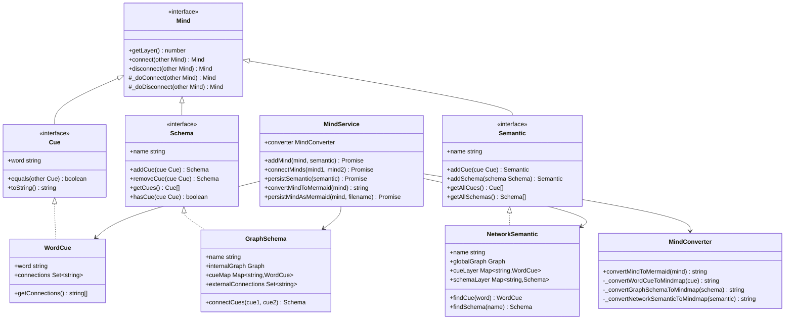

# Mind - 认知记忆体系

> 基于认知心理学原理的AI记忆架构，实现从理论到工程的完美转化

## 系统架构

### UML类图设计



### 认知层次架构


## 认知心理学理论映射

### 理论基础对照表

| 认知心理学理论 | 对应程序抽象 | 实现类 | 核心功能 |
|---------------|-------------|--------|----------|
| **Baddeley工作记忆模型** | Mind接口体系 | Mind | 统一的认知操作接口 |
| **认知线索理论** | Cue接口 | WordCue | 最小认知单元，触发记忆 |
| **Bartlett图式理论** | Schema接口 | GraphSchema | 结构化认知框架 |
| **Collins语义网络** | Semantic接口 | NetworkSemantic | 全局知识网络 |
| **层次扩散激活** | connect()方法 | 层次主导原则 | 认知关联的建立 |

### 认知过程序列图

#### 记忆形成过程


#### 记忆检索过程


## API调用层面

### 核心调用接口

#### 1. 全局单例导入
```javascript
const { 
  mindService,        // 全局单例服务
  WordCue,           // 认知线索类
  GraphSchema,       // 认知图式类
  NetworkSemantic    // 语义网络类
} = require('./src/lib/core/cognition/mind');
```

#### 2. 基础认知构建API
```javascript
// 创建认知原子 (Layer 1)
const concept = new WordCue('artificial_intelligence');
const related = new WordCue('machine_learning');

// 建立语义关联
concept.connect(related);  // AI ←→ ML

// 创建认知图式 (Layer 2)
const aiDomain = new GraphSchema('ai_concepts');
aiDomain.addCue(concept);
aiDomain.addCue(related);

// 创建语义网络 (Layer 3)
const knowledgeBase = new NetworkSemantic('tech_knowledge');
await mindService.addMind(aiDomain, knowledgeBase);
```

#### 3. 高级认知操作API
```javascript
// 跨层次连接 (层次主导原则自动处理)
concept.connect(aiDomain);      // 概念 → 图式 (被包含)
aiDomain.connect(knowledgeBase); // 图式 → 网络 (被包含)

// 图式内连接
aiDomain.connectCues(concept, related); // 图式内部关联

// 认知网络检索
const foundConcept = knowledgeBase.findCue('artificial_intelligence');
const foundSchema = knowledgeBase.findSchema('ai_concepts');
```

#### 4. 持久化与可视化API
```javascript
// 双格式持久化
const result = await mindService.persistSemanticBoth(knowledgeBase);
// 输出: { jsonPath: "knowledge.json", mermaidPath: "knowledge.mmd" }

// 思维导图转换
const mindmap = mindService.convertMindToMermaid(knowledgeBase);
console.log(mindmap);
/* 输出:
mindmap
  root)tech_knowledge)
    ai_concepts
      artificial_intelligence
        machine_learning
*/

// 独立文件持久化
await mindService.persistMindAsMermaid(knowledgeBase, 'ai_mindmap');
const mindmapContent = await mindService.loadMermaidText('ai_mindmap');
```

#### 5. 复杂认知建模API
```javascript
// 构建多层次认知网络
const buildComplexKnowledge = async () => {
  const knowledge = new NetworkSemantic('domain_expertise');
  
  // 核心概念层
  const coreSchema = new GraphSchema('core_concepts');
  const ai = new WordCue('AI');
  const ml = new WordCue('ML');
  const dl = new WordCue('DL');
  
  // 建立概念层次关系
  ai.connect(ml);
  ml.connect(dl);
  coreSchema.addCue(ai).addCue(ml).addCue(dl);
  
  // 应用领域层
  const appSchema = new GraphSchema('applications');
  const nlp = new WordCue('NLP');
  const cv = new WordCue('CV');
  const robotics = new WordCue('Robotics');
  
  // 应用间关联
  nlp.connect(cv);
  appSchema.addCue(nlp).addCue(cv).addCue(robotics);
  
  // 跨层关联 (核心技术 → 应用领域)
  dl.connect(nlp);
  dl.connect(cv);
  ml.connect(robotics);
  
  // 整合到知识网络
  await mindService.addMind(coreSchema, knowledge);
  await mindService.addMind(appSchema, knowledge);
  
  // 输出分析
  const stats = knowledge.getNetworkStats();
  console.log('知识网络统计:', stats);
  
  return knowledge;
};
```

### 思维导图输出格式

#### WordCue输出
```javascript
const cue = new WordCue('innovation');
cue.connect(new WordCue('creativity'));
cue.connect(new WordCue('technology'));

const mindmap = mindService.convertMindToMermaid(cue);
```
输出:


#### GraphSchema输出
```javascript
const schema = new GraphSchema('innovation_process');
const idea = new WordCue('idea');
const prototype = new WordCue('prototype');
const product = new WordCue('product');

idea.connect(prototype);
prototype.connect(product);
schema.addCue(idea).addCue(prototype).addCue(product);

const mindmap = mindService.convertMindToMermaid(schema);
```
输出:


#### NetworkSemantic输出
```javascript
const semantic = new NetworkSemantic('business_ecosystem');
// ... 添加多个Schema和Cue
const mindmap = mindService.convertMindToMermaid(semantic);
```
输出:


## 层次主导原则

### 核心设计理念

```mermaid
graph LR
    subgraph "层次主导规则"
        A[小的融入大的] --> B[大的主导连接]
        B --> C[返回主导者]
    end
    
    subgraph "具体表现"
        D[WordCue.connect(Schema)] --> E[Schema主导]
        F[Schema.connect(Semantic)] --> G[Semantic主导]
        H[Semantic.connect(任何)] --> I[Semantic永远主导]
    end
    
    A -.实现.-> D
    B -.实现.-> E
    C -.实现.-> G
```

### 连接矩阵

| 调用者↓ \ 参数→ | WordCue | GraphSchema | NetworkSemantic |
|----------------|---------|-------------|-----------------|
| **WordCue** | 同级关联 | 被Schema包含 | 被Semantic包含 |
| **GraphSchema** | 包含WordCue | 同级关联 | 被Semantic包含 |
| **NetworkSemantic** | 包含WordCue | 包含Schema | 同级关联 |

### 返回值规律

```javascript
// 同级连接 - 返回调用者
cue1.connect(cue2)           // 返回 cue1
schema1.connect(schema2)     // 返回 schema1

// 跨级连接 - 返回层次更高者
cue.connect(schema)          // 返回 schema (Layer 2 > Layer 1)
schema.connect(semantic)     // 返回 semantic (Layer 3 > Layer 2)
cue.connect(semantic)        // 返回 semantic (Layer 3 > Layer 1)

// 最高层主导 - 永远返回Semantic
semantic.connect(任何对象)    // 永远返回 semantic
```

## 设计优势

### 1. 认知一致性
- **理论映射**: 每个程序概念都有对应的认知心理学理论基础
- **层次对应**: 三层架构完美映射认知科学的层次结构
- **操作自然**: connect/disconnect符合人类认知的直觉

### 2. 工程简洁性
- **统一接口**: 所有认知对象都是Mind，具备相同的连接能力
- **自动处理**: 层次主导原则消除了手动类型判断的复杂性
- **奥卡姆剃刀**: 复杂认知理论简化为两个核心操作

### 3. 可视化直观性
- **思维导图**: 默认输出符合人脑思维的树状结构
- **层次清晰**: 根节点、分支、叶子节点层次分明
- **关系明确**: 认知关联通过缩进层次直观表达

### 4. 扩展灵活性
- **接口导向**: 易于扩展新的认知概念类型
- **协议开放**: 支持新的序列化和可视化格式
- **组合自由**: 认知元素可以任意组合和连接

## 应用场景

### 1. 知识管理系统
```javascript
// 构建企业知识图谱
const enterpriseKnowledge = new NetworkSemantic('company_knowledge');

// 技术栈知识域
const techStack = new GraphSchema('technology_stack');
const frontend = new WordCue('React');
const backend = new WordCue('Node.js');
const database = new WordCue('MongoDB');

frontend.connect(backend);
backend.connect(database);
techStack.addCue(frontend).addCue(backend).addCue(database);

await mindService.addMind(techStack, enterpriseKnowledge);
```

### 2. 教育学习系统
```javascript
// 构建学科知识体系
const mathKnowledge = new NetworkSemantic('mathematics');

// 代数领域
const algebra = new GraphSchema('algebra');
const variables = new WordCue('variables');
const equations = new WordCue('equations');
const functions = new WordCue('functions');

variables.connect(equations);
equations.connect(functions);
algebra.addCue(variables).addCue(equations).addCue(functions);

await mindService.addMind(algebra, mathKnowledge);
```

### 3. 智能推荐系统
```javascript
// 构建用户兴趣模型
const userInterests = new NetworkSemantic('user_profile');

// 兴趣领域建模
const interests = new GraphSchema('preferences');
const music = new WordCue('jazz');
const books = new WordCue('sci-fi');
const movies = new WordCue('thriller');

// 兴趣关联分析
music.connect(books);  // 爵士乐爱好者可能喜欢科幻
books.connect(movies); // 科幻读者可能喜欢惊悚片

interests.addCue(music).addCue(books).addCue(movies);
await mindService.addMind(interests, userInterests);
```

## 技术实现细节

### graphology图数据库集成
```javascript
// GraphSchema内部使用真实图结构
class GraphSchema {
  constructor(name) {
    this.internalGraph = new Graph(); // 专业图数据库
    this.cueMap = new Map();          // 快速查找缓存
  }
  
  connectCues(cue1, cue2) {
    // 利用graphology的图算法能力
    this.internalGraph.addEdge(cue1.word, cue2.word);
    return this;
  }
}
```

### 序列化支持
```javascript
// 完整的JSON序列化/反序列化
const jsonData = await mindService.persistSemantic(semantic);
const loadedSemantic = await mindService.loadSemantic('knowledge_base');

// 思维导图文本序列化
const mindmapText = mindService.convertMindToMermaid(semantic);
await mindService.persistMindAsMermaid(semantic, 'mindmap_file');
```

### 性能优化
- **按需加载**: 延迟创建图结构，节省内存
- **缓存机制**: 智能缓存常用查询结果
- **并行处理**: JSON和Mermaid格式并行生成
- **增量更新**: 支持部分更新而非全量重建

---

**理论指导**: 认知心理学经典理论 + 马克思主义矛盾论  
**设计原则**: 奥卡姆剃刀原则 + 层次主导理论  
**技术实现**: graphology + @mermaid-js/parser  
**可视化**: Mermaid思维导图 + UML序列图